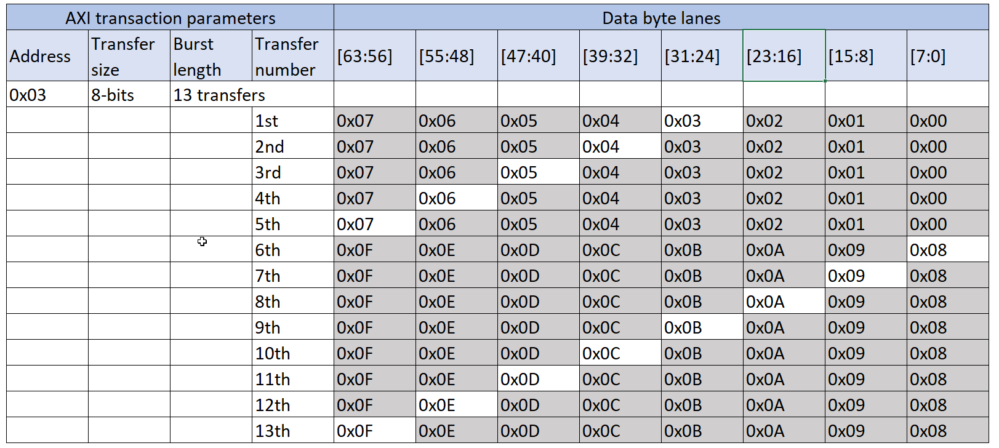
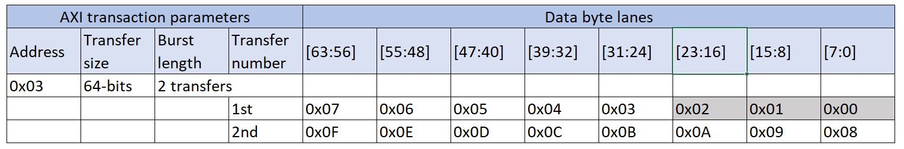

# Example of an unaligned start address

Source: <https://developer.arm.com/documentation/102482/0000/DMAC-interfaces/AXI5-manager-interfaces/Example-of-an-unaligned-start-address>

### Example of an unaligned start address

Assuming the following settings:

- DATA\_WIDTH = 64
- CH\_CTRL.TRANSIZE = 0 (8-bit), CH\_XADDRINC.SRC/DESXADDRINC = 1
- CH\_XSIZE.SRC/DESXSIZE = 0xD (13 bytes)
- CH\_SRC/DESADDR.SRC/DESXADDR[2:0] = 3

### Unoptimized read/write

AXI5 transaction uses the TRANSIZE value for axsize. This means the unoptimized bandwidth utilization is constant for all beats.

Utilization
:   Transaction size in bytes/bus size in bytes, 1/8 in this example.

The following figure shows the AXI5 transactions for this scenario. Each row in the figure represents a transfer and the shaded cells indicate bytes that are not transferred.

Figure 1. AXI5 transactions for unoptimized bandwidth utilization

### Optimized read/write

When bandwidth utilization is optimized, read and write side behave similarly in case the start address is unaligned. The axaddr signal uses the unaligned address. For reads it implicitely means for the AXI5 subordinate to ignore lower byte lanes. For writes, additionaly the wstrb signals specify the used byte lanes.

Utilization
:   Bytes until first aligned address in AXI-access/bus size in bytes, (8-3)/8 in this example.

The following figure shows the AXI5 transactions for this scenario. Each row in the figure represents a transfer and the shaded cells indicate bytes that are not transferred.

Figure 2. AXI5 transactions for optimized bandwidth utilization

