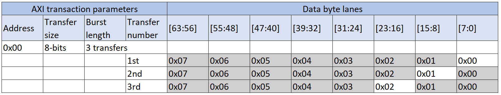
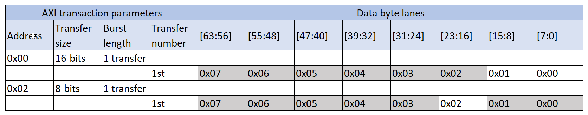
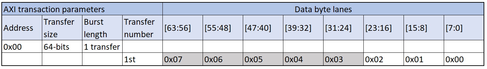

# Example of an unaligned end address

Source: <https://developer.arm.com/documentation/102482/0000/DMAC-interfaces/AXI5-manager-interfaces/Example-of-an-unaligned-end-address>

### Example of an unaligned end address

Assume the following settings:

- DATA\_WIDTH = 64
- CH\_CTRL.TRANSIZE = 0 (8-bit), CH\_XADDRINC.SRC/DESXADDRINC = 1
- CH\_XSIZE.SRC/DESXSIZE = 0x3 (3 bytes)
- CH\_SRC/DESADDR.SRC/DESXADDR[2:0] = 0

### Unoptimized read/write

AXI5 transaction uses the TRANSIZE value for axsize. This means the unoptimized bandwidth utilization is constant for all beats.

Utilization
:   Transaction size in bytes / bus size in bytes, 1/8 in this example.

The following figure shows the AXI5 transactions for this scenario. Each row in the figure represents a transfer and the shaded cells indicate bytes that are not transferred.

Figure 1. AXI transactions for unoptimized read/write

### Optimized read

The first burst uses 16-bit access, while the second only 8-bit.

Utilization
:   Transaction size in bytes/bus size in bytes,

- 2/8 – for the first transaction
- 1/8 – for the second transaction.

The following figure shows the AXI5 transactions for this scenario. Each row in the figure represents a transfer and the shaded cells indicate bytes that are not transferred.

Figure 2. AXI transactions for optimized read

### Optimized write

For the write bursts the bus width can be used, wstrb signals specify the used byte lanes for the AXI5 subordinate.

Utilization
:   Transaction size in bytes/bus size in bytes, 3/8 for this transaction.

The following figure shows the AXI5 transactions for this scenario. Each row in the figure represents a transfer and the shaded cells indicate bytes that are not transferred.

Figure 3. AXI transactions for optimized write

