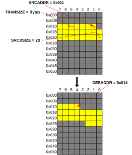

# DMAC operation basic commands

Source: <https://developer.arm.com/documentation/102482/0000/DMAC-operation/DMAC-operation-basic-commands>

### DMAC operation basic commands

This section contains an overview of DMA-350 operation basic commands.

### Transfer type 1D

Transfer type 1D is a one-dimensional block transfer. It transfers data from the source address to the destination address continuously in configured transfer size. This mode is the typical use-case for bulk data transfer where no data formatting is necessary during DMAC transfer. Transfer size setting range from byte to bus width in power of 2 increments. The transfer size is the same on both source and destination sides. The source and destination address are aligned with the transfer size as the lower address bits are ignored according to the TRANSIZE value. The number of transfers to copy are specified in transfer size increments. The SW can also limit the maximum burst length the DMAC can send to the bus to allow arbitrating others on the interconnect.

Figure 1. 1D transfer example

<table>
 <caption>
  
   
    Table 1.
   
   1D transfer attributes
  
 </caption>
 <colgroup>
  <col span="1"/>
  <col span="1"/>
  <col span="1"/>
 </colgroup>
 <thead>
  <tr>
   <th class="documents-nocellnorowborder" colspan="1" id="d39501e85" rowspan="1">
    

     Parameter name
    

   </th>
   <th class="documents-nocellnorowborder" colspan="1" id="d39501e89" rowspan="1">
    

     Register map entry
    

   </th>
   <th class="documents-cell-norowborder" colspan="1" id="d39501e93" rowspan="1">
    

     Description
    

   </th>
  </tr>
 </thead>
 <tbody>
  <tr>
   <td class="documents-nocellnorowborder" colspan="1" rowspan="1">
    

     Source Address
    

   </td>
   <td class="documents-nocellnorowborder" colspan="1" rowspan="1">
    

     CH&lt;x&gt;_SRCADDR
    

   </td>
   <td class="documents-cell-norowborder" colspan="1" rowspan="1">
    

     The starting source address to transfer data from. The source address must be aligned with the transfer size.
    

   </td>
  </tr>
  <tr>
   <td class="documents-nocellnorowborder" colspan="1" rowspan="1">
    

     Destination Address
    

   </td>
   <td class="documents-nocellnorowborder" colspan="1" rowspan="1">
    

     CH&lt;x&gt;_DESADDR
    

   </td>
   <td class="documents-cell-norowborder" colspan="1" rowspan="1">
    

     The starting destination address to transfer data to. The destination address must be aligned with the transfer size.
    

   </td>
  </tr>
  <tr>
   <td class="documents-nocellnorowborder" colspan="1" rowspan="1">
    

     Source X-size
    

   </td>
   <td class="documents-nocellnorowborder" colspan="1" rowspan="1">
    

     CH&lt;x&gt;_XSIZE.SRCXSIZE
    

   </td>
   <td class="documents-cell-norowborder" colspan="1" rowspan="1">
    

     The source number of transfers in the X dimension. The width of the source transfers is equal to the TRANSIZE value of the source transfers.
    

   </td>
  </tr>
  <tr>
   <td class="documents-nocellnorowborder" colspan="1" rowspan="1">
    

     Destination X-size
    

   </td>
   <td class="documents-nocellnorowborder" colspan="1" rowspan="1">
    

     CH&lt;x&gt;_XSIZE.DESXSIZE
    

   </td>
   <td class="documents-cell-norowborder" colspan="1" rowspan="1">
    

     The destination number of transfers in the X dimension. The width of the destination transfers is equal to the TRANSIZE value of the destination transfers.
    

   </td>
  </tr>
  <tr>
   <td class="documents-nocellnorowborder" colspan="1" rowspan="1">
    

     Transfer size
    

   </td>
   <td class="documents-nocellnorowborder" colspan="1" rowspan="1">
    

     CH&lt;x&gt;_CTRL.TRANSIZE
    

   </td>
   <td class="documents-cell-norowborder" colspan="1" rowspan="1">
    

     The data width that is utilized by both the source and the destination of the DMAC operation.
    

   </td>
  </tr>
  <tr>
   <td class="documents-nocellnorowborder" colspan="1" rowspan="1">
    

     Priority
    

   </td>
   <td class="documents-nocellnorowborder" colspan="1" rowspan="1">
    

     CH&lt;x&gt;_CTRL.PRIORITY
    

   </td>
   <td class="documents-cell-norowborder" colspan="1" rowspan="1">
    

     This signal is passed on to the AXI as AxQOS and is used for arbitration between the channels.
    

   </td>
  </tr>
  <tr>
   <td class="documents-nocellnorowborder" colspan="1" rowspan="1">
    

     Source maximum burst size
    

   </td>
   <td class="documents-nocellnorowborder" colspan="1" rowspan="1">
    

     CH&lt;x&gt;_SRCTRANSCFG.SRCMAXBURSTLEN
    

   </td>
   <td class="documents-cell-norowborder" colspan="1" rowspan="1">
    

     The maximum burst length that is supported on the source side of the DMAC operation.
    

   </td>
  </tr>
  <tr>
   <td class="documents-nocellnorowborder" colspan="1" rowspan="1">
    

     Destination maximum burst size
    

   </td>
   <td class="documents-nocellnorowborder" colspan="1" rowspan="1">
    

     CH&lt;x&gt;_DESTRANSCFG.DESMAXBURSTLEN
    

   </td>
   <td class="documents-cell-norowborder" colspan="1" rowspan="1">
    

     The maximum burst length that is supported on the destination side of the DMAC operation.
    

   </td>
  </tr>
  <tr>
   <td class="documents-nocellnorowborder" colspan="1" rowspan="1">
    

     Source AXI transfer properties
    

   </td>
   <td class="documents-nocellnorowborder" colspan="1" rowspan="1">
    

     CH&lt;x&gt;_SRCTRANSCFG.SRCTRP
    

   </td>
   <td class="documents-cell-norowborder" colspan="1" rowspan="1">
    

     Source transfer properties
    

    

     These properties include memory type, shareability attribute, secure attribute and privilege attribute, and thus determine the values on the arprot, arcache, ardomain and arinner signals.
    

   </td>
  </tr>
  <tr>
   <td class="documents-nocellnorowborder" colspan="1" rowspan="1">
    

     Destination AXI transfer properties
    

   </td>
   <td class="documents-nocellnorowborder" colspan="1" rowspan="1">
    

     CH&lt;x&gt;_DESTRANSCFG.DESTRP
    

   </td>
   <td class="documents-cell-norowborder" colspan="1" rowspan="1">
    

     Destination transfer properties
    

    

     These properties include memory type, shareability attribute, secure attribute and privilege attribute, and thus determine the values on the awprot, awcache, awdomain and awinner signals.
    

   </td>
  </tr>
  <tr>
   <td class="documents-nocellnorowborder" colspan="1" rowspan="1">
    

     1D wrap type
    

   </td>
   <td class="documents-nocellnorowborder" colspan="1" rowspan="1">
    

     CH&lt;x&gt;_CTRL.XTYPE
    

   </td>
   <td class="documents-cell-norowborder" colspan="1" rowspan="1">
    

     Determines how to handle some cases of 1D, when the source and the destination X-sizes are not equal.
    

   </td>
  </tr>
  <tr>
   <td class="documents-nocellnorowborder" colspan="1" rowspan="1">
    

     Fill value
    

   </td>
   <td class="documents-nocellnorowborder" colspan="1" rowspan="1">
    

     CH&lt;x&gt;_FILLVAL
    

   </td>
   <td class="documents-cell-norowborder" colspan="1" rowspan="1">
    

     The fill value for special wrap cases, when the destination X-size is larger than the source X-size, and the remainder of the address range must be filled with predefined values.
    

   </td>
  </tr>
  <tr>
   <td class="documents-nocellnorowborder" colspan="1" rowspan="1">
    

     Source address increment
    

   </td>
   <td class="documents-nocellnorowborder" colspan="1" rowspan="1">
    

     CH&lt;x&gt;_XADDRINC.SRCXADDRINC
    

   </td>
   <td class="documents-cell-norowborder" colspan="1" rowspan="1">
    

     Increment used to calculate address on source side. The increment is: TRANSIZE * SRCXADDRINC
    

   </td>
  </tr>
  <tr>
   <td class="documents-row-nocellborder" colspan="1" rowspan="1">
    

     Destination address increment
    

   </td>
   <td class="documents-row-nocellborder" colspan="1" rowspan="1">
    

     CH&lt;x&gt;_XADDRINC.DESXADDRINC
    

   </td>
   <td class="documents-cellrowborder" colspan="1" rowspan="1">
    

     Increment used to calculate address on destination side. The increment is: TRANSIZE * DESXADDRINC
    

   </td>
  </tr>
 </tbody>
</table>

- **[1D operation modes](/documentation/102482/0000/DMAC-operation/DMAC-operation-basic-commands/1D-operation-modes?lang=en)**
   The WRAP functionality (1D wrap type) extends 1D transfers by allowing different source and destination memory sizes. This allows copying the same data multiple times to the destination location or filling an area with a default pattern.
- **[List of cases for 1D WRAP](/documentation/102482/0000/DMAC-operation/DMAC-operation-basic-commands/List-of-cases-for-1D-WRAP?lang=en)**
   The 1D WRAP transfers can result in the following cases:
- **[1D transfers with increments](/documentation/102482/0000/DMAC-operation/DMAC-operation-basic-commands/1D-transfers-with-increments?lang=en)**
   The 1D transfers also have increment capabilities to the source and destination addresses. It allows transferring memory ranges with gaps to other locations with different gaps. It also allows setting 0 increment to result in a peripheral like access targeting a single memory location with multiple accesses. The number of transfers is the same on both sides. Increments are based on the transfer size.
