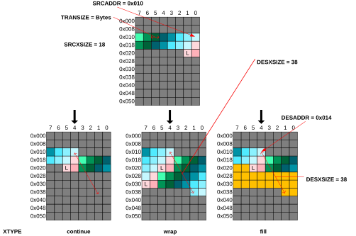

# 1D operation modes

Source: <https://developer.arm.com/documentation/102482/0000/DMAC-operation/DMAC-operation-basic-commands/1D-operation-modes>

### 1D operation modes

The WRAP functionality (1D wrap type) extends 1D transfers by allowing different source and destination memory sizes. This allows copying the same data multiple times to the destination location or filling an area with a default pattern.

The figure shows the different patterns, with the L indicating the last item of the source block.

Figure 1. 1D wrap transfers of different types

When WRAP modes are used for 1D operation the XTYPE setting defines the behavior of the DMAC when copying the source data to the destination. The options are the following:

continue
:   Wrapping within one line is disabled, used for 2D cases only. DESXSIZE is ignored. 1D operation type: 1Dbasic

wrap
:   Wrapping enabled, the source is copied multiple times to the destination. 1D operation type: 1Dwrap

fill
:   Filling enabled, the destination is filled with the predefined pattern when the source runs out of data. 1D operation type: 1Dfill

See the detailed descriptions of these modes in [List of cases for 1D WRAP](/documentation/102482/0000/DMAC-operation/DMAC-operation-basic-commands/List-of-cases-for-1D-WRAP?lang=en "The 1D WRAP transfers can result in the following cases:").
