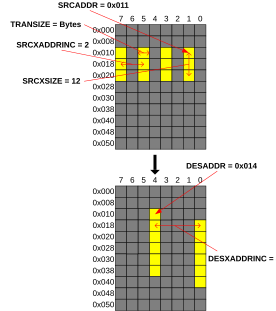
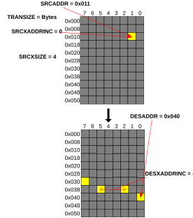

# 1D transfers with increments

Source: <https://developer.arm.com/documentation/102482/0000/DMAC-operation/DMAC-operation-basic-commands/1D-transfers-with-increments>

### 1D transfers with increments

The 1D transfers also have increment capabilities to the source and destination addresses. It allows transferring memory ranges with gaps to other locations with different gaps. It also allows setting 0 increment to result in a peripheral like access targeting a single memory location with multiple accesses. The number of transfers is the same on both sides. Increments are based on the transfer size.

Figure 1. 1D transfer with increments

The increment value can be negative, too, in case a command must fetch or fill the memory in a different direction. The following example shows a transfer of 4 bytes from the same location to the destination where reverse addressing is used with decrements of 3. All bytes are read from the address 0x11, the first byte is stored at 0x40, the second at 0x3D, the third at 0x3A, and the final fourth at 0x37.

Figure 2. 1D transfer with zero and negative increments

The DMA-350 supports 16-bit wide increment registers. The range is interpreted a 2s complement where negative numbers range from -32768 (0x8000) to -1 (0xFFFF) and zero or positive numbers range from 0 (0x0000) to 32767 (0x7FFF).
