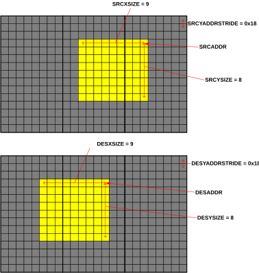
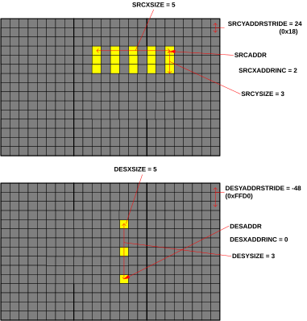
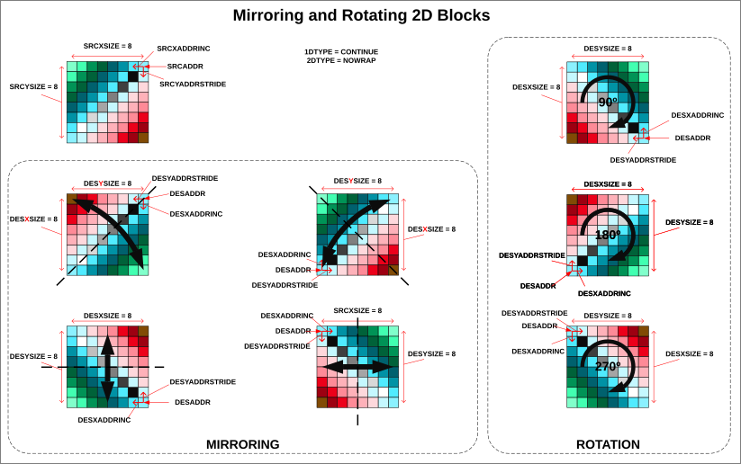

# Transfer type 2D

Source: <https://developer.arm.com/documentation/102482/0000/DMAC-operation/DMAC-operation-extended-commands/Transfer-type-2D>

### Transfer type 2D

The 2D transfers copies image-related data in the same format in the X and Y direction from one location to the other. The 2D operation contains extra registers for YSIZE, which defines the number of XSIZE-wide lines used in the copy.

1D transfers can still be created when the 2D mode is enabled by setting the YSIZE to 1. A YSIZE of 0 means no transfers in this case. When YSIZE is bigger than 1 then XSIZE reloads at the end of the line and jumps from 1 to the starting value. The transition from 1 to 0 means the end of the command and happens at the same time for both XSIZE and YSIZE registers.

The YADDRSTRIDE register defines the address difference between the starting address of each XSIZE-wide line. The stride values can be positive or negative as well, similar to the XADDRINC.

<table>
 <caption>
  
   
    Table 1.
   
   Configurable parameters of the 2D operation
  
 </caption>
 <colgroup>
  <col span="1"/>
  <col span="1"/>
  <col span="1"/>
 </colgroup>
 <thead>
  <tr>
   <th class="documents-nocellnorowborder" colspan="1" id="d45864e76" rowspan="1">
    

     Parameter name
    

   </th>
   <th class="documents-nocellnorowborder" colspan="1" id="d45864e80" rowspan="1">
    

     Register map entry
    

   </th>
   <th class="documents-cell-norowborder" colspan="1" id="d45864e84" rowspan="1">
    

     Description
    

   </th>
  </tr>
 </thead>
 <tbody>
  <tr>
   <td class="documents-nocellnorowborder" colspan="1" rowspan="1">
    

     2D enable
    

   </td>
   <td class="documents-nocellnorowborder" colspan="1" rowspan="1">
    

     CH&lt;x&gt;_CTRL.YTYPE
    

   </td>
   <td class="documents-cell-norowborder" colspan="1" rowspan="1">
    

     This configuration register enables and disables the 2D operation and determines its type.
    

   </td>
  </tr>
  <tr>
   <td class="documents-nocellnorowborder" colspan="1" rowspan="1">
    

     Source address stride register
    

   </td>
   <td class="documents-nocellnorowborder" colspan="1" rowspan="1">
    

     CH&lt;x&gt;_YADDRSTRIDE.SRCYADDRSTRIDE
    

   </td>
   <td class="documents-cell-norowborder" colspan="1" rowspan="1">
    

     The Y direction address stride at the source. This configuration register calculates the starting address of the next row by incrementing the starting address of the current row.
    

   </td>
  </tr>
  <tr>
   <td class="documents-nocellnorowborder" colspan="1" rowspan="1">
    

     Destination address stride register
    

   </td>
   <td class="documents-nocellnorowborder" colspan="1" rowspan="1">
    

     CH&lt;x&gt;_YADDRSTRIDE.DESYADDRSTRIDE
    

   </td>
   <td class="documents-cell-norowborder" colspan="1" rowspan="1">
    

     The Y direction address stride at the destination. This configuration register calculates the starting address of the next row by incrementing the starting address of the current row.
    

   </td>
  </tr>
  <tr>
   <td class="documents-nocellnorowborder" colspan="1" rowspan="1">
    

     Source Y-size
    

   </td>
   <td class="documents-nocellnorowborder" colspan="1" rowspan="1">
    

     CH&lt;x&gt;_YSIZE.SRCYSIZE
    

   </td>
   <td class="documents-cell-norowborder" colspan="1" rowspan="1">
    

     The number of rows of data to be transferred at the source.
    

   </td>
  </tr>
  <tr>
   <td class="documents-nocellnorowborder" colspan="1" rowspan="1">
    

     Destination Y-size
    

   </td>
   <td class="documents-nocellnorowborder" colspan="1" rowspan="1">
    

     CH&lt;x&gt;_YSIZE.DESYSIZE
    

   </td>
   <td class="documents-cell-norowborder" colspan="1" rowspan="1">
    

     The number of rows of data to be written at the destination.
    

   </td>
  </tr>
  <tr>
   <td class="documents-row-nocellborder" colspan="1" rowspan="1">
    

     1D wrap type
    

   </td>
   <td class="documents-row-nocellborder" colspan="1" rowspan="1">
    

     CH&lt;x&gt;_CTRL.XTYPE
    

   </td>
   <td class="documents-cellrowborder" colspan="1" rowspan="1">
    

     This configuration register determines how to handle some cases of the 1D operations when the source and destination X-sizes are not equal. The configuration register has added importance at 2D operations, as some of the 1D wrap type operations only influence 2D operations.
    

   </td>
  </tr>
 </tbody>
</table>

In the following example the SRC and DES sizes are equal, but if they are set differently different kinds of wrapping scenarios might occur. These are supported when the WRAP option is enabled. When using 2D transfers, the XADDRINC values can also be used to enable minimal transformation of the copied images.

Figure 1. 2D transfer example

> ### Note
>
> The 1D with increment can also be realized with 2D if XSIZE is set to 1 and the YADDRSTRIDE is equal to the XADDRINC.

The following example shows a scenario where the (SRC/DES)XADDRINC is enabled and gapped data is copied to FIFOs at the destination which use the same address. The DESYADDRSTRIDE is also set to negative to show that the DESADDR value is decremented through the operation.

Figure 2. 2D transfer with increments

Special corner cases might occur if the abs(YADDRSTRIDE) value is smaller than the abs(XSIZE\*XADDRINC) (considering negative values). In these scenarios, the same or slightly shifted data is read multiple times or the same destination area is overwritten. This might be useful for signal processing purposes. For example, FFT or DCT, where multiple samples in the time domain are combined and used in the frequency domain.

Using negative values for the increments also result in special 2D image copy features that provide mirroring, rotating or transposing images. Using XADDRINC to be bigger than YADDRSTRIDE and choosing the destination address starting point at an arbitrary location changes X and Y directions. These cases are shown in the following examples.

Figure 3. 2D transformations using increments

