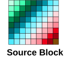

# WRAP for 2D

Source: <https://developer.arm.com/documentation/102482/0000/DMAC-operation/DMAC-operation-extended-commands/WRAP-for-2D>

### WRAP for 2D

The WRAP operations extend the normal 2D copy by allowing different size and arrangement for the destination. The SRCXSIZE and SRCYSIZE parameters of the source can be mapped to a DESXSIZE / DESYSIZE destination location where the sizes can be the same or different between source and destination. Mapping the parameters results in having smaller or larger destination location, therefore requiring different wrap types. This allows reshaping the source data to the destination and also allows filling borders with a predefined fill value.

When you use 2D wrapping, the XTYPE settings are also considered to handle wrap types on a line basis. It also supports a continuous flow of data from one line into different lines on the destination side.

The following figure shows a 9x8 source block where each data item has a different color. This is used in the following examples to show where these items land at the destination location. A black rectangle shows the original size of the frame at the source and the yellow dotted rectangular shape shows the full content of the source data block.

Figure 1. 2D 9x8 size source block

The YTYPE settings are very similar to the XTYPE values but they work in the Y direction of the transfer.

disable
:   No 2D transfer occurs, the YSIZE and YADDRSTRIDE values are ignored.

continue
:   Wrapping is disabled, SRCYSIZE number of lines are read and min(SRCYSIZE, DESYSIZE) limits the number of lines to write during the transfer.

wrap
:   Wrapping enabled, the source lines are copied multiple times to the destination area.

fill
:   Filling enabled, the remaining lines in the destination area are filled with the predefined pattern when the source runs out of data.

- **[List of cases for 2D WRAP](/documentation/102482/0000/DMAC-operation/DMAC-operation-extended-commands/WRAP-for-2D/List-of-cases-for-2D-WRAP?lang=en)**
   The following cases are highlighted when YTYPE is not disabled, but because of XSIZE and YSIZE settings they do not always result in real 2D transfers:
- **[2D wrap cases](/documentation/102482/0000/DMAC-operation/DMAC-operation-extended-commands/WRAP-for-2D/2D-wrap-cases?lang=en)**
   The 2D wrap cases are as follows.
