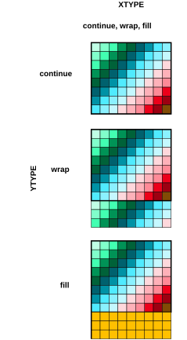
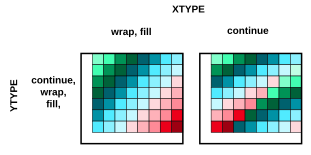
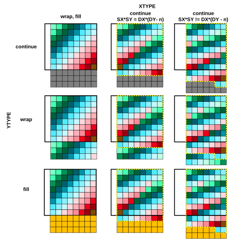
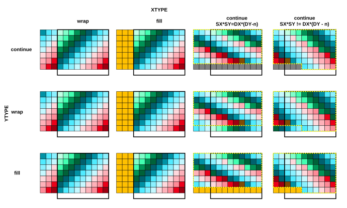
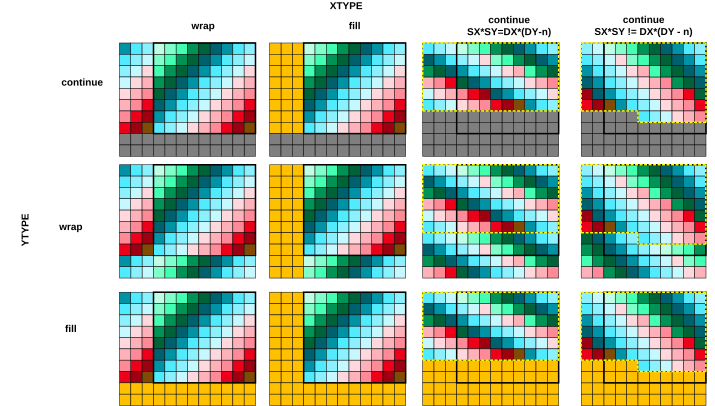

# 2D wrap cases

Source: <https://developer.arm.com/documentation/102482/0000/DMAC-operation/DMAC-operation-extended-commands/WRAP-for-2D/2D-wrap-cases>

### 2D wrap cases

The 2D wrap cases are as follows.

### SRCXSIZE == DESXSIZE

When the lengths of the two lines are equal results in simple scenarios where the settings of XTYPE do not matter.

SRCYSIZE == DESYSIZE

No wrapping occurs, source area is same as destination area.

SRCYSIZE > DESYSIZE

Destination is smaller than the source, copy stops when destination is filled, regardless of the wrap type. This ensures that no overwrite happens on the destination side. The source data is still read as it might be required for the stream output interface or simply dropped.

SRCYSIZE < DESYSIZE

Destination is larger than the source so different wrapping options can be used:

YTYPE:

continue
:   Stops copying data when SRCYSIZE is reached.

wrap
:   The address counter wraps around and starts copying the beginning of the source data to the remaining part of the destination memory location.

fill
:   Fills the remaining Y lines with the fill data

Figure 1. 2D wrap when SRCXSIZE == DESXSIZE

### SRCXSIZE > DESXSIZE

These scenarios cover the cases when the source line is wider than the destination line.

SRCYSIZE >= DESYSIZE

Copying to a smaller area so wrapping of lines on the destination side can occur. YTYPE does not matter since the YSIZE is smaller or equal so no overwrite occurs. The XTYPEs can make a difference in how the data is copied to the destination location.

XTYPE:

wrap, fill
:   Since the destination is smaller than the source, the copy stops when the destination line is filled

continue
:   The remaining data from the source line is continuously written to the next line in at the destination. The last few beats of the data that do not fit into the destination are not copied.

YTYPE:

continue, wrap, fill
:   The destination height is smaller than the source, so the copy stops when the destination area is filled.

Figure 2. 2D wrap when SRCXSIZE > DESXSIZE and SRCYSIZE >= DESYSIZE

SRCYSIZE < DESYSIZE

Copying to an area of different shape where X is narrower, but Y is higher at the destination. This reshaping of data could be handled differently with the selection of the 1D and 2D wrap types. The following figure summarizes the options we have when doing the memory copy in these scenarios.

Figure 3. 2D wrap when SRCXSIZE > DESXSIZE and SRCYSIZE < DESYSIZE

The XTYPE continue, wrap, and fill values do not matter in these scenarios as the X line is narrower. The continue option results in filling the next line with the remaining data from the source line.

There is a special case when the source and destination area is the same size, but different shape. This example shows SX=9, SY=8, DX=8, DY=9 case in the middle column in the figure where the n number in the equation is 0. In this case the YTYPE has no meaning because the complete data from the source fills the destination, so no wrapping or filling can occur. If n is greater than 0, it means that there are full DESXSIZE-wide lines remaining empty after all the data is used from the source and in this case wrapping and filling can occur.

The other continue column shows the case when the last line in the destination is only partially filled with the source data. These scenarios can also result in wrapping and filling but these start in the middle of the destination line.

### SRCXSIZE < DESXSIZE

The following scenarios cover the cases when the line at the destination is wider than the source.

SRCYSIZE >= DESYSIZE

The source rectangle can still be higher than the destination one which results in different situations. The source data can be truncated if it cannot fit into the destination, or it is reshaped when the destination rectangle size matches the source area, or even some wrapping can occur if the destination is larger than the source. The XTYPE also counts since the destination line is wider than the source, so different wrapping types can result in different patterns for a single line.

Figure 4. 2D wrap when SRCXSIZE < DESXSIZE and SRCYSIZE >= DESYSIZE

The YTYPE continue, wrap, fill values do the same if the XTYPE is continued, wrap or fill. This is because having less or equal lines in the destination than the source means the destination lines are not overwritten.

The XTYPE continue case is special in this sense because multiple source lines are merged to fill a single destination line continuously. This enables the reshaping of data at the destination and the YTYPE takes effect in how the remaining space is filled at the destination. This case also has special subcases when the line is completely filled at the destination side and wrapping or filling can occur on a full line level. The other case when the destination line is only partially filled with the last data beats from the source. The remaining part of the destination can also contain wrapped source data from the beginning or it can be filled with the predefined pattern.

SRCYSIZE < DESYSIZE

This scenario shows when the destination rectangle is bigger in all directions so wrapping can occur in both 1D and 2D directions. The difference to the previous case is that YTYPE also matters when XTYPE is set to continue, wrap or fill. The XTYPE continue setting works the same way as in the previous case.

Figure 5. 2D wrap when SRCXSIZE < DESXSIZE and SRCYSIZE < DESYSIZE

The XTYPE continue cases may extend or fill the destination area in Y direction depending on the YTYPE setting. The YTYPE continue cases can extend or fill the destination area in the X direction. It can also be used for 1D to 2D copies when selecting the continue option so the source data is copied to the destination in a continuous manner. When wrap is set to both types, it can serve as tiling the same data to a larger area. Fill in both directions can create a border around two sides of the image. A full border on the two other sides can only be created by linking multiple commands together. Border on the up and right side of the image can be created by using negative increments.
