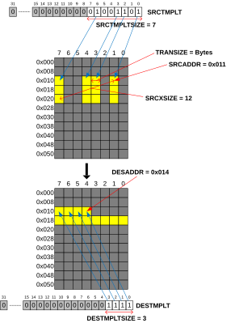

# Templated transfers

Source: <https://developer.arm.com/documentation/102482/0000/DMAC-operation/DMAC-operation-extended-commands/Templated-transfers>

### Templated transfers

The templated transfer feature allows 1D transfers to selectively copy data using predefined patterns. The patterns are defined by template registers that describe repetitive bit-mask of addresses to be transferred.

The following diagram gives an example for templated transfers:

Figure 1. TMPLT

The bit masks are defined in the template registers SRCTMPLT / DESTMPLT. There are separate source and destination template registers as well as source and destination template size fields that define the length of the templates. The source and destination sides can be configured independently.

The lowest bit of the template registers are fixed to 1. There cannot be initial gaps in the transfer and there is always data transferred at the start addresses defined by SRCADDR / DESADDR. If an initial gap is still required, the addresses must be displaced so that the first transfers are located at SRCADDR / DESADDR.

The actual template sizes are defined as SRCTMPLTSIZE + 1 / DESTMPLTSIZE + 1. The default settings of zeroes mean that templating is disabled. The template feature is enabled by setting one of the template sizes to be greater than one, that is SRCTMPLTSIZE > 0 and DESTMPLTSIZE > 0 or both. The higher bits of the mask in the template registers that fall out of the defined template size are ignored.

### Address calculation

The templated transfer feature always uses single transfers to transfer data, it does not try to combine the consecutive transfers into bursts. A new address is calculated for the transfer in each cycle.

### Templated transfers with stream interface

The stream interface (AXI4-Stream) is not aware of the template type as it always receives packed data. Only the AXI addressing deals with the patterns on both source and destination sides.
