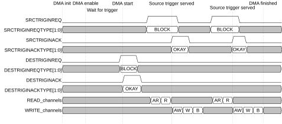
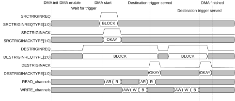

# Trigger input flow control mode

Source: <https://developer.arm.com/documentation/102482/0000/DMAC-operation/DMAC-operation-triggers/Trigger-inputs/Trigger-input-flow-control-mode>

### Trigger input flow control mode

Trigger inputs can also be used for flow control purposes and only enable small parts of a larger command for every trigger. For this mode, the SW must set the trigger size which tells the number of transfer size blocks to be accessed for one trigger event. The source trigger input is used to control the read flow, while the destination trigger input controls the write flow of a DMA operation.

Figure 1. Flow control mode trigger for source and command for destination

The figure shows that the read transfers can only start after the destination command trigger and the source trigger is also received. Writes on the destination side can only start when there is enough data received from the source side.

When source trigger is set to flow control mode, read operations of a DMA channel stall until the first trigger request is received.

Figure 2. Command trigger for source and block for destination

The figure shows that the destination trigger request arrives first but the command still must wait for the source trigger to arrive. The read transfers start right after the source command trigger is received. The writes can only start when the destination trigger is received and there is enough data to send. The DMAC preloads the data in its internal FIFO so that the writes can happen as soon as possible when the next destination trigger is received.

When destination trigger is set, write operations of a DMA channel stall until it receives the first trigger request. Read operations can already start and fill the FIFO before the destination trigger handshake is done.

When a trigger input request is received, the command execution can start and the DMA channel exits from the waiting state. The DMAC only accesses the number of transfers specified by the block size register as a maximum. The DMAC does not raise the trigger acknowledge until the DMA operation for the block size amount of transfers last (allowing smaller blocks for the final block) and the response of the last transfer is received.

The DMA channel waits for all response transactions to arrive before the acknowledge is asserted. The handshake must return to idle for the state machine to return to the “wait for trigger” or “finished” state. This adds higher latency between triggers as the address generation stalls until the last response is received. However, it also avoids timing conflicts between parallel trigger acknowledgments and AXI transfers arriving at the peripheral side.

The DMA channel can be set to allow DMAC flow-control operation for both source and destination sides. In this mode, the DMA channel counts the number of transfers and, when the required number is reached, it ends the DMA channel operation. The DMA channel sends OKAY ACK to the peripheral when there are still transfer size blocks to be transferred. When the last transfer size block is reached the DMA channel sends LAST OKAY ack.

Figure 3. Trigger input ACK assertion and deassertion for block triggers

The figure shows the ack deassertion approach of the DMAC when using block triggers.

t0
:   The Trigger Interface is in IDLE.

t1
:   The peripheral requests a BLOCK or SINGLE trigger type.

t2
:   The DMAC started the execution of the request as soon as possible and at t2 all transfers requested for this operation are finished.

t3
:   The peripheral deasserts the
    req signal when it receives the OKAY response from the DMAC.

t4
:   The DMAC is finished with servicing the request and deasserts the
    ack signal when it is ready to accept a new request.
