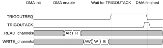

# Trigger outputs

Source: <https://developer.arm.com/documentation/102482/0000/DMAC-operation/DMAC-operation-triggers/Trigger-outputs>

### Trigger outputs

Trigger outputs define the end of the command execution before the DONE interrupt is asserted. They can be used to synchronize activities between HW elements in the system.

When waiting for trigger output acknowledge, the channel operation is stalled until the acknowledge is received and trigger output interface of the channel returns back to IDLE.

Figure 1. Trigger output request assertion

A channel has one trigger output port when enabled.

> ### Note
>
> For debug purposes, the SW can mimic the external HW trigger. See [Software triggers](/documentation/102482/0000/DMAC-operation/DMAC-operation-triggers/Software-triggers?lang=en "The software Trigger Interfaces are provided to enable the software to interact with triggering. They can be used for synchronizing the DMAC operation with the software, or during development, it can be a substitute for hardware trigger events.") for more information.
