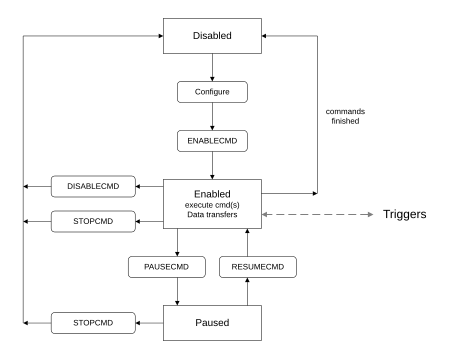

# DMA Channel lifecycle

Source: <https://developer.arm.com/documentation/102482/0000/DMAC-operation/DMA-Channel-lifecycle>

### DMA Channel lifecycle

The operation of a DMA channel is shown in the following figure:

Figure 1. DMA channel lifecycle

### Disabled state

After reset, the channel is in the disabled state. The command to be executed must be set up by configuring the channel registers. The software can modify every writable configuration register in this state.

After the channel is configured, the execution is started by setting the ENABLECMD bit in the CH<x>\_CMD register.

### Enabled state

Execution of the command happens in the Enabled state. When the ENABLECMD bit is set, the ch\_enabled signal is asserted to indicate ongoing command execution. This status signal remains HIGH until the command is completed and no other command linked command is configured, or the channel operation is stopped manually or because of an error event.

In the enabled state, all configuration registers of the channel become HW-controlled ones. The SW is still allowed to read the registers, but the HW is updating their contents throughout the operation of the command. The only registers the SW can adjust during the command operation are the CH<x>\_CMD, CH<x>\_STATUS, and CH<x>\_WRKREGPTR registers that allow the SW to stop or pause the command execution, clear interrupts and inspect internal work register states.

The following size and address registers are continuously updated during the data transfer to show the current state of the transfer:

- CH<x>\_SRCADDR / CH<x>\_SRCADDRHI
- CH<x>\_DESADDR / CH<x>\_DESADDRHI
- CH<x>\_XSIZE / CH<x>\_XSIZEHI
- CH<x>\_YSIZE

The \*ADDR registers point to the next location in the memory where accesses are made. The \*SIZE registers count down from the starting value to 0 and show the remaining number of transfers when read. A counter value cannot explicitly show that the command is finished as 2D or wrap operations might restart the counters or finish earlier.

The command execution ends in the following cases:

- The command is finished successfully.
- An error event (for example, configuration error) causes the command to stop.
- The channel is disabled because of setting the DISABLECMD bit in the CH<x>\_CMD register.
- The channel is stopped because of:

  - Setting the STOPCMD bit in the CH<x>\_CMD register
  - Setting the ALLCHSTOP bit in the NSEC\_CTRL / SEC\_CTRL register (depending on the configured security of the channel)
  - Asserting the allch\_stop\_req\_nonsec / allch\_stop\_req\_sec signal (depending on the configured security of the channel)

The channel returns to the disabled state when any of the previous conditions cause the command to end its execution. The status flags (STAT\_\* fields in the CH<x>\_STATUS register) are set when returning to disabled state. The SW can inspect the status flags to determine whether the execution was successful or an error occurred.

### Paused state

The channel enters the paused state when a pause request is issued. A pause request can be issued by:

- Setting the PAUSECMD bit in the CH<x>\_CMD register (SW pause request).
- Setting the ALLCHPAUSE bit in the NSEC\_CTRL / SEC\_CTRL register (depending on the configured security of the channel).
- Asserting the allch\_pause\_req\_nonsec / allch\_pause\_req\_sec signal (depending on the configured security of the channel).
- Automatic SW pause request when the STAT\_DONE flag is asserted and the channel has been preconfigured to enable done-pause by setting the DONEPAUSEEN bit in the CH<x>\_CTRL register.
- Cross Trigger Interface
- Warm reset

In the paused state, the channel execution is stalled. The bus transactions are stopped and processing of triggers is also halted. The SW can inspect the channel state while being paused, as the address and size registers reflect the current state of the channel. Internal channel registers can also be inspected by setting the CH<x>\_WRKREGPTR and reading the CH<x>\_WRKREGVAL register.

Operation of the channel is continued when the pause request is revoked:

- SW pause request, including done-pause, can be revoked by setting the RESUMECMD bit in the CH<x>\_CMD register.
- All-channel-pause request is revoked by clearing the STAT\_ALLCHPAUSED flag in the NSEC\_STATUS / SEC\_STATUS register.
- HW pause request is revoked by deasserting the allch\_pause\_req\_nonsec / allch\_pause\_req\_sec signal.

The channel can be stopped in the paused state by issuing a stop command.

> ### Note
>
> The channel remains enabled (ch\_enabled asserted) in the paused state, only the execution is halted temporarily. The configuration registers remain read-only when paused.

- **[Command execution states](/documentation/102482/0000/DMAC-operation/DMA-Channel-lifecycle/Command-execution-states?lang=en)**
   Each command has various steps that are executed in a fixed order. Some steps can be skipped depending on the configuration of the command.
- **[Automatic restart of commands](/documentation/102482/0000/DMAC-operation/DMA-Channel-lifecycle/Automatic-restart-of-commands?lang=en)**
   The auto restart feature improves the efficiency when a single command must be repeated many times in a loop, by eliminating unnecessary reloading of the same command.
- **[Error handling](/documentation/102482/0000/DMAC-operation/DMA-Channel-lifecycle/Error-handling?lang=en)**
   There are four types of errors that can occur during DMAC operation:
- **[Command execution status reporting](/documentation/102482/0000/DMAC-operation/DMA-Channel-lifecycle/Command-execution-status-reporting?lang=en)**
   The software can read the contents of X, Y size, and address registers after the DMA command execution.
