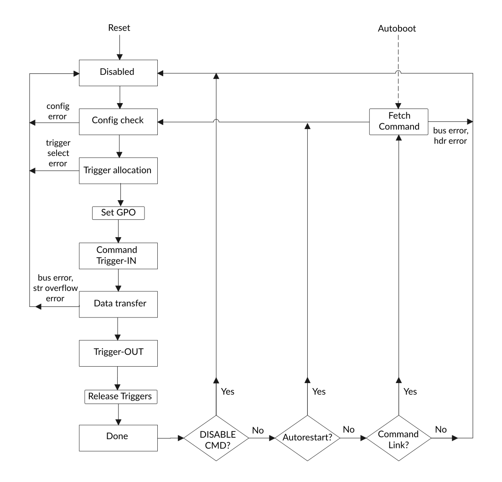

# Command execution states

Source: <https://developer.arm.com/documentation/102482/0000/DMAC-operation/DMA-Channel-lifecycle/Command-execution-states>

### Command execution states

Each command has various steps that are executed in a fixed order. Some steps can be skipped depending on the configuration of the command.

The following flowchart illustrates the DMA channel command execution states.

Figure 1. DMA channel command states

### Configuration checking state

This state verifies the configuration of the channel. If an invalid register value or conflicting settings are detected, the corresponding error status flags are set, and the channel operation is stopped.

### Trigger allocation state

If an external HW trigger or internal triggering is configured, the selected trigger port or channel connection is made in this state. If the connection could not be established, a trigger selection error is indicated, and the channel operation is stopped. If only SW triggering, or no triggering is configured, this step is ignored. The GPO output is set to the new value (if configured) before proceeding to the next state.

### Command trigger state

The command trigger state handles the incoming command trigger requests when a command trigger input is configured. The channel execution is halted until a command trigger request is received on all trigger inputs that are in command trigger mode. The trigger acknowledge is asserted only when all request is received. If no command trigger is configured, this step is ignored.

### Data transfer state

The data transfers occur in this state. Flow-control trigger are processed only in this state.

### Trigger output state

As the last step of a command, the trigger output request is asserted, if output triggering is configured. Operation halts until an acknowledgment is received. If no output triggering is configured, this step is skipped.

### Done state

Reaching this state indicates that the command has completed successfully. The trigger connections are released, and the STAT\_DONE flag is set depending on the configured DONE\_TYPE field.

If a DISABLECMD has been issued up to this point, the channel execution is finished and the STAT\_DISABLED flag is set.

If CMDRESTARTCNT is nonzero or CMDRESTARTINFEN is set, then the current command is restarted automatically. The CMDRESTARTCNT counter is decremented by 1 if it is nonzero.

If no automatic restart of the current command is configured, then the LINKADDREN flag is checked. If set, the command link feature is enabled, and the next command is fetched using the LINKADDR pointer.

> ### Note
>
> Each command in a command link can choose input and output triggers. The consecutive commands do not necessarily select the same triggers. Regardless, the triggers are reconnected at each command during the execution of the command-chain.
>
> When a trigger input request is sent to a DMA channel after the channel has received the last trigger it was expecting, the trigger request remains pending. The next command that is configured to use the same external trigger port or internal channel receives it. If the new linked command uses this same trigger, the next command can respond to it and no trigger event is lost.

If the auto restart and command link are both disabled, the channel operation is finished, and the channel returns to disabled state.

Otherwise, the DONEPAUSEEN flag is checked. If set, the channel execution is paused until a RESUMECMD is received.
