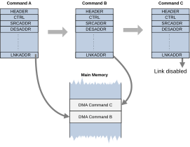

# Command structure

Source: <https://developer.arm.com/documentation/102482/0000/DMAC-operation/Command-linking/Command-structure>

### Command structure

The commands are stored in the system memory within a linked list data structure. Each command has information on what DMA channel configuration registers must be updated and a pointer to the next command.

The pointer to the next command is stored in the CH<x>\_LINKADDR / CH<x>\_LINKADDRHI configuration registers. The registers can be updated by the next command as any other channel configuration register.

The command chain is terminated by disabling the LINKADDREN flag (the 0th bit) in the CH<x>\_LINKADDR register. All other commands must have this flag enabled to indicate a valid link address.

The first command of the command chain must be set manually in the channel configuration registers. The first command can be empty and only link to the first real command in the chain.

### Linked command chain structure

The following figure illustrates a command chain data structure:

Figure 1. Command linking operation

### Command descriptors

The commands descriptors are encoded within a continuous array of 32-bit words in the memory.

The first 32-bit word of each command serves as a header that contains a bitmap to indicate what registers require updating. The header also has a special flag, REGCLEAR, that instructs the DMA channel to clear all the configuration registers that are modifiable by command link before updating them with the new values of the command. If this flag is not set, the configuration registers not updated by the command are kept at their previous settings.

The following table specifies the header word of the commands:

<table>
 <caption>
  
   
    Table 1.
   
   Command link header
  
 </caption>
 <colgroup>
  <col span="1"/>
  <col span="1"/>
  <col span="1"/>
 </colgroup>
 <thead>
  <tr>
   <th class="documents-nocellnorowborder" colspan="1" id="d43667e111" rowspan="1">
    

     Bit
    

   </th>
   <th class="documents-nocellnorowborder" colspan="1" id="d43667e115" rowspan="1">
    

     Name
    

   </th>
   <th class="documents-cell-norowborder" colspan="1" id="d43667e119" rowspan="1">
    

     Description
    

   </th>
  </tr>
 </thead>
 <tbody>
  <tr>
   <td class="documents-nocellnorowborder" colspan="1" rowspan="1">
    

     0 (LSB)
    

   </td>
   <td class="documents-nocellnorowborder" colspan="1" rowspan="1">
    

     REGCLEAR
    

   </td>
   <td class="documents-cell-norowborder" colspan="1" rowspan="1">
    

     Clear registers before updating with new values
    

   </td>
  </tr>
  <tr>
   <td class="documents-nocellnorowborder" colspan="1" rowspan="1">
    

     1
    

   </td>
   <td class="documents-nocellnorowborder" colspan="1" rowspan="1">
    

     Reserved
    

   </td>
   <td class="documents-cell-norowborder" colspan="1" rowspan="1">
    

     Reserved for future use, must be zero
    

   </td>
  </tr>
  <tr>
   <td class="documents-nocellnorowborder" colspan="1" rowspan="1">
    

     2
    

   </td>
   <td class="documents-nocellnorowborder" colspan="1" rowspan="1">
    

     INTREN
    

   </td>
   <td class="documents-cell-norowborder" colspan="1" rowspan="1">
    

     Update the CH&lt;x&gt;_INTREN register
    

   </td>
  </tr>
  <tr>
   <td class="documents-nocellnorowborder" colspan="1" rowspan="1">
    

     3
    

   </td>
   <td class="documents-nocellnorowborder" colspan="1" rowspan="1">
    

     CTRL
    

   </td>
   <td class="documents-cell-norowborder" colspan="1" rowspan="1">
    

     Update the CH&lt;x&gt;_CTRL register
    

   </td>
  </tr>
  <tr>
   <td class="documents-nocellnorowborder" colspan="1" rowspan="1">
    

     4
    

   </td>
   <td class="documents-nocellnorowborder" colspan="1" rowspan="1">
    

     SRCADDR
    

   </td>
   <td class="documents-cell-norowborder" colspan="1" rowspan="1">
    

     Update the CH&lt;x&gt;_SRCADDR register
    

   </td>
  </tr>
  <tr>
   <td class="documents-nocellnorowborder" colspan="1" rowspan="1">
    

     5
    

   </td>
   <td class="documents-nocellnorowborder" colspan="1" rowspan="1">
    

     SRCADDRHI
    

   </td>
   <td class="documents-cell-norowborder" colspan="1" rowspan="1">
    

     Update the CH&lt;x&gt;_SRCADDRHI register (when 40-bit addressing is used)
    

   </td>
  </tr>
  <tr>
   <td class="documents-nocellnorowborder" colspan="1" rowspan="1">
    

     6
    

   </td>
   <td class="documents-nocellnorowborder" colspan="1" rowspan="1">
    

     DESADDR
    

   </td>
   <td class="documents-cell-norowborder" colspan="1" rowspan="1">
    

     Update the CH&lt;x&gt;_SRCADDR register
    

   </td>
  </tr>
  <tr>
   <td class="documents-nocellnorowborder" colspan="1" rowspan="1">
    

     7
    

   </td>
   <td class="documents-nocellnorowborder" colspan="1" rowspan="1">
    

     DESADDRHI
    

   </td>
   <td class="documents-cell-norowborder" colspan="1" rowspan="1">
    

     Update the CH&lt;x&gt;_SRCADDRHI register (when 40-bit addressing is used)
    

   </td>
  </tr>
  <tr>
   <td class="documents-nocellnorowborder" colspan="1" rowspan="1">
    

     8
    

   </td>
   <td class="documents-nocellnorowborder" colspan="1" rowspan="1">
    

     XSIZE
    

   </td>
   <td class="documents-cell-norowborder" colspan="1" rowspan="1">
    

     Update the CH&lt;x&gt;_XSIZE register
    

   </td>
  </tr>
  <tr>
   <td class="documents-nocellnorowborder" colspan="1" rowspan="1">
    

     9
    

   </td>
   <td class="documents-nocellnorowborder" colspan="1" rowspan="1">
    

     XSIZEHI
    

   </td>
   <td class="documents-cell-norowborder" colspan="1" rowspan="1">
    

     Update the CH&lt;x&gt;_XSIZEHI register
    

   </td>
  </tr>
  <tr>
   <td class="documents-nocellnorowborder" colspan="1" rowspan="1">
    

     10
    

   </td>
   <td class="documents-nocellnorowborder" colspan="1" rowspan="1">
    

     SRCTRANSCFG
    

   </td>
   <td class="documents-cell-norowborder" colspan="1" rowspan="1">
    

     Update the CH&lt;x&gt;_SRCTRANSCFG register
    

   </td>
  </tr>
  <tr>
   <td class="documents-nocellnorowborder" colspan="1" rowspan="1">
    

     11
    

   </td>
   <td class="documents-nocellnorowborder" colspan="1" rowspan="1">
    

     DESTRANSCFG
    

   </td>
   <td class="documents-cell-norowborder" colspan="1" rowspan="1">
    

     Update the CH&lt;x&gt;_DESTRANSCFG register
    

   </td>
  </tr>
  <tr>
   <td class="documents-nocellnorowborder" colspan="1" rowspan="1">
    

     12
    

   </td>
   <td class="documents-nocellnorowborder" colspan="1" rowspan="1">
    

     XADDRINC
    

   </td>
   <td class="documents-cell-norowborder" colspan="1" rowspan="1">
    

     Update the CH&lt;x&gt;_XADDRINC register
    

   </td>
  </tr>
  <tr>
   <td class="documents-nocellnorowborder" colspan="1" rowspan="1">
    

     13
    

   </td>
   <td class="documents-nocellnorowborder" colspan="1" rowspan="1">
    

     YADDRSTRIDE
    

   </td>
   <td class="documents-cell-norowborder" colspan="1" rowspan="1">
    

     Update the CH&lt;x&gt;_YADDRSTRIDE register
    

   </td>
  </tr>
  <tr>
   <td class="documents-nocellnorowborder" colspan="1" rowspan="1">
    

     14
    

   </td>
   <td class="documents-nocellnorowborder" colspan="1" rowspan="1">
    

     FILLVAL
    

   </td>
   <td class="documents-cell-norowborder" colspan="1" rowspan="1">
    

     Update the CH&lt;x&gt;_FILLVAL register
    

   </td>
  </tr>
  <tr>
   <td class="documents-nocellnorowborder" colspan="1" rowspan="1">
    

     15
    

   </td>
   <td class="documents-nocellnorowborder" colspan="1" rowspan="1">
    

     YSIZE
    

   </td>
   <td class="documents-cell-norowborder" colspan="1" rowspan="1">
    

     Update the CH&lt;x&gt;_YSIZE register
    

   </td>
  </tr>
  <tr>
   <td class="documents-nocellnorowborder" colspan="1" rowspan="1">
    

     16
    

   </td>
   <td class="documents-nocellnorowborder" colspan="1" rowspan="1">
    

     TMPLTCFG
    

   </td>
   <td class="documents-cell-norowborder" colspan="1" rowspan="1">
    

     Update the CH&lt;x&gt;_TMPLTCFG register
    

   </td>
  </tr>
  <tr>
   <td class="documents-nocellnorowborder" colspan="1" rowspan="1">
    

     17
    

   </td>
   <td class="documents-nocellnorowborder" colspan="1" rowspan="1">
    

     SRCTMPLT
    

   </td>
   <td class="documents-cell-norowborder" colspan="1" rowspan="1">
    

     Update the CH&lt;x&gt;_SRCTMPLT register
    

   </td>
  </tr>
  <tr>
   <td class="documents-nocellnorowborder" colspan="1" rowspan="1">
    

     18
    

   </td>
   <td class="documents-nocellnorowborder" colspan="1" rowspan="1">
    

     DESTMPLT
    

   </td>
   <td class="documents-cell-norowborder" colspan="1" rowspan="1">
    

     Update the CH&lt;x&gt;_DESTMPLT register
    

   </td>
  </tr>
  <tr>
   <td class="documents-nocellnorowborder" colspan="1" rowspan="1">
    

     19
    

   </td>
   <td class="documents-nocellnorowborder" colspan="1" rowspan="1">
    

     SRCTRIGINCFG
    

   </td>
   <td class="documents-cell-norowborder" colspan="1" rowspan="1">
    

     Update the CH&lt;x&gt;_SRCTRIGINCFG register
    

   </td>
  </tr>
  <tr>
   <td class="documents-nocellnorowborder" colspan="1" rowspan="1">
    

     20
    

   </td>
   <td class="documents-nocellnorowborder" colspan="1" rowspan="1">
    

     DESTRIGINCFG
    

   </td>
   <td class="documents-cell-norowborder" colspan="1" rowspan="1">
    

     Update the CH&lt;x&gt;_DESTRIGINCFG register
    

   </td>
  </tr>
  <tr>
   <td class="documents-nocellnorowborder" colspan="1" rowspan="1">
    

     21
    

   </td>
   <td class="documents-nocellnorowborder" colspan="1" rowspan="1">
    

     TRIGOUTCFG
    

   </td>
   <td class="documents-cell-norowborder" colspan="1" rowspan="1">
    

     Update the CH&lt;x&gt;_TRIGOUTCFG register
    

   </td>
  </tr>
  <tr>
   <td class="documents-nocellnorowborder" colspan="1" rowspan="1">
    

     22
    

   </td>
   <td class="documents-nocellnorowborder" colspan="1" rowspan="1">
    

     GPOEN0
    

   </td>
   <td class="documents-cell-norowborder" colspan="1" rowspan="1">
    

     Update the CH&lt;x&gt;_GPOEN0 register
    

   </td>
  </tr>
  <tr>
   <td class="documents-nocellnorowborder" colspan="1" rowspan="1">
    

     23
    

   </td>
   <td class="documents-nocellnorowborder" colspan="1" rowspan="1">
    

     Reserved
    

   </td>
   <td class="documents-cell-norowborder" colspan="1" rowspan="1">
    

     Reserved for future use, must be zero
    

   </td>
  </tr>
  <tr>
   <td class="documents-nocellnorowborder" colspan="1" rowspan="1">
    

     24
    

   </td>
   <td class="documents-nocellnorowborder" colspan="1" rowspan="1">
    

     GPOVAL0
    

   </td>
   <td class="documents-cell-norowborder" colspan="1" rowspan="1">
    

     Update the CH&lt;x&gt;_GPOVAL0 register
    

   </td>
  </tr>
  <tr>
   <td class="documents-nocellnorowborder" colspan="1" rowspan="1">
    

     25
    

   </td>
   <td class="documents-nocellnorowborder" colspan="1" rowspan="1">
    

     Reserved
    

   </td>
   <td class="documents-cell-norowborder" colspan="1" rowspan="1">
    

     Reserved for future use, must be zero
    

   </td>
  </tr>
  <tr>
   <td class="documents-nocellnorowborder" colspan="1" rowspan="1">
    

     26
    

   </td>
   <td class="documents-nocellnorowborder" colspan="1" rowspan="1">
    

     STREAMINTCFG
    

   </td>
   <td class="documents-cell-norowborder" colspan="1" rowspan="1">
    

     Update the CH&lt;x&gt;_STREAMINTCFG register
    

   </td>
  </tr>
  <tr>
   <td class="documents-nocellnorowborder" colspan="1" rowspan="1">
    

     27
    

   </td>
   <td class="documents-nocellnorowborder" colspan="1" rowspan="1">
    

     Reserved
    

   </td>
   <td class="documents-cell-norowborder" colspan="1" rowspan="1">
    

     Reserved for future use, must be zero
    

   </td>
  </tr>
  <tr>
   <td class="documents-nocellnorowborder" colspan="1" rowspan="1">
    

     28
    

   </td>
   <td class="documents-nocellnorowborder" colspan="1" rowspan="1">
    

     LINKATTR
    

   </td>
   <td class="documents-cell-norowborder" colspan="1" rowspan="1">
    

     Update the CH&lt;x&gt;_LINKATTR register
    

   </td>
  </tr>
  <tr>
   <td class="documents-nocellnorowborder" colspan="1" rowspan="1">
    

     29
    

   </td>
   <td class="documents-nocellnorowborder" colspan="1" rowspan="1">
    

     AUTOCFG
    

   </td>
   <td class="documents-cell-norowborder" colspan="1" rowspan="1">
    

     Update the CH&lt;x&gt;_AUTOCFG register
    

   </td>
  </tr>
  <tr>
   <td class="documents-nocellnorowborder" colspan="1" rowspan="1">
    

     30
    

   </td>
   <td class="documents-nocellnorowborder" colspan="1" rowspan="1">
    

     LINKADDR
    

   </td>
   <td class="documents-cell-norowborder" colspan="1" rowspan="1">
    

     Update the CH&lt;x&gt;_LINKADDR register
    

   </td>
  </tr>
  <tr>
   <td class="documents-row-nocellborder" colspan="1" rowspan="1">
    

     31 (MSB)
    

   </td>
   <td class="documents-row-nocellborder" colspan="1" rowspan="1">
    

     LINKADDRHI
    

   </td>
   <td class="documents-cellrowborder" colspan="1" rowspan="1">
    

     Update the CH&lt;x&gt;_LINKADDRHI register (when 40-bit addressing is used)
    

   </td>
  </tr>
 </tbody>
</table>

> ### Note
>
> At least one bit of the header word must be set to 1, otherwise a configuration error is reported and execution of the command stops. For more information, see [Error handling](/documentation/102482/0000/DMAC-operation/DMA-Channel-lifecycle/Error-handling?lang=en "There are four types of errors that can occur during DMAC operation:").

The consecutive words in a command must contain the new values of the configuration registers that were indicated for updating in the header. They must be in the same order as the flags in the header starting from LSB to MSB.

### Example descriptors for linked commands

An example of three descriptors in the memory when 32-bit addressing is used:

<table>
 <caption>
  
   
    Table 2.
   
   Command link example memory map, HEADER_0
  
 </caption>
 <colgroup>
  <col span="1"/>
  <col span="1"/>
  <col span="1"/>
 </colgroup>
 <thead>
  <tr>
   <th class="documents-nocellnorowborder" colspan="1" id="d43667e656" rowspan="1">
    

     Descriptor offset
    

   </th>
   <th class="documents-nocellnorowborder" colspan="1" id="d43667e660" rowspan="1">
    

     Field
    

   </th>
   <th class="documents-cell-norowborder" colspan="1" id="d43667e664" rowspan="1">
    

     Value
    

   </th>
  </tr>
 </thead>
 <tbody>
  <tr>
   <td class="documents-nocellnorowborder" colspan="1" rowspan="1">
    

     
      0x000
     
    

   </td>
   <td class="documents-nocellnorowborder" colspan="1" rowspan="1">
    

     
      HEADER_0
     
    

   </td>
   <td class="documents-cell-norowborder" colspan="1" rowspan="1">
    

     
      0x0000_0D5D
     
    

   </td>
  </tr>
  <tr>
   <td class="documents-nocellnorowborder" colspan="1" rowspan="1">
    

     
      0x004
     
    

   </td>
   <td class="documents-nocellnorowborder" colspan="1" rowspan="1">
    

     INTREN
    

   </td>
   <td class="documents-cell-norowborder" colspan="1" rowspan="1">
    

     Any
    

   </td>
  </tr>
  <tr>
   <td class="documents-nocellnorowborder" colspan="1" rowspan="1">
    

     
      0x008
     
    

   </td>
   <td class="documents-nocellnorowborder" colspan="1" rowspan="1">
    

     CTRL
    

   </td>
   <td class="documents-cell-norowborder" colspan="1" rowspan="1">
    

     Simple 32-bit wide 1D
    

   </td>
  </tr>
  <tr>
   <td class="documents-nocellnorowborder" colspan="1" rowspan="1">
    

     
      0x00C
     
    

   </td>
   <td class="documents-nocellnorowborder" colspan="1" rowspan="1">
    

     SRCADDR
    

   </td>
   <td class="documents-cell-norowborder" colspan="1" rowspan="1">
    

     Any
    

   </td>
  </tr>
  <tr>
   <td class="documents-nocellnorowborder" colspan="1" rowspan="1">
    

     
      0x010
     
    

   </td>
   <td class="documents-nocellnorowborder" colspan="1" rowspan="1">
    

     DESADDR
    

   </td>
   <td class="documents-cell-norowborder" colspan="1" rowspan="1">
    

     Any
    

   </td>
  </tr>
  <tr>
   <td class="documents-nocellnorowborder" colspan="1" rowspan="1">
    

     
      0x014
     
    

   </td>
   <td class="documents-nocellnorowborder" colspan="1" rowspan="1">
    

     XSIZE
    

   </td>
   <td class="documents-cell-norowborder" colspan="1" rowspan="1">
    

     Any
    

   </td>
  </tr>
  <tr>
   <td class="documents-nocellnorowborder" colspan="1" rowspan="1">
    

     
      0x018
     
    

   </td>
   <td class="documents-nocellnorowborder" colspan="1" rowspan="1">
    

     SRCTRANSCFG
    

   </td>
   <td class="documents-cell-norowborder" colspan="1" rowspan="1">
    

     Any
    

   </td>
  </tr>
  <tr>
   <td class="documents-row-nocellborder" colspan="1" rowspan="1">
    

     
      0x01C
     
    

   </td>
   <td class="documents-row-nocellborder" colspan="1" rowspan="1">
    

     DESTRANSCFG
    

   </td>
   <td class="documents-cellrowborder" colspan="1" rowspan="1">
    

     Any
    

   </td>
  </tr>
 </tbody>
</table>

<table>
 <caption>
  
   
    Table 3.
   
   Command link example memory map, HEADER_1
  
 </caption>
 <colgroup>
  <col span="1"/>
  <col span="1"/>
  <col span="1"/>
 </colgroup>
 <thead>
  <tr>
   <th class="documents-nocellnorowborder" colspan="1" id="d43667e823" rowspan="1">
    

     Descriptor Offset
    

   </th>
   <th class="documents-nocellnorowborder" colspan="1" id="d43667e827" rowspan="1">
    

     Field
    

   </th>
   <th class="documents-cell-norowborder" colspan="1" id="d43667e831" rowspan="1">
    

     Value
    

   </th>
  </tr>
 </thead>
 <tbody>
  <tr>
   <td class="documents-nocellnorowborder" colspan="1" rowspan="1">
    

     
      0x020
     
    

   </td>
   <td class="documents-nocellnorowborder" colspan="1" rowspan="1">
    

     
      HEADER_1
     
    

   </td>
   <td class="documents-cell-norowborder" colspan="1" rowspan="1">
    

     
      0x4000_0158
     
    

   </td>
  </tr>
  <tr>
   <td class="documents-nocellnorowborder" colspan="1" rowspan="1">
    

     
      0x024
     
    

   </td>
   <td class="documents-nocellnorowborder" colspan="1" rowspan="1">
    

     CTRL
    

   </td>
   <td class="documents-cell-norowborder" colspan="1" rowspan="1">
    

     Simple 8-bit wide 1D
    

   </td>
  </tr>
  <tr>
   <td class="documents-nocellnorowborder" colspan="1" rowspan="1">
    

     
      0x028
     
    

   </td>
   <td class="documents-nocellnorowborder" colspan="1" rowspan="1">
    

     SRCADDR
    

   </td>
   <td class="documents-cell-norowborder" colspan="1" rowspan="1">
    

     Any
    

   </td>
  </tr>
  <tr>
   <td class="documents-nocellnorowborder" colspan="1" rowspan="1">
    

     
      0x02C
     
    

   </td>
   <td class="documents-nocellnorowborder" colspan="1" rowspan="1">
    

     DESADDR
    

   </td>
   <td class="documents-cell-norowborder" colspan="1" rowspan="1">
    

     Any
    

   </td>
  </tr>
  <tr>
   <td class="documents-nocellnorowborder" colspan="1" rowspan="1">
    

     
      0x030
     
    

   </td>
   <td class="documents-nocellnorowborder" colspan="1" rowspan="1">
    

     XSIZE
    

   </td>
   <td class="documents-cell-norowborder" colspan="1" rowspan="1">
    

     Any
    

   </td>
  </tr>
  <tr>
   <td class="documents-row-nocellborder" colspan="1" rowspan="1">
    

     
      0x034
     
    

   </td>
   <td class="documents-row-nocellborder" colspan="1" rowspan="1">
    

     LINKADDR
    

   </td>
   <td class="documents-cellrowborder" colspan="1" rowspan="1">
    

     Descriptor offset +
     
      0x038
     
     + 1 (ENABLE BIT)
    

   </td>
  </tr>
 </tbody>
</table>

<table>
 <caption>
  
   
    Table 4.
   
   Command link example memory map, HEADER_2
  
 </caption>
 <colgroup>
  <col span="1"/>
  <col span="1"/>
  <col span="1"/>
 </colgroup>
 <thead>
  <tr>
   <th class="documents-nocellnorowborder" colspan="1" id="d43667e961" rowspan="1">
    

     Descriptor Offset
    

   </th>
   <th class="documents-nocellnorowborder" colspan="1" id="d43667e965" rowspan="1">
    

     Field
    

   </th>
   <th class="documents-cell-norowborder" colspan="1" id="d43667e969" rowspan="1">
    

     Value
    

   </th>
  </tr>
 </thead>
 <tbody>
  <tr>
   <td class="documents-nocellnorowborder" colspan="1" rowspan="1">
    

     
      0x038
     
    

   </td>
   <td class="documents-nocellnorowborder" colspan="1" rowspan="1">
    

     
      HEADER_2
     
    

   </td>
   <td class="documents-cell-norowborder" colspan="1" rowspan="1">
    

     
      0x4000_0140
     
    

   </td>
  </tr>
  <tr>
   <td class="documents-nocellnorowborder" colspan="1" rowspan="1">
    

     
      0x03C
     
    

   </td>
   <td class="documents-nocellnorowborder" colspan="1" rowspan="1">
    

     DESADDR
    

   </td>
   <td class="documents-cell-norowborder" colspan="1" rowspan="1">
    

     Any
    

   </td>
  </tr>
  <tr>
   <td class="documents-nocellnorowborder" colspan="1" rowspan="1">
    

     
      0x040
     
    

   </td>
   <td class="documents-nocellnorowborder" colspan="1" rowspan="1">
    

     XSIZE
    

   </td>
   <td class="documents-cell-norowborder" colspan="1" rowspan="1">
    

     Any
    

   </td>
  </tr>
  <tr>
   <td class="documents-row-nocellborder" colspan="1" rowspan="1">
    

     
      0x044
     
    

   </td>
   <td class="documents-row-nocellborder" colspan="1" rowspan="1">
    

     LINKADDR
    

   </td>
   <td class="documents-cellrowborder" colspan="1" rowspan="1">
    

     
      0x000
     
    

   </td>
  </tr>
 </tbody>
</table>

The Any value means that the SW can set it to whatever the command requires.

The HEADER\_0 defines a command that sets up a complete 1D transfer with all registers necessary. This is because the header contained the REGCLEAR bit set which clears all previous settings from the channel registers. It also terminates that command chain because the REGCLEAR command cleared the LINKADDR as well.

Another chained command is stored in the memory defined by HEADER\_1, independent from the first one. It sets a new CTRL register content, updates SRCADDR and DESADDR values and sets the XSIZE to define the length of the command. The other register settings remain the same as the first command in this command chain. It also updates the LINKADDR register and links the command to the next command defined by HEADER\_2. When the command defined by HEADER\_1 is finished, the next descriptor at HEADER\_2 is read. This only changes the DESADDR and the XSIZE compared to the previous command. This might be used to copy the trailing source data to a different location. This is the final command in the chain, so it terminates the link by setting the LINKADDR register to 0 that clears the LINKADDREN enable bit.
