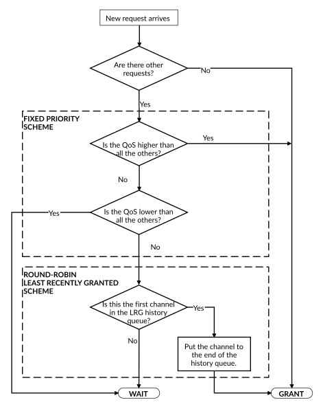

# Arbitration scheme

Source: <https://developer.arm.com/documentation/102482/0000/DMAC-operation/Arbitration/Arbitration-scheme>

### Arbitration scheme

This section describes the Least-Recently Granted (LRG) arbitration algorithm.

### LRG Arbitration algorithm

The BIU implements an LRG arbitration algorithm for selecting which DMA channel request to serve. The LRG algorithm’s input parameters are priority settings indicated by AXI arqos and awqos attributes in the requests. The priorities are set in configuration registers by SW and can only be changed when the channel is in IDLE.

The arbitration policy is separated to two layers depending on the priority setting of the channel:

- Priority-based arbitration layer that arbitrates between channels of different priority levels.
- Round-robin scheme arbitration layer that arbitrates between channels with the same priority level, based on which of them was least recently granted.

The base layer is a fixed arbitration scheme if the priority settings are different per channel. When multiple requests have different priorities, the single request with the highest priority wins the arbitration. When multiple channels have the highest priority a round robin scheme, least-recently granted (LRG) is applied resulting in a fair share of the bus interface. When all channels are using the round robin scheme, all channels get arbitrated in every round if they had a request since arbitration happens after every burst. When one channel must have higher priority than the others, it can be escalated to the fixed priority layer by setting the priority value above the others. This can lead to starvation of low-priority requests but it ensures a deterministic execution of high priority tasks. A channel using the fixed priority scheme has a higher priority than the round robin scheme so it gets arbitrated first until it runs out of requests. This scheme keeps the flexibility for the SW to set any kind of priority policy in the system. This also allows for time-critical tasks to happen and channels with the same priority use the bus in an even share.

The round robin scheme saves the history of the granted requests. The scheme sorts the channels by descending order of the time of grant, that is from the least recently granted to the most recently granted. When multiple channels have higher priority, the round robin scheme only considers the channels with the highest priority level and selects the least recently granted channel based on the serving history. The same applies when all requests have been served on the higher priority level and the same channels have new requests on a lower priority level which has more outstanding requests. That is, the round robin scheme considers all the channels with the same (highest) priority level and selects the least recently granted channel.

The following figure describes the LRG algorithm in detail:

Figure 1. LRG arbitration algorithm

In some corner cases, starvation can occur for lower priority channels when high priority requests and low-priority requests are interleaved. For example, this starvation can be caused by an infinitely looped command linked list where the SW frequently enables a higher priority channel and takes all the timeslots from lower priority channels. Reads for command linking also happen with the same priority and same arbitration scheme as the other data-related reads. These cases can be avoided by managing the risks of starvation in SW when using high priority channels together with low-priority ones. The DMAC does not implement fair share algorithms to avoid these situations and it is up to the SW designer to take this into consideration. In a generic approach, free timeslots occur when the high priority channels wait for trigger, wait for responses to arrive, get reconfigured over APB4 or read a new command from the linked list. These free timeslots could be used to enable the low-priority channels to progress in their operation.

> ### CAUTION
>
> Infinitely looped command link lists can result in starvation of lower priority levels.
