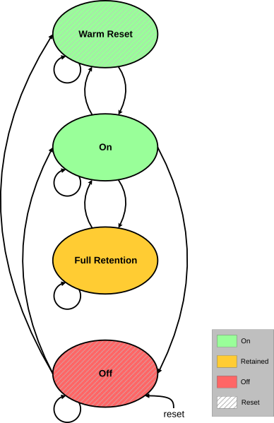

# Power P-Channel

Source: <https://developer.arm.com/documentation/102482/0000/DMAC-operation/DMAC-power-management-and-DMAC-control/Power-management/Power-P-Channel>

### Power P-Channel

The DMA-350 is using one full LPI P-Channel for power management. The purpose of this feature is to enable lower power states (removing power) to reduce power consumption while not in active use. The power P-Channel is used to control the power state of the DMAC logic.

The following four power states can be requested over the P-Channel interface, any other state requests are denied:

- On
- Warm reset mode
- Full retention mode
- Off

The DMAC has a simple power management scenario with the P-Channel interface. When the DMAC is active, power quiescence requests are denied and the operation simply continues. Warm reset mode request pauses all ongoing channel operation and exiting from Warm reset mode to On resumes the channel operation. When the DMAC is actively waiting for an event, the quiescence request to Full retention mode state is accepted but Off state is denied. When the DMAC is inactive, request to Off state is accepted. Before entering Off state, FIFOs are emptied and register values are not kept.

The following figure shows the supported power states and transitions between power states.

Figure 1. Supported power states and transitions

Entering lower power modes (Full retention mode, Off) can be disabled with the DISMINPWR field of configuration registers [NSEC\_CTRL](/documentation/102482/0000/Programmers-model/Register-descriptions/DMANSECCTRL-description/NSEC-CTRL?lang=en "The Non-secure Control registers can be used to adjust the interrupt generation and general behavior of the Non-secure channels.") and [SEC\_CTRL](/documentation/102482/0000/Programmers-model/Register-descriptions/DMASECCTRL-description/SEC-CTRL?lang=en "The Secure Control registers can be used to adjust the interrupt generation and general behavior of the Secure channels."). In effect of the settings of the registers the power state request is denied if the minimum power state set in DISMINPWR is higher than the requested power state and there is at least one channel configured as Non-secure or Secure respectively.

Entering Full retention mode state while the DMA is in an actively waiting state can be Disabled and Enabled by the IDLERETEN field of configuration registers [NSEC\_CTRL](/documentation/102482/0000/Programmers-model/Register-descriptions/DMANSECCTRL-description/NSEC-CTRL?lang=en "The Non-secure Control registers can be used to adjust the interrupt generation and general behavior of the Non-secure channels.") and [SEC\_CTRL](/documentation/102482/0000/Programmers-model/Register-descriptions/DMASECCTRL-description/SEC-CTRL?lang=en "The Secure Control registers can be used to adjust the interrupt generation and general behavior of the Secure channels."). In effect of the settings of these registers the power state request is always denied if IDLERETEN is set to Disabled, the requested state is Full retention mode and at least one Non-secure or Secure channel (according to the IDLERETEN field’s security) is waiting for an event.

For more information on the P-Channel handshake mechanism, see the [AMBA® Low Power Interface Specification](https://developer.arm.com/documentation/ihi0068/) document.

For P-Channel interface signals, see [Signal descriptions](/documentation/102482/0000/Signal-descriptions?lang=en "This appendix contains all signal descriptions.").
