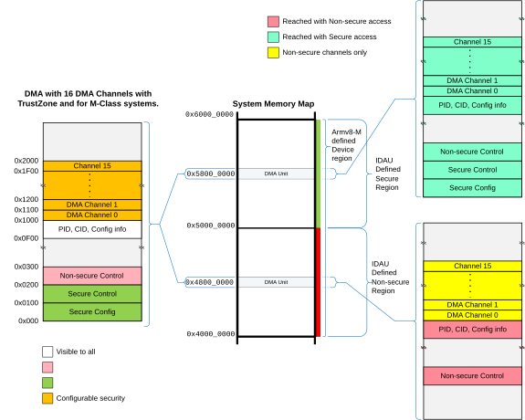

# Configuration

Source: <https://developer.arm.com/documentation/102482/0000/DMAC-operation/DMAC-power-management-and-DMAC-control/Configuration>

### Configuration

The DMA-350 can be set up through its configuration registers. These registers are divided into several frames. Each register frame occupies a 256 byte address space.

The layout of the register frames is shown in the following figure.

Figure 1. DMA register frame layout

The whole DMA unit occupies an 8kB configuration address space. For detailed description about each register, see [Register descriptions](/documentation/102482/0000/Programmers-model/Register-descriptions?lang=en "Register summary provides cross references to individual registers.").

- **[DMA unit configuration](/documentation/102482/0000/DMAC-operation/DMAC-power-management-and-DMAC-control/Configuration/DMA-unit-configuration?lang=en)**
   The following four register frames are associated with the DMA unit:
- **[Channel configuration](/documentation/102482/0000/DMAC-operation/DMAC-power-management-and-DMAC-control/Configuration/Channel-configuration?lang=en)**
   Each DMA channel has its own register frame which contains the channel-specific configuration registers. The configuration registers are writable only when the channel is not enabled. When the ENABLECMD bit is set in the CH<x>\_CMD register, the settings are frozen throughout the execution of the command.
