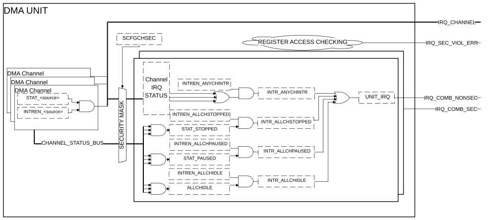

# Interrupt operation

Source: <https://developer.arm.com/documentation/102482/0000/DMAC-operation/Interrupt-operation>

### Interrupt operation

Each channel has its own interrupt to indicate state changes within the channel. There are DMA unit level interrupts that show unit level state changes. The SW can enable, disable, or clear the interrupts.

When both Secure and Non-secure interrupts are used, each interrupt has its handler running in the proper security world. This means that alignment is required when changing the Security state of the channels. The channel interrupt is considered Secure when the channel is configured as Secure.

The channel and unit level interrupts can be seen in the following figure.

Figure 1. DMA Unit level interrupts

<table>
 <caption>
  
   
    Table 1.
   
   Non-secure DMA level interrupt signal sources
  
 </caption>
 <colgroup>
  <col span="1"/>
  <col span="1"/>
 </colgroup>
 <thead>
  <tr>
   <th class="documents-nocellnorowborder" colspan="1" id="d5294e81" rowspan="1">
    

     Interrupt source
    

   </th>
   <th class="documents-cell-norowborder" colspan="1" id="d5294e85" rowspan="1">
    

     Description
    

   </th>
  </tr>
 </thead>
 <tbody>
  <tr>
   <td class="documents-nocellnorowborder" colspan="1" rowspan="1">
    

     
      
       chintrstatus0
      
     
    

   </td>
   <td class="documents-cell-norowborder" colspan="1" rowspan="1">
    

     Collated channel Non-secure interrupts.
    

   </td>
  </tr>
  <tr>
   <td class="documents-nocellnorowborder" colspan="1" rowspan="1">
    

     
      
       intr_anychintr
      
     
    

   </td>
   <td class="documents-cell-norowborder" colspan="1" rowspan="1">
    

     This interrupt is a combined Non-secure interrupt, combining the other Non-secure interrupt sources and all the Non-secure channel interrupts when NSEC_CTRL.INTREN_ANYCHINTR is set to
     <code>
      1
     </code>
     .
    

   </td>
  </tr>
  <tr>
   <td class="documents-nocellnorowborder" colspan="1" rowspan="1">
    

     
      
       intr_allchidle
      
     
    

   </td>
   <td class="documents-cell-norowborder" colspan="1" rowspan="1">
    

     This interrupt is raised when every Non-secure channel returns to IDLE state from a non-IDLE state. The interrupt is not asserted after reset.
    

   </td>
  </tr>
  <tr>
   <td class="documents-nocellnorowborder" colspan="1" rowspan="1">
    

     
      
       intr_allchstopped
      
     
    

   </td>
   <td class="documents-cell-norowborder" colspan="1" rowspan="1">
    

     This interrupt is raised when the last Non-secure channel enters stopped state.
    

   </td>
  </tr>
  <tr>
   <td class="documents-row-nocellborder" colspan="1" rowspan="1">
    

     
      
       intr_allchpaused
      
     
    

   </td>
   <td class="documents-cellrowborder" colspan="1" rowspan="1">
    

     This interrupt is raised when the last Non-secure channel enters paused state.
    

   </td>
  </tr>
 </tbody>
</table>

<table>
 <caption>
  
   
    Table 2.
   
   Secure DMA level interrupt signal sources
  
 </caption>
 <colgroup>
  <col span="1"/>
  <col span="1"/>
 </colgroup>
 <thead>
  <tr>
   <th class="documents-nocellnorowborder" colspan="1" id="d5294e174" rowspan="1">
    

     Interrupt source
    

   </th>
   <th class="documents-cell-norowborder" colspan="1" id="d5294e178" rowspan="1">
    

     Description
    

   </th>
  </tr>
 </thead>
 <tbody>
  <tr>
   <td class="documents-nocellnorowborder" colspan="1" rowspan="1">
    

     
      
       chintrstatus0
      
     
    

   </td>
   <td class="documents-cell-norowborder" colspan="1" rowspan="1">
    

     Collated channel Secure interrupt flags.
    

   </td>
  </tr>
  <tr>
   <td class="documents-nocellnorowborder" colspan="1" rowspan="1">
    

     
      
       intr_anychintr
      
     
    

   </td>
   <td class="documents-cell-norowborder" colspan="1" rowspan="1">
    

     This interrupt is a combined Secure interrupt, combining the other Secure interrupt sources and all the Secure channel interrupts when SEC_CTRL.INTREN_ANYCHINTR is set to
     <code>
      1
     </code>
     .
    

   </td>
  </tr>
  <tr>
   <td class="documents-nocellnorowborder" colspan="1" rowspan="1">
    

     
      
       intr_allchidle
      
     
    

   </td>
   <td class="documents-cell-norowborder" colspan="1" rowspan="1">
    

     This interrupt is raised when every Secure channel returns to idle state from a non-idle state. The interrupt is not asserted after reset.
    

   </td>
  </tr>
  <tr>
   <td class="documents-nocellnorowborder" colspan="1" rowspan="1">
    

     
      
       intr_allchstopped
      
     
    

   </td>
   <td class="documents-cell-norowborder" colspan="1" rowspan="1">
    

     This interrupt is raised when the last Secure channel enters stopped state.
    

   </td>
  </tr>
  <tr>
   <td class="documents-row-nocellborder" colspan="1" rowspan="1">
    

     
      
       intr_allchpaused
      
     
    

   </td>
   <td class="documents-cellrowborder" colspan="1" rowspan="1">
    

     This interrupt is raised when the last Secure channel enters paused state.
    

   </td>
  </tr>
 </tbody>
</table>

The irq\_sec\_viol\_err interrupt signal is provided to notify the Secure entity that a security violation has occurred with register access to the DMA. The irq\_sec\_viol\_err interrupt signal does not exist when SECEXT\_PRESENT is set to `0`.
