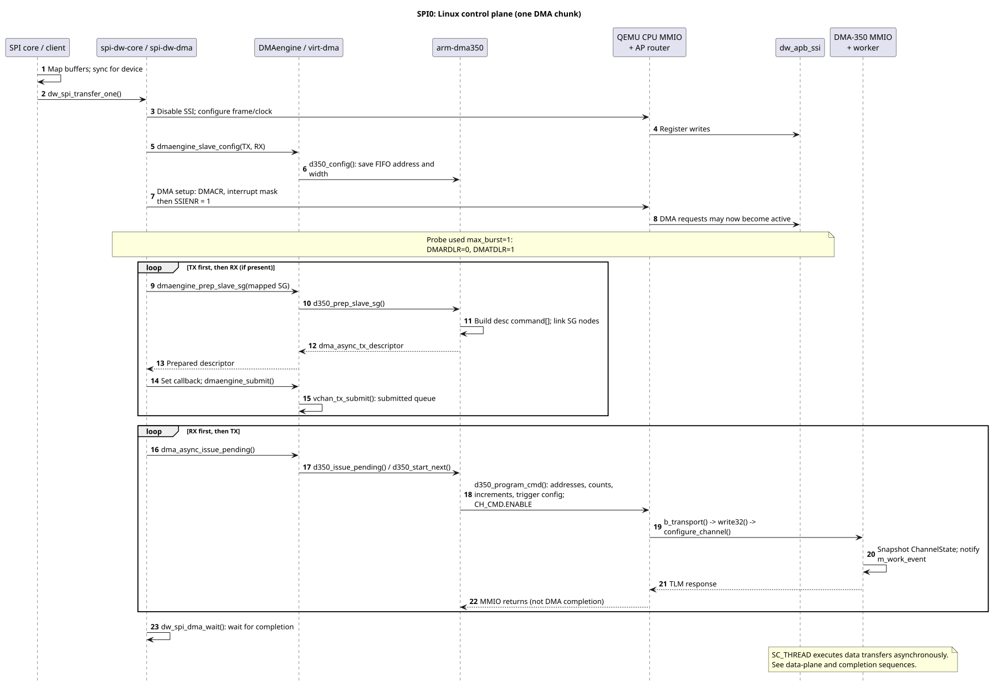
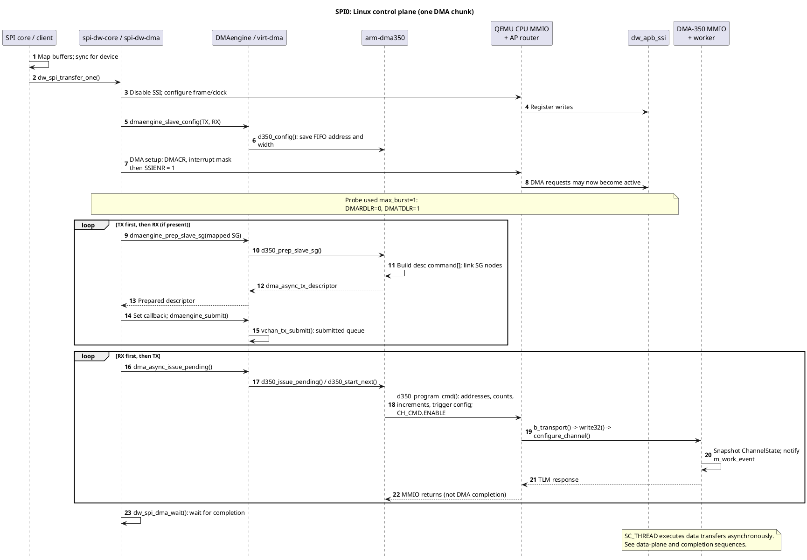
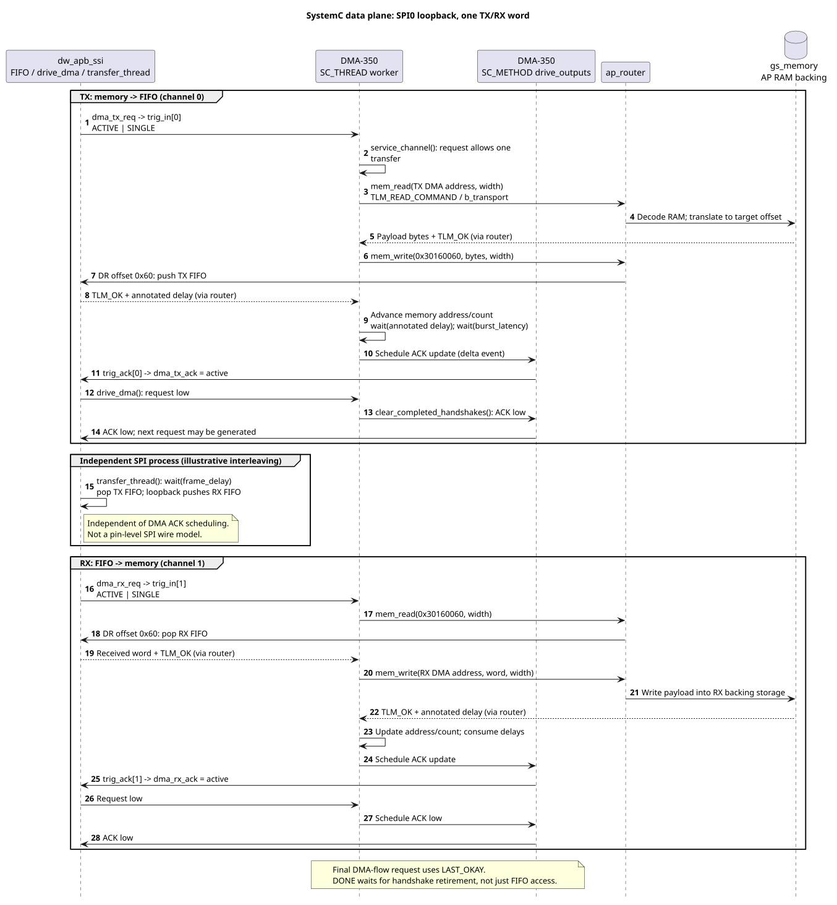
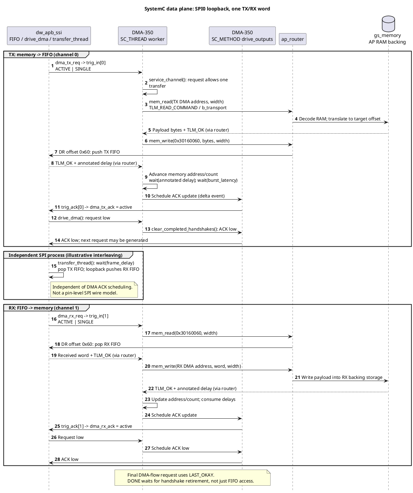
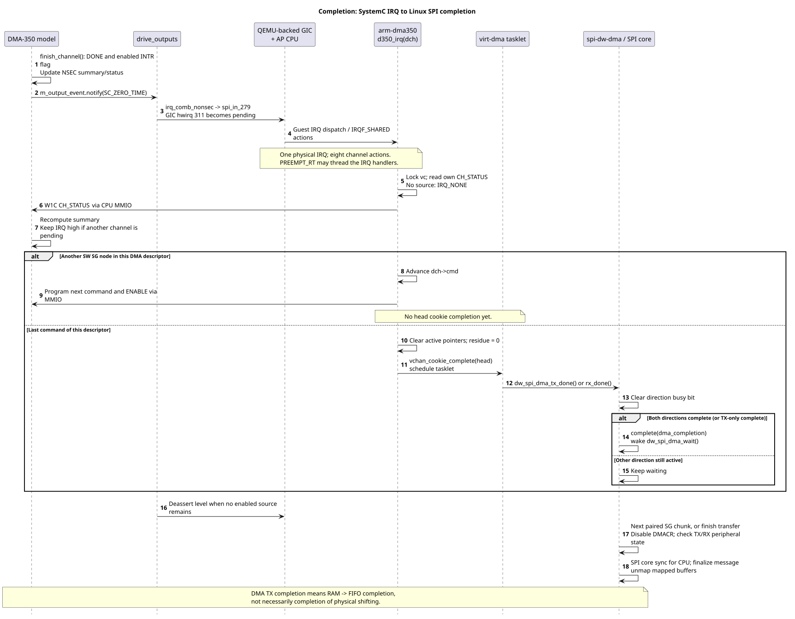
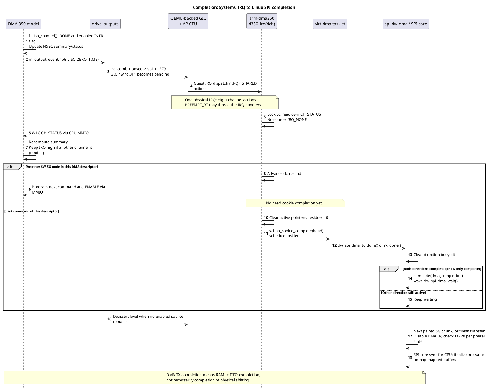
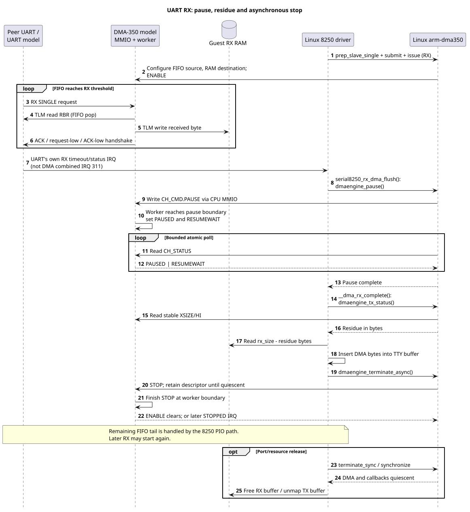
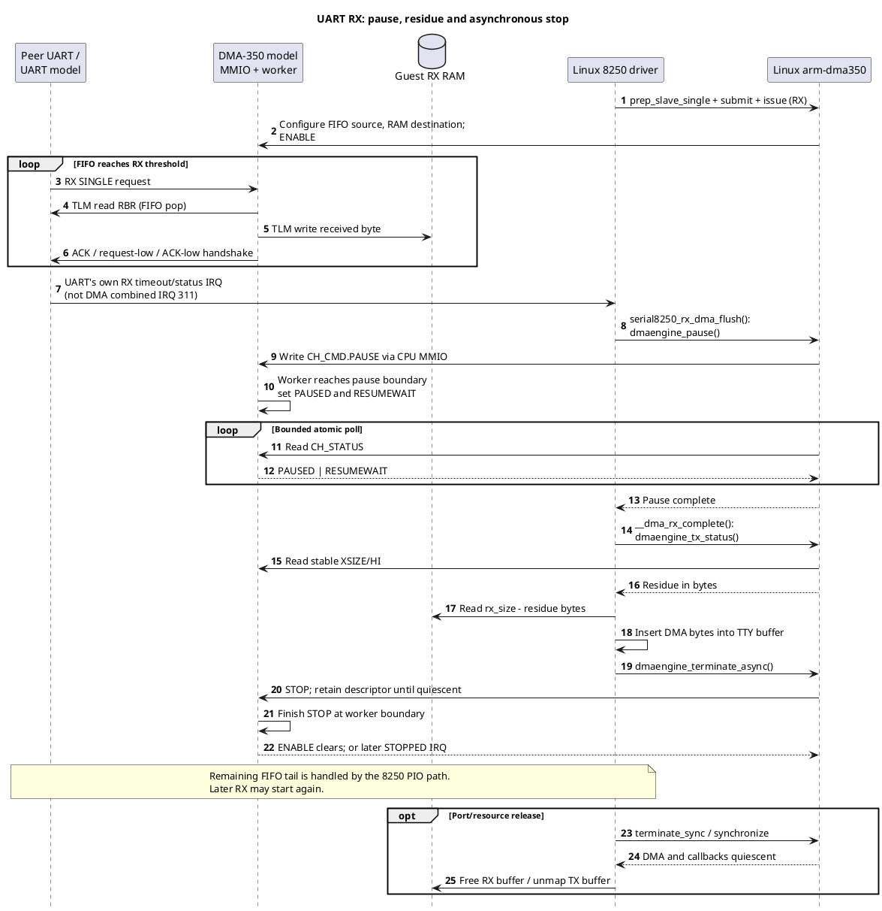

# DMA-350: Linux에서 SystemC 데이터 전송까지

이 문서는 현재 Apollo QVP 코드의 **실제 호출 경로와 process 경계**를 설명한다.
Linux 기준은 `41b96d0832e8`이며, QBox platform의 combined IRQ 작업 트리를 함께
읽었다. 다이어그램은 코드를 재구성한 sequence이지 모든 화살표를 개별 계측한
실행 trace는 아니다. 기존 데이터 검증 결과는
[구현 및 검증 문서](apollo-qvp-implementation.md)를 참조한다.
Linux driver lifeline은 같은 guest kernel 안의 역할 구분이며 별도 CPU나
독립 프로세스를 뜻하지 않는다. 그림의 SystemC worker와 output method는
실제 서로 다른 SystemC process다.

## 1. 실제로 데이터를 옮기는 주체

Linux DMAengine이 데이터를 복사하는 것이 아니다. Linux client와 DMA-350
driver는 전송을 준비하고 MMIO register를 설정한다. 이후 **DMA-350 SystemC
worker가 TLM initiator**가 되어 RAM과 peripheral FIFO에 접근한다.

| 구분 | 실행 주체와 경로 |
|---|---|
| 제어 경로 | Linux driver → QEMU AP CPU의 MMIO → QBox CPU memory socket → AP router → DMA-350 또는 SSI target |
| 데이터 경로 | `dma350::worker_thread()` → `mem_read/mem_write()` → `initiator_socket->b_transport()` → AP router → RAM/FIFO target |
| 요청/응답 신호 | Peripheral `drive_dma()` → `dma_*_req` → DMA `trig_in[]`; DMA `drive_outputs()` → `trig_ack[]` → peripheral `dma_*_ack` |
| 완료 경로 | DMA channel status → Non-secure summary/global gate → `irq_comb_nonsec` → QEMU-backed GIC/AP CPU → Linux IRQ → virt-dma callback |

CPU MMIO와 DMA master는 **같은 AP 주소 공간**을 쓰지만 서로 다른 initiator다.
`ros.bind_ap_view_targets()`가 DMA master를 `ap_router.target_socket`에 연결한다.
`ap_compute.enable_ap_router()`는 AP CPU memory socket, peripheral targets와
`host_ap_dram1/host_ap_dram2` RAM targets를 같은 AP view로 연결한다.

AP RAM은 `gs_memory`가 보관하는 backing storage다. 현재 DMA-350은 DMI pointer를
얻어 직접 사용하는 fast path가 없고, RAM 접근도 매번 `b_transport()`로 보낸다.
CPU 쪽 RAM 접근은 구성에 따라 DMI가 가능하므로 CPU와 DMA의 access 방식이
항상 같지는 않다. 같은 backing storage를 보는 기능 모델이며, 실제 cache snoop나
AXI coherence timing을 모델링했다고 해석하면 안 된다.

### 주소와 폭의 예: SPI0

| 항목 | TX | RX |
|---|---|---|
| 전용 DMA 채널 / request | 0 / 0 | 1 / 1 |
| source | Linux가 DMA-map한 TX buffer 주소 | SSI0 DR `0x30160060` |
| destination | SSI0 DR `0x30160060` | Linux가 DMA-map한 RX buffer 주소 |
| 주소 증가 | memory만 증가, FIFO 고정 | FIFO 고정, memory만 증가 |
| flow control | destination HW trigger | source HW trigger |

Linux buffer의 CPU virtual address를 그대로 register에 쓰지 않는다.
`sg_dma_address()`로 얻은 DMA 주소를 `CH_SRCADDR/HI`, `CH_DESADDR/HI`에 쓴다.
현재 AP DMA 경로는 AP router에 직접 연결되며 별도 SMMU translation 경로를
통과하도록 배선하지 않았다. Diagram의 RAM 주소는 이 AP view의 주소다.

예를 들어 8-bit SPI의 N-byte TX는 source increment=1, destination increment=0,
XSIZE=N이다. 16-bit 전송이면 한 transfer가 2 byte이므로 XSIZE=N/2가 된다.
Memory 주소는 transfer 폭만큼 증가한다. Router는 주소를 decode한 뒤 통상
대상 base를 빼므로, SSI model에는 DR offset `0x60`이 전달된다.

## 2. Linux SPI 요청과 DMA-350 명령 설정

SPI core가 buffer mapping/sync를 담당하고, `spi-dw-dma`가 DMAengine client다.
`arm-dma350`은 provider로서 mapped SG를 원래 `d350_desc` 타입의 한 allocation에
저장하고 `next`로 연결한다. Linux 내부 descriptor는 **SW queue**이며,
DMA-350 IP가 이 C 구조체를 메모리에서 읽는 hardware command list가 아니다.
Driver가 각 명령을 직접 register에 써 준다. `CH_LINKADDR`는 0이다.

중요한 순서는 **TX submit → RX submit → RX issue → TX issue**다.
Submit은 queue에 넣는 동작이고, issue가 실제 MMIO ENABLE로 이어진다.

현재 `max_sg_burst=1`이므로 full-duplex multi-SG는
`dw_spi_dma_transfer_one()`이 TX/RX 경계를 맞춰 한 항목씩 제출한다.
단일 SG와 TX-only는 `dw_spi_dma_transfer_all()` 경로다. 두 경로 모두
RX가 있을 때 RX를 먼저 issue한다. 단순화를 위해 그림은 한 chunk를 나타낸다.



<details>
<summary>PlantUML source: Linux SPI 설정</summary>



</details>

`CH_CMD.ENABLE` write 시 model은 주소·count·폭·increment·trigger를
`ChannelState`로 읽고 worker event를 알린다. MMIO callback 안에서 전체 DMA를
수행하거나 `wait()`로 완료까지 막지 않는다. 따라서 ENABLE의 MMIO 응답과
DMA 완료 IRQ는 서로 다른 시점이다.

## 3. SystemC에서 RAM과 FIFO 사이의 실제 전송

`worker_thread()`는 실행 가능한 채널을 순회하며 `service_channel()`을 호출한다.
외부 request가 없는 채널은 SRCWAIT/DESTWAIT 상태로 대기한다. 진행 가능한
작업이 없으면 worker가 event를 기다린다. 채널별 상태는 독립적이며, 한 host
thread가 시뮬레이션 작업을 순회한다는 의미이지 Linux 채널을 동적 재배정하는
공유 scheduler라는 의미는 아니다.

현재 DWC request는 SINGLE이다. `flow_request_limit()`이 한 request당 transfer
수를 1로 제한한다. `burst_bytes=256`은 worker 실행 분할의 상한이고,
SINGLE 요청을 256-byte FIFO 접근으로 바꾸지 않는다.

`mem_read()`와 `mem_write()`는 TLM payload에 command/address/data pointer/
length/streaming width를 넣어 AP router로 전송한다. 응답은 blocking transport
반환 시 확인한다. FIFO 경로는 `execute_copy_burst()`의 fixed-increment 경로이며,
최대 16-byte 임시 buffer에 **source read 후 destination write**를 수행한다.
Memory target에서는 backing storage와 payload 사이의 복사가 이루어지고,
SSI target의 DR write/read는 실제 TX FIFO push / RX FIFO pop을 수행한다.



<details>
<summary>PlantUML source: SystemC 데이터와 handshake</summary>



</details>

그림은 가능한 진행 예를 나타내며, 다음 구분이 중요하다.

- 必須順序は source read → destination write → 応答と遅延処理 → ACK이다.
  SSI의 독립 thread와 DMA ACK 사이에 모든 경우 동일한 순서를 강제하지 않는다.
- Request/ACK는 4-phase다: request high → ACK high → request low → ACK low.
  `drive_outputs()`와 peripheral `drive_dma()`가 delta event로 신호를 갱신한다.
  MMIO를 호출한 QEMU context와 worker가 같은 signal을 직접 쓰지 않는다.
- ACK에는 bit 2의 active와 하위 type 비트가 있다. DMA-flow의 마지막 요청은
  LAST_OKAY를 사용하지만, peripheral helper는 active/deassert handshake를 처리한다.
- 현재 SSI는 `CTRLR0` loopback bit와 pinmux가 활성일 때 TX word를 RX FIFO로
  옮긴다. 외부 SPI slave와 전기적 MOSI/MISO edge를 교환하는 그림이 아니다.
- RAM→RAM memcpy는 외부 request 없이 진행한다. 양쪽 increment=1이면
  `execute_copy_burst()`가 vector buffer로 묶어 read/write한다. FILL은 source
  read 없이 FILLVAL로 만든 데이터를 destination에 쓴다.

## 4. 완료, 공유 IRQ, Linux callback

DMA-350은 전송과 마지막 handshake를 마친 뒤 DONE 상태를 만든다.
채널 interrupt flag는 `NSEC_CHINTRSTATUS0`에 집계되며,
`NSEC_CTRL.INTREN_ANYCHINTR`가 켜져 있으면 combined output이 assert된다.
이 gate는 upstream ANYCH patch가 Linux probe에서 활성화한다.



<details>
<summary>PlantUML source: 완료 및 공유 IRQ</summary>



</details>

DT에 같은 SPI 279를 8회 지정하므로 기존 `platform_get_irq(pdev, i)`가 같은
Linux IRQ를 반환한다. 각 채널은 서로 다른 `dch`를 dev_id로 등록한다.
새 controller dispatcher가 아니라 Linux shared IRQ framework가 action을 호출하며,
각 `d350_irq()`는 자기 채널만 검사한다. 한 채널을 clear해도 다른 pending이
있으면 combined line은 유지된다.

DMA IRQ가 SPI wait를 직접 깨우는 것은 아니다. virt-dma가 cookie를 완료하고
tasklet에서 callback을 호출한다. SPI TX/RX callback이 각 busy bit를 지운 뒤,
마지막 방향이 끝났을 때 completion을 알린다. SPI core의 CPU sync/unmap은
그 이후의 message 수명에 따른다.

`dw_spi_dma_transfer()`는 DMA wait 후 TX FIFO 상태와 RX 상태를 추가 확인한다.
따라서 model의 DMA DONE, SPI controller의 FIFO/shift 완료, Linux message 완료를
같은 사건으로 그리면 안 된다. 현재 full-duplex multi-SG에서는 SPI client가
경계를 나누고, UART TX 등에서는 provider 내부 `next` chain이 실제 사용될 수 있다.
IRQ output의 delta 처리와 Linux tasklet 실행 사이의 상대적 시각은 고정하지 않는다.
그림의 deassert 위치는 한 가지 진행 예이며, SPI callback이 IRQ line의 low를
기다린다는 의미가 아니다.

## 5. UART partial RX와 정지 경계

UART RX는 page-sized DMA buffer를 준비하지만 항상 그 길이만큼 수신하지 않는다.
FIFO threshold 아래의 tail은 DMA request를 만들지 않을 수 있다. UART 고유의
RX timeout/status IRQ와 DMA combined IRQ는 서로 다른 IRQ 경로다.



<details>
<summary>PlantUML source: UART partial RX</summary>



</details>

`d350_pause()`가 실제 PAUSED/RESUMEWAIT를 기다리는 이유는 바로 다음에
`rx_size - residue`를 계산하기 때문이다. 종료 시에는 STOP register write만으로
메모리를 free하지 않는다. STOP이 늦으면 descriptor를 보존하고 STOPPED IRQ 또는
synchronize 재시도로 정리를 마친다. 그림은 성공 경로이며 PAUSE timeout이나
영구 STOP 실패에 대한 완전한 복구 구현을 뜻하지 않는다.
이 UART 그림에서는 반복을 줄이기 위해 CPU MMIO bridge와 AP router를 생략했다.
Register 접근은 2절의 제어 경로, FIFO/RAM 접근은 3절의 TLM 경로를 그대로 따른다.

## 6. 시간·오류·기능 범위

- `SC_THREAD worker_thread`와 peripheral thread가 실행/대기를 담당한다.
  신호 출력용 `SC_METHOD`는 wait하지 않고 delta event로 출력한다.
- `b_transport()`는 data movement와 응답을 반환하고, worker는 누적된 annotated
  delay와 `burst_latency`를 소비한다. TLM 호출 반환과 simulation time 소비를
  분리해서 봐야 한다. 이 값은 실리콘 throughput이나 bus arbitration 측정치가 아니다.
- TLM address/read/write 실패 시 model은 ERRINFO와 ERR status/interrupt를 만들며,
  Linux는 read/write failed 또는 aborted 결과와 residue를 전달한다.
  실패한 transfer를 정상 DONE/ACK 성공으로 간주하지 않는다.
  FIFO read 뒤 RAM write가 실패하면 이미 pop한 FIFO를 자동으로 되돌리지는 않는다.
  원자적 rollback이나 자동 retry를 제공하는 전송 모델이 아니다.
- AP I2C는 현재 DMA 연결 대상이 아니다. Reusable I2C DMA model에서는
  DATA_CMD TX 16-bit/RX 8-bit를 같은 방식으로 처리하지만, 현재 AP에서는 PIO다.
- UART pair는 `biflow_socket` backend 경로를 사용한다. SPI는 현재 내부 loopback이며
  별도 외부 slave bus protocol model을 추가했다고 해석하지 않는다.
- Hardware command-link fetch, cycle-accurate AXI burst/cache snoop, TrustZone
  attribution 및 모든 global unit IRQ는 구현 범위 밖이다.

## 7. 코드 근거

| 파일 | 확인한 함수/연결 |
|---|---|
| [Linux DMA-350](../../hsoc-stack/components/primary_compute/linux/drivers/dma/arm-dma350.c) | prep_slave_sg, program_cmd, issue_pending, irq, pause, synchronize |
| [Linux DesignWare SPI DMA](../../hsoc-stack/components/primary_compute/linux/drivers/spi/spi-dw-dma.c) | dma_setup, transfer_all/one, submit_tx/rx, tx_done/rx_done, wait |
| [Linux DesignWare SPI core](../../hsoc-stack/components/primary_compute/linux/drivers/spi/spi-dw-core.c) | dw_spi_transfer_one |
| [Linux SPI core](../../hsoc-stack/components/primary_compute/linux/drivers/spi/spi.c) | map/sync/unmap 및 finalize_current_message |
| [Linux virt-dma](../../hsoc-stack/components/primary_compute/linux/drivers/dma/virt-dma.c) | vchan_tx_submit, vchan_complete |
| [Linux 8250 DMA](../../hsoc-stack/components/primary_compute/linux/drivers/tty/serial/8250/8250_dma.c) | rx_dma, rx_dma_flush, __dma_rx_complete, release_dma |
| [DMA-350 model](../../hsoc-stack/tools/qbox-platform/systemc-components/dma350/src/dma350.cc) | configure_channel, worker_thread, service_channel, execute_copy_burst, mem_read/write, drive_outputs |
| [SSI model](../../hsoc-stack/tools/qbox/systemc-components/spi/dw-apb-ssi/src/dw-apb-ssi.cc) | drive_dma, DR read/write, transfer_thread |
| [DMA handshake helper](../../hsoc-stack/tools/qbox/systemc-components/common/include/dma-trigger.h) | update, acknowledge, force_idle |
| [AP DMA 배선](../../hsoc-stack/tools/qbox-platform/platforms/apollo/hw-block/ros.lua) | bind_dma_requests, bind_ap_view_targets |
| [AP CPU/RAM 배선](../../hsoc-stack/tools/qbox-platform/platforms/apollo/hw-block/ap_compute.lua) | enable_ap_router, host_ap_dram1/2, cpu.mem |
| [Router](../../hsoc-stack/tools/qbox/systemc-components/router/include/router.h) | decode_address, b_transport, target offset 변환 |
| [RAM](../../hsoc-stack/tools/qbox/systemc-components/gs_memory/include/gs_memory.h) | backing storage read/write, b_transport, DMI 제공 |

문서 보강을 위해 새로운 BSP/게스트 실행을 수행하지 않았다. 코드 흐름 분석과
PlantUML 검증은 기존 runtime 데이터 검증과 구분한다.

## 8. Diagram 검증 및 재생성

PlantUML 1.2026.8을 localhost PicoWeb으로 실행하여 외부 render 서버에
diagram 내용을 보내지 않았다. 아래 checker로 4개 source의 syntax/render를
검사했고, SVG와 전체 크기 PNG를 열어 참가자·화살표·텍스트가 잘리지 않는지
확인했다. **4/4 syntax PASS, render PASS, viewer PASS**다.

검증 자료는 `build/dma350/sequence-diagrams/check/report.json`, `summary.md`,
`index.html`에 있으며 전체 PNG는 `build/dma350/sequence-diagrams/full-png/`에 있다.
본문의 SVG는 검증한 render 결과를 복사한 것이다. PlantUML source는 각 그림
아래의 접을 수 있는 code block에 보존했다.

이번 환경에서 사용한 명령은 다음과 같다. 첫 명령은 별도 터미널에서 실행하고
작업 후 해당 localhost 서버를 종료한다.

```bash
java -jar build/dma350/sequence-diagrams/tools/plantuml.jar -picoweb:18089:127.0.0.1
python3 ~/.codex/skills/markdown-diagram-validator/scripts/check_markdown_diagrams.py \
  doc/dma-350/systemc-dma-sequence.md \
  --output-dir build/dma350/sequence-diagrams/check \
  --plantuml-server http://127.0.0.1:18089 --strict
```

| Checker record | 문서 SVG |
|---|---|
| plantuml-001 | images/systemc-dma-control.svg |
| plantuml-002 | images/systemc-dma-data.svg |
| plantuml-003 | images/systemc-dma-completion.svg |
| plantuml-004 | images/systemc-dma-uart-rx.svg |
