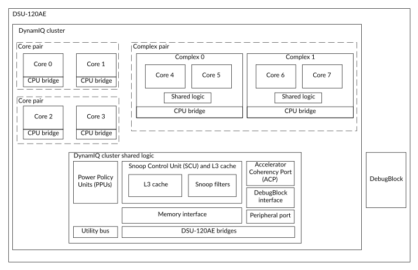
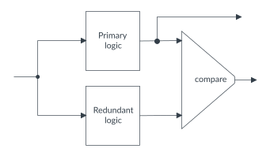
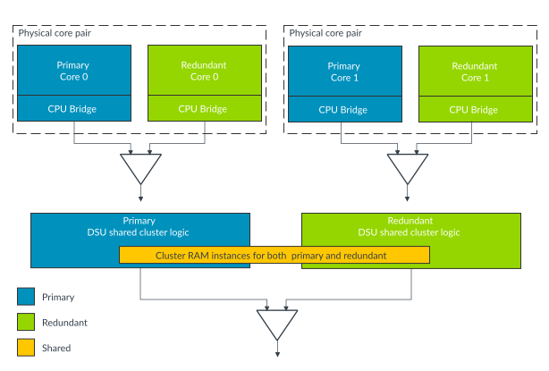

# The DynamIQ Shared Unit-120AE

Source: <https://developer.arm.com/documentation/107721/0001/The-DynamIQ-Shared-Unit-120AE>

### The DynamIQ™ Shared Unit-120AE

The DynamIQ Shared Unit-120AE (DSU-120AE) provides a shared L3 memory system, snoop control and filtering, and other control logic to support a cluster of A-class architecture cores. The DSU-120AE also adds in bus protection and Dual-Core Lock-Step (DCLS) features to support additional fault protection.

### DSU-120AE cluster overview

The following figure shows an example of a DSU-120AE-based cluster in one particular build time configuration. This configuration excludes the DCLS features, so that functionality that is common to all configurations can easily be described.

Figure 1. DSU-120AE DynamIQ™ cluster

> ### Note
>
> - The figure above is one possible representation of the cluster and it can vary between the different configurations. For more information about the configurations, see the [DCLS configurations](/documentation/107721/0001/The-DynamIQ-Shared-Unit-120AE/DCLS-configurations?lang=en "At build time configuration, you can configure the cluster to operate in one of the Dual-Core Lock-Step (DCLS) configurations where logic is duplicated and compared.").
> - In this book, the DSU-120AE DynamIQ™ cluster is referred to as a cluster in cases where distinguishing between the DSU-120AE DynamIQ™ cluster and the DSU-120AE is not important to the context.

All cores and complexes in the DSU-120AE DynamIQ™ cluster are coherently connected to an L3 memory system that includes an L3 cache and a Snoop Control Unit (SCU). The SCU maintains coherency between caches in the cores and the L3 cache, and includes a snoop filter to optimize coherency maintenance operations. The shared L3 cache simplifies process migration between the cores.

The DSU-120AE DynamIQ™ cluster can be implemented with various power domains to target power performance levels. These power domains are managed through the Power Policy Units (PPUs). The DSU-120AE DynamIQ™ cluster supports many mechanisms to reduce static and dynamic power dissipation. For example, placing the core and L3 cache into retention and powering down parts of the L3 cache.

All the external interfaces including those to the cores are provided through the DSU-120AE to the System on Chip (SoC). Main system transactions are supported through the memory interface which can be implemented as a coherent or non-coherent interface. A peripheral port is provided to support low latency access to external system components but also can be used as a non-coherent manager interface. The Accelerator Coherency Port (ACP) provides coherent access for non-cached managers that need I/O coherency with the cluster. The utility bus is a memory-mapped port that provides a programming interface to the PPUs and some of the other system components.

A dedicated debug component, called the DebugBlock, forms part of the DSU-120AE that provides the interface for debug capability. The DebugBlock is instanced as a separate unit for supporting debug over powerdown.

Finally, there are several asynchronous bridges automatically built in across the cluster to resynchronize timing across various clock domain boundaries.

> ### Note
>
> - For information on the behavior and features of your core, including whether your core is supported in a complex, see the Technical Reference Manual (TRM) for your core.
> - For information on the DSU-120AE macrocell implementation, see DSU-120AE Configuration and Integration Manual.

### DCLS feature overview

In DCLS implementations, the logic is duplicated to form the primary logic and redundant logic as the following figure shows. The same inputs are applied to both the primary and redundant logic and the outputs are compared. The redundant logic block therefore acts as a check to the operation of the primary logic block. This process of tracking the logic is known as Lock-Step, and the duplication of logic allows for error detection.

Figure 2. DCLS principle

In a DSU-120AE-based cluster, the same principle is applied to the cores in the cluster, and the DSU-120AE logic itself. For example, the following figure shows a basic top-level view of the duplicated logic in a DSU-120AE based cluster including four Automotive Enhanced (AE) cores. Each primary and redundant AE core forms a core pair. Both cores that make up a core pair must be the same type of core with the same configuration. The DSU-120AE logic is also duplicated, apart from the shared memory block which includes the L3 RAMs and snoop filter RAMs. Comparators are also included to compare the outputs of each core pair and the DSU shared cluster logic as shown.

Figure 3. Lock-configuration in the DSU-120AE-based cluster

> ### Note
>
> - The preceding figure is a conceptual figure to show how the DCLS principle is applied to a DSU-120AE-based cluster. For more information on the actual comparator arrangement in the DSU-120AE-based cluster, see [Primary and redundant logic comparison](/documentation/107721/0001/The-DynamIQ-Shared-Unit-120AE/DCLS-configurations/Primary-and-redundant-logic-comparison?lang=en "When the DSU-120AE is configured in Lock-configuration or Mixed-configuration and is using either Lock-mode or Hybrid-mode, then both the primary and redundant parts of the DSU-120AE logic are active. Both copies of the DSU-120AE logic outputs feed comparators to check for any behavioral difference between the primary and redundant logic. The following figure shows the comparators with the cluster logic.").
> - In this book the term core pair is used. Processor cores that are compatible with the DSU-120AE Lock-configuration are always instantiated as core pairs. A core pair consists of two identical instances of the compatible processor core. In Lock-configuration, the two cores act together in the core pair to function architecturally as a single core. In Split-configuration each core behaves independently and architecturally the two cores act as two independent cores.

The preceding arrangement where the DSU-120AE logic and AE cores are duplicated and comparators are instantiated is one possible build-time configuration of the DSU-120AE known as Lock-configuration.

Another build-time configuration is to configure the cluster and cores not to use DCLS. In this configuration, there is no duplication, and no instantiation of comparators, and therefore no DCLS error detection or correction. This configuration is called Split-configuration. The following figure shows the same DSU-120AE-based cluster, as in preceding figure, but configured for Split-configuration.

Figure 4. Split-configuration in the DSU-120AE-based cluster

As can be seen from comparing the two preceding figures, core pairs consist of evenly numbered core instances. For example, core pair 0 would consist of core 0 and core 1, and core pair 1 is made up of core 2 and core 3.

In a Split-configuration, the DSU-120AE-based cluster can be configured to use between two and 14 cores. However if using a Lock-configuration, the total number of cores configured is the number of primary cores, and ranges between one and 7 cores. The DSU-120AE-based cluster can also be configured to use up to two different types of cores in the same cluster. Cores can be configured for various performance points during macrocell implementation and run at different frequencies and voltages.

The DSU-120AE DynamIQ™ cluster also supports complexes where typically two cores of the same type are linked together and share logic. Examples of shared logic include a floating-point unit and an L2 cache. In addition to supporting core pairs, the DSU-120AE DynamIQ™ cluster also supports complex pairs, where one of the two complexes is a primary complex and the other one a redundant complex. Again both the primary and redundant complexes must be identical to one another. For more information on DCLS organization and operation, see [DCLS configurations](/documentation/107721/0001/The-DynamIQ-Shared-Unit-120AE/DCLS-configurations?lang=en "At build time configuration, you can configure the cluster to operate in one of the Dual-Core Lock-Step (DCLS) configurations where logic is duplicated and compared.").
