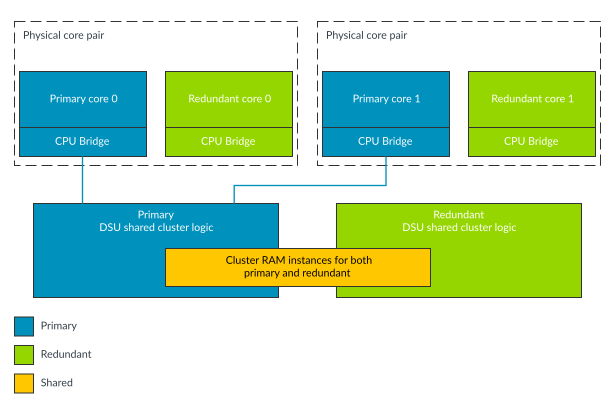
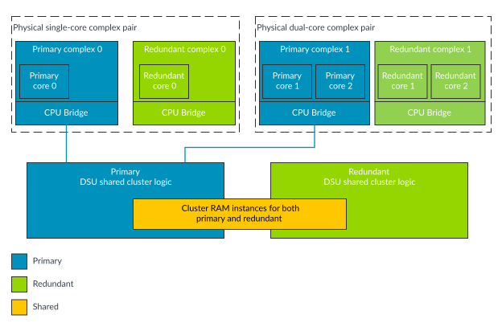

# Lock-configuration

Source: <https://developer.arm.com/documentation/107721/0001/The-DynamIQ-Shared-Unit-120AE/DCLS-configurations/Lock-configuration>

### Lock-configuration

The arrangement where the DSU-120AE logic and AE cores are duplicated and comparators are instantiated is one possible build-time configuration of the DSU-120AE, known as Lock-configuration. In this configuration both the DSU cluster logic and the core or complex logic is instantiated as primary and redundant pairs of logic. The primary logic provides the functional behavior and the redundant logic is used for comparison purposes. The redundant copy of the logic employs a multi-cycle Temporal Delay (N) along with clock-tree diversity. The following figure shows an example arrangement of the DSU and the cores in Lock-configuration.

Figure 1. Lock-configuration: core example

> ### Note
>
> - All cores have to be in core pairs and all complexes have to be in complex pairs in Lock-configuration.
> - For comparison and interaction of the primary and redundant logic see [Primary and redundant logic comparison](/documentation/107721/0001/The-DynamIQ-Shared-Unit-120AE/DCLS-configurations/Primary-and-redundant-logic-comparison?lang=en "When the DSU-120AE is configured in Lock-configuration or Mixed-configuration and is using either Lock-mode or Hybrid-mode, then both the primary and redundant parts of the DSU-120AE logic are active. Both copies of the DSU-120AE logic outputs feed comparators to check for any behavioral difference between the primary and redundant logic. The following figure shows the comparators with the cluster logic.").

The following figure shows an example arrangement of the DSU and the complexes in Lock-configuration.

Figure 2. Lock-configuration: complex example

