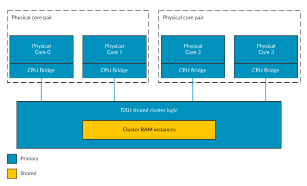
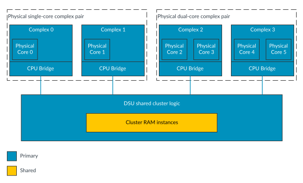

# Split-configuration

Source: <https://developer.arm.com/documentation/107721/0001/The-DynamIQ-Shared-Unit-120AE/DCLS-configurations/Split-configuration>

### Split-configuration

Another possible build-time configuration is called Split-configuration. In this configuration there is no duplicate logic included for either the cluster or the cores or complexes. This means that there is no duplicate logic error detection capability included. Interface protection is not supported in Split-configuration. The following figure shows an example arrangement of the same DSU-120AE, and cores as in the preceding topic, but configured for Split-configuration.

Figure 1. Split-configuration: core example

> ### Note
>
> All cores have to be in core pairs and all complexes have to be in complex pairs in Split-configuration.

As can be seen from comparing the Lock-configuration and Split-configuration core example figures, core pairs consist of evenly numbered core instances. For example, core pair 0 consists of core 0 and core 1, and core pair 1 consists of core 2 and core 3.

In a Split-configuration, the DSU-120AE DynamIQ™ cluster can be configured to use between two and 14 cores. However, if using a Lock-configuration, the total number of cores configured is the number of primary cores, and ranges between one and seven cores. The DSU-120AE DynamIQ™ cluster can also be configured to use up to two different types of cores in the same cluster. Cores can be configured for various performance points during macrocell implementation and run at different frequencies and voltages.

In Split-configuration, the complexes are configured the same way as the cores. The following figure shows an example arrangement of the same DSU-120AE, and complexes configured for Split-configuration.

Figure 2. Split-configuration: complex example

