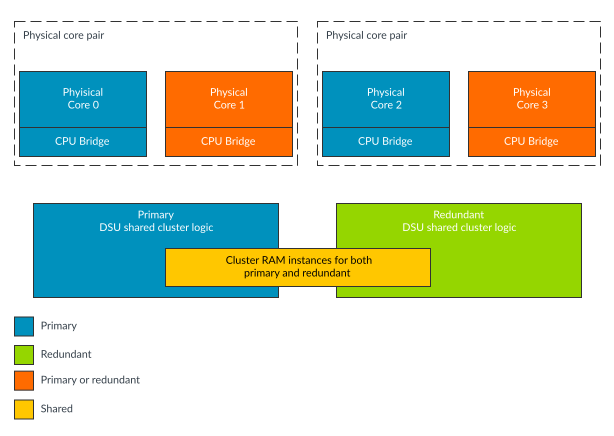
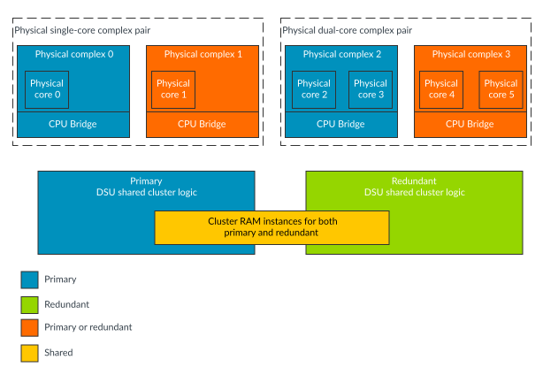

# Mixed-configuration

Source: <https://developer.arm.com/documentation/107721/0001/The-DynamIQ-Shared-Unit-120AE/DCLS-configurations/Mixed-configuration>

### Mixed-configuration

A third build-time DCLS configuration is called Mixed-configuration.

In Mixed-configuration, both the DSU cluster logic and the core or complex logic is instantiated as pairs of logic so that cores have to be instantiated in core pairs and complexes in complex pairs. The core pairs of logic can either be used as primary and redundant pairs of logic or each of the cores in the core pair can be used independently. The pair of cluster logic can either be used as primary and redundant pairs of logic or one of the cluster pairs can be unused. The core and cluster logic can be pin-configured at cluster reset to use three different modes.

- In Mixed-configuration Split-mode, each of the cores in the core pairs is used independently and only the primary cluster logic is used.
- In Mixed-configuration Lock-mode, the primary logic for both the cores and cluster provides the functional behavior and the redundant logic is used for comparison purposes.
- In Mixed-configuration Hybrid-mode, each of the cores in the core pairs is used independently but the cluster logic is used as primary and redundant pairs of logic.

> ### Note
>
> Both the Mixed-configuration Split-mode and Mixed-configuration Lock-mode functions similarly to the Split-configuration and Lock-configuration.
>
> The pin-configurable flexibility of Mixed-configuration Split-mode has a tradeoff with circuit area because the redundant logic is still present but not used in this configuration.

The following figure shows an example arrangement of the logic duplication and core instances, when configured for Mixed-configuration.

Figure 1. Mixed-configuration: core example

- All cores have to be in core pairs and all complexes have to be in complex pairs in all modes of Mixed-configuration.
- In Split-mode, all cores operate as primary logic.
- The redundant DSU logic is unused, when the DSU is in Split-mode.
- Mixed-configuration Split-mode will be referred to as Split-mode.
- Mixed-configuration Lock-mode will be referred to as Lock-mode.

The following figure shows an example arrangement of the logic duplication and complex instances, when configured for Mixed-configuration.

Figure 2. Mixed-configuration: complex example

For further details on the modes of Mixed-configuration, see the following topics below. For details on programming the different Mixed-configuration modes, see [Selecting different modes in Mixed-configuration](/documentation/107721/0001/Power-and-reset-control-with-Power-Policy-Units/Selecting-different-modes-in-Mixed-configuration--?lang=en "In Mixed-configuration, the three different modes, namely Lock-mode, Split-mode, and Hybrid-mode are selected at cluster reset time using pins. The CORESLDEFAULT and CLUSTERSLDEFAULT signals are used to select the mode, and they only take effect when the nRESET pin is deasserted. The mode selected is shown in the CLUSTERAE_CLUSTERSLCTLR and CLUSTERAE_CORESLCTLR registers which are read only.").
