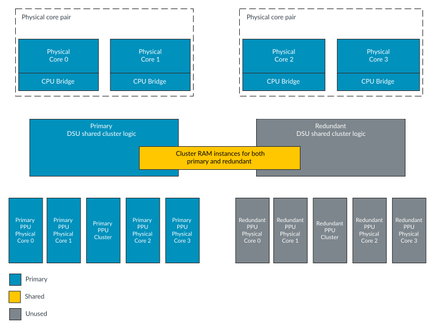
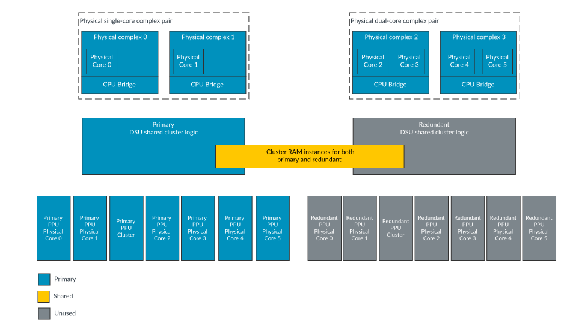

# Split-mode (Mixed-configuration with cores split and DSU logic split)

Source: <https://developer.arm.com/documentation/107721/0001/The-DynamIQ-Shared-Unit-120AE/DCLS-configurations/Mixed-configuration/Split-mode--Mixed-configuration-with-cores-split-and-DSU-logic-split->

### Split-mode (Mixed-configuration with cores split and DSU logic split)

Split-mode has the same functionality as Split-configuration. In Split-configuration, the compute performance is doubled compared with the equivalent Lock-configuration and Lock-mode. Split-mode does not support Dual-Core Lock-Step (DCLS).

In Split-mode, each core is logically independent such that the cluster provides maximum compute throughout. The Split-mode sacrifices the increased fault tolerance of the primary and redundant logic for the compute performance, achieved by doubling the number of independent processor cores that are active. The redundant cluster logic is still present, but is not utilized and it is clock gated where feasible. The selection of Split-mode is controlled from the CLUSTERAE\_CLUSTERSLCTLR and CLUSTERAE\_CORESLCTLR registers, where the values of the registers are set using the CLUSTERSLDEFAULT and CORESLDEFAULT input signals. See the [External cluster AE registers summary](/documentation/107721/0001/External-registers/Registers-accessed-over-the-utility-bus/External-cluster-AE-registers-summary?lang=en "The cluster Automotive Enhanced (AE) registers are only accessible from memory-mapped accesses on the utility bus."). The cores that support DCLS are provided as core pairs, that combine two cores together with two interfaces to the DSU. When operating in Split-mode, the two cores in the core pair act independently. All cores are instantiated as core pairs, combining two cores together with two interfaces to the DSU.

The following figure shows an example arrangement of the DSU-120AE cluster and the core instances in Split-mode.

Figure 1. Mixed-configuration Split-mode: core example

> ### Note
>
> If DSU-AE is executing in
> Split-mode, there are two CPU bridges per physical core pair. One is the
> primary, the other is
> redundant. In
> Split-mode they are both operating independently and both their
> cores are also operating independently.

The following figure shows an example arrangement of the Split-mode cluster overview with the complex instances.

Figure 2. Mixed-configuration Split-mode: complex example

