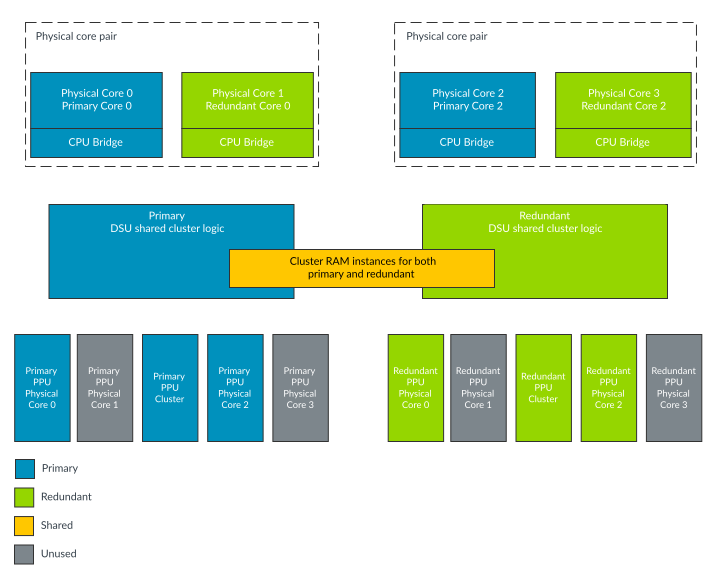
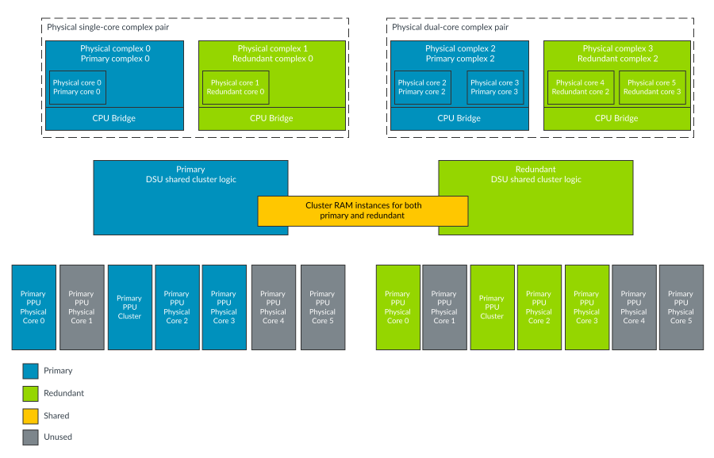

# Lock-mode (Mixed-configuration with cores locked and DSU logic locked)

Source: <https://developer.arm.com/documentation/107721/0001/The-DynamIQ-Shared-Unit-120AE/DCLS-configurations/Mixed-configuration/Lock-mode--Mixed-configuration-with-cores-locked-and-DSU-logic-locked->

### Lock-mode (Mixed-configuration with cores locked and DSU logic locked)

In Lock-mode, similar to Lock-configuration, the cluster and the cores work in Dual-Core Lock-Step (DCLS). This mode introduces primary and redundant logic. The comparators and timeout mechanisms catch the divergences between the primary and redundant logic.

In Lock-mode, the DSU-120AE and the cores are configured to operate in Lock-Step. In addition, each pair of cores is logically viewed as a single core by the DSU. While the total number of cores available for compute performance is halved, the resulting configuration provides a complete Dual-Core Lock-Step (DCLS) solution for the whole cluster, significantly improving the fault detection capabilities. The selection of Lock-mode is controlled from the CLUSTERAE\_CLUSTERSLCTLR and CLUSTERAE\_CORESLCTLR registers, where the values of the registers are set using the CLUSTERSLDEFAULT and CORESLDEFAULT input signals. See the [External cluster AE registers summary](/documentation/107721/0001/External-registers/Registers-accessed-over-the-utility-bus/External-cluster-AE-registers-summary?lang=en "The cluster Automotive Enhanced (AE) registers are only accessible from memory-mapped accesses on the utility bus."). The cores that support DCLS are configured as core pairs, that combine two cores together with two interfaces to the DSU logic. When operating in Lock-mode, the second core becomes the redundant copy of the first (primary) core, and comparators check the outputs of the two cores match. The second core's interface to the DSU is unused and looks to the software as if the second core is powered off. The redundant copy of the logic employs a multi-cycle Temporal Delay (N) along with clock-tree diversity.

The following figure shows an example arrangement of the cluster and core instances in Lock-mode.

Figure 1. Mixed-configuration Lock-mode: core example

> ### Note
>
> - Logical core and complex numbering is always based on the number of physical cores and complexes. For more information about logical core numbering, see [Core, complex, and processing element numbering](/documentation/107721/0001/The-DynamIQ-Shared-Unit-120AE/Core--complex--and-processing-element-numbering?lang=en "A cluster contains two or more cores. The cluster can also contain two or more complexes which can be made up of either a single core or two cores. Because certain parts of the design, such as signal names and register bit values, depend on the number of cores and complexes within the cluster, a numbering system has been created.").
> - Any attempts to access core 1 and core 3 will respond as if the core is powered down and the wakeup requests to these cores will not have any effect.
> - The unused Power Policy Units (PPUs) are still present and can still be accessed by software.

The following figure shows an example arrangement of the Lock-mode cluster overview and complex instances.

Figure 2. Mixed-configuration Lock-mode: complex example

> ### Note
>
> - Logical core and complex numbering is always based on the number of physical cores and complexes. For more information about logical core numbering, see [Core, complex, and processing element numbering](/documentation/107721/0001/The-DynamIQ-Shared-Unit-120AE/Core--complex--and-processing-element-numbering?lang=en "A cluster contains two or more cores. The cluster can also contain two or more complexes which can be made up of either a single core or two cores. Because certain parts of the design, such as signal names and register bit values, depend on the number of cores and complexes within the cluster, a numbering system has been created.").
> - Any attempts to access core 1 in complex 1 or core 4 and 5 in complex 3 will respond as if the core is powered down and the wakeup requests to these cores will not have any effect.
> - The unused Power Policy Units (PPUs) are still present and can still be accessed by software.
