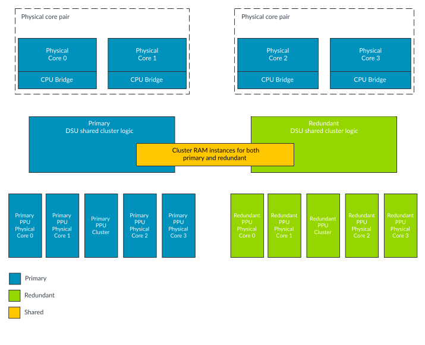
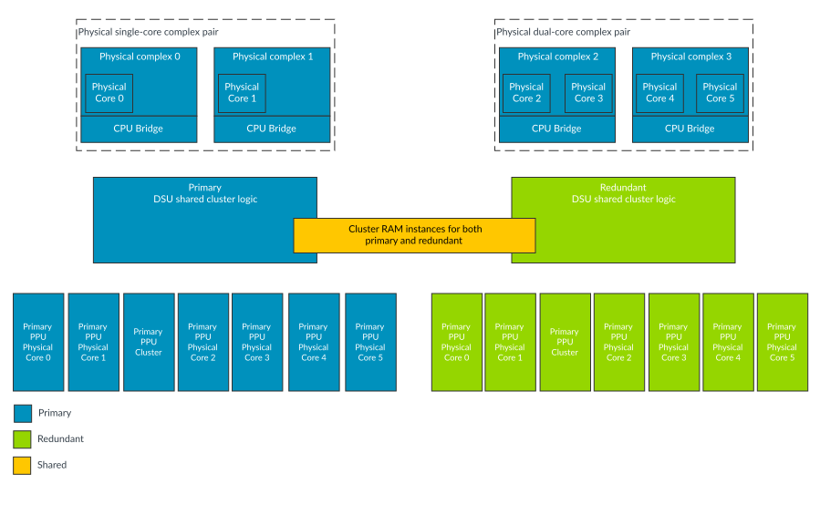

# Hybrid-mode (Mixed-configuration with cores split and DSU logic locked)

Source: <https://developer.arm.com/documentation/107721/0001/The-DynamIQ-Shared-Unit-120AE/DCLS-configurations/Mixed-configuration/Hybrid-mode--Mixed-configuration-with-cores-split-and-DSU-logic-locked->

### Hybrid-mode (Mixed-configuration with cores split and DSU logic locked)

Hybrid-mode is a Mixed execution mode where the cores are configured to execute independently (similar to Split-mode) while the DSU-120AE is configured to execute in Lock-Step (similar to Lock-mode). All of the duplicate DSU logic is used in Hybrid-mode, including the redundant shared cluster logic and the redundant Power Policy Unit (PPU) instances for all of the cores.

In Hybrid-mode, the cluster provides the following partial Dual-Core Lock-Step (DCLS) solutions:

- The Hybrid-mode allows better cluster performance relative to the Lock-mode because there are more cores operating independently of each other.
- The Hybrid-mode allows better fault detection in the cluster relative to Split-mode as the DSU-120AE is configured to execute in Lock-Step.

The Hybrid-mode can help the cluster availability in some applications. These applications might require a certain level of fault detection which is beyond what Split-mode can provide, but do not need the full cost of Lock-mode. This level of fault detection could be achieved by mechanisms such as logic Built-In Self Test (BIST) or Software Test Libraries (STLs). It is possible to perform these activities on one core at a time, which means that the remaining cores in the cluster are still available for running the workload. However, when the shared cluster logic requires these activities, the whole cluster becomes unavailable for the duration. This unavailability of all cores in the cluster might be unacceptable for some use cases, therefore Hybrid-mode allows the shared logic to have DCLS to give sufficient fault detection capabilities without requiring Logic Built-In Self Test (LBIST) or STLs to run on the shared logic, while the cores can still run in Split-mode. The selection of Hybrid-mode is controlled from the CLUSTERAE\_CLUSTERSLCTLR and CLUSTERAE\_CORESLCTLR registers, where the values of the registers are set using the CLUSTERSLDEFAULT and CORESLDEFAULT input signals. See the [External cluster AE registers summary](/documentation/107721/0001/External-registers/Registers-accessed-over-the-utility-bus/External-cluster-AE-registers-summary?lang=en "The cluster Automotive Enhanced (AE) registers are only accessible from memory-mapped accesses on the utility bus.").

The following figure shows an example arrangement of the DSU-120AE cluster and the core instances in Hybrid-mode.

Figure 1. Mixed-configuration Hybrid-mode: core example

The following figure shows an example arrangement of the Hybrid-mode cluster overview and complex instances.

Figure 2. Mixed-configuration Hybrid-mode: complex example

