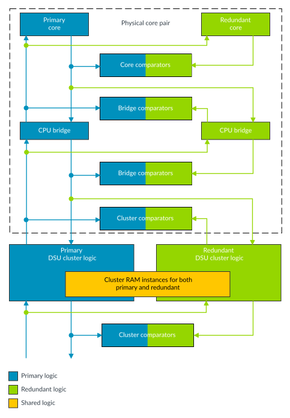
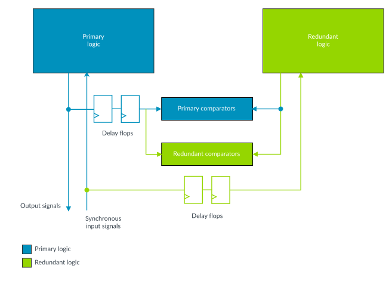
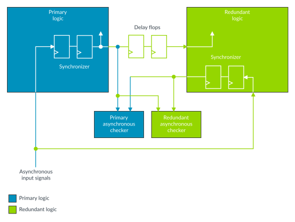
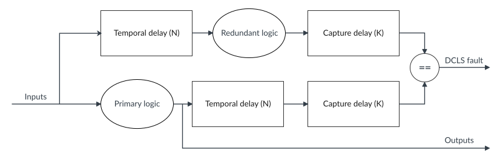

# Primary and redundant logic comparison

Source: <https://developer.arm.com/documentation/107721/0001/The-DynamIQ-Shared-Unit-120AE/DCLS-configurations/Primary-and-redundant-logic-comparison>

### Primary and redundant logic comparison

When the DSU-120AE is configured in Lock-configuration or Mixed-configuration and is using either Lock-mode or Hybrid-mode, then both the primary and redundant parts of the DSU-120AE logic are active. Both copies of the DSU-120AE logic outputs feed comparators to check for any behavioral difference between the primary and redundant logic. The following figure shows the comparators with the cluster logic.

Figure 1. Comparators overview

> ### Note
>
> Note that this figure is a conceptual representation of how the primary and redundant logic is compared using the comparators. It does not represent the exact hierarchical implementation or connectivity of the comparators.

The same inputs are driven to both the primary and to the redundant logic. However, the signals driving the redundant logic are delayed by a configurable number of clock cycles compared to the signals driving the primary logic. This delay is added so that when there is a common physical event that affects both the primary and the redundant logic, the delay ensures that the primary and redundant logic behavior is more likely to differ. For example, in the case of a common physical event such as a significant drop or rise in the power supply that generates a fault in the behavior of the logic, then the delay between the primary and the redundant logic operation ensures that the generated fault has a different impact on the primary and redundant logic behavior, so the primary and redundant logic behavior will differ. For synchronous inputs to the logic, this is done by adding additional register stages on the signals driving the redundant logic. The primary logic outputs are delayed by the same number of delay stages as the redundant logic inputs, so the comparators observe identical behavior in both the primary and in the redundant logic as long as no physical faults occur in either the primary or redundant logic. Then the primary logic outputs can be compared with the redundant logic outputs. The following figure shows the timing delays for the synchronous signals.

Figure 2. Timing delays for the synchronous signals

When there are asynchronous inputs both to the primary and redundant logic, it is necessary that the delay between the primary and redundant operation is identical to the synchronous signal delay. This means that the asynchronous signal must be synchronized once and then the synchronizer output is used to drive both the primary and the redundant logic. However, the redundant logic includes a duplicate synchronizer for the asynchronous signal and the duplicated synchronizer output can be compared against the primary synchronizer output to check synchronization faults. The asynchronous comparison checks for identical outputs from both of the synchronizers, but it tolerates the differences in the cycle accuracy behavior due to the differences in the asynchronous signal synchronization. The following figure shows the timing delays for the asynchronous signals.

Figure 3. Timing delays for the asynchronous signals

The comparison logic drives output error signals from the cluster to indicate if there is any divergence between the primary and redundant logic behavior.

> ### Note
>
> Note that in case of a fault, there is no way to define if the fault arises from the
> primary or from the
> redundant logic. Comparators can only detect behavior divergences between the
> primary and
> redundant logic, but comparators cannot identify the correct behavior.

The comparison logic itself is also fully duplicated, where one set of comparison logic is running in the primary logic clock domain and the other set of comparison logic is running in the redundant clock domain. This means that there are two separate comparisons made for each output signal. The results of both comparators are output from the cluster, so the system-level logic can detect any behavior divergence in between the two sets of comparison logic.

The following types of control exist for the comparator logic:

Enable signal
:   There is an enable signal for the comparators to control whether the comparators report any detected errors on the comparator output signals.

Error injection control signals
:   There are error injection control signals to force each comparator output to report an error.

This permits the testing of system-level logic that monitors the output signals to confirm that the monitoring logic will detect if an error is reported from the comparator.

The delay between the primary and redundant logic is set by a configuration option when the cluster is implemented. In addition to the delay between the primary and redundant logic, the configuration option also controls the number of additional register stages to assist with timing closure for the physical design. The following figure shows the primary and redundant logic temporal and capture delays.

Figure 4. Primary and redundant logic Temporal delays and Capture delays

