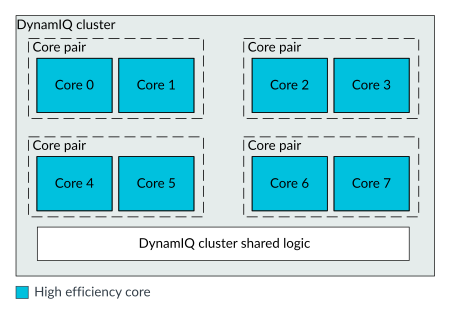
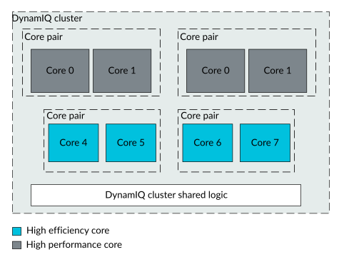
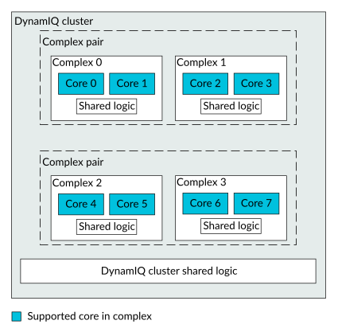
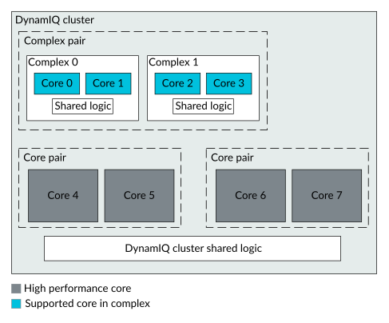

# Cluster configurations

Source: <https://developer.arm.com/documentation/107721/0001/The-DynamIQ-Shared-Unit-120AE/Cluster-configurations>

### Cluster configurations

A cluster can be configured with up to two different types of cores in the same cluster, irrespective of whether the cluster is configured either for Lock-configuration or Mixed-configuration. Each core can target different power efficiency and performance levels. The cluster also supports complexes.

A cluster can be configured in many arrangements. Examples of cluster arrangements are:

- One or more cores of the same type.
- Various arrangements of two types of cores. For example, one or more cores targeting either a high-performance level or a higher power efficiency level.
- Various arrangements of three of cores. For example, one or more high-performance cores, power-efficient cores, and intermediate cores.
- One or more complexes and no individual cores. For information on complexes, see [What is a complex?](/documentation/107721/0001/The-DynamIQ-Shared-Unit-120AE/Cluster-configurations/What-is-a-complex-?lang=en "The DSU-120AE DynamIQ cluster supports blocks that are called complexes which contain up to two cores of the same type and some shared logic. Sharing some logic between the two cores of a dual core complex can make the dual core complex area efficient. However, this area efficiency is at the cost of reduced performance compared with using two single-core complexes.").
- One or more complexes and individual cores.
  > ### Note
  >
  > For clusters, configured in
  > Lock-configuration, a maximum of seven
  > cores can be configured.

The following figure shows a cluster that is configured with all the same type of core.

Figure 1. DynamIQ cluster with one type of core

The following figure shows a cluster that is configured with two types of core.

Figure 2. DynamIQ cluster with two types of cores

The following figure shows a cluster that is configured with four complexes.

Figure 3. DynamIQ cluster with four complexes

The following figure shows a cluster that is configured with two complexes, and four individual cores.

Figure 4. DynamIQ cluster with two complexes and four high-performance cores

> ### Note
>
> All DSU-120AE-compatible cores support use in a multi-core cluster. Any combination of these cores should be configurable in the cluster provided that:
>
> - In Split-configuration and Split-mode, the maximum number of cores is 14.
> - In Lock-configuration and Lock-mode, the maximum number of cores is seven.
> - There are no more than two different types of core in the cluster.
