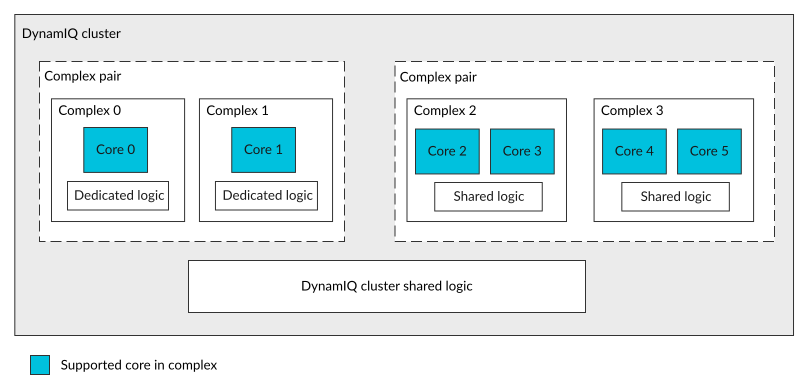

# What is a complex?

Source: <https://developer.arm.com/documentation/107721/0001/The-DynamIQ-Shared-Unit-120AE/Cluster-configurations/What-is-a-complex->

### What is a complex?

The DSU-120AE DynamIQ™ cluster supports blocks that are called complexes which contain up to two cores of the same type and some shared logic. Sharing some logic between the two cores of a dual core complex can make the dual core complex area efficient. However, this area efficiency is at the cost of reduced performance compared with using two single-core complexes.

The DSU-120AE DynamIQ™ cluster also supports complex pairs, where one of the two complexes is a primary complex and the other one a redundant complex. Both the primary and redundant complexes must be identical to one another. A complex pair contains two complexes where each complex can have either a single core or a dual core as shown in the figure below.

> ### Note
>
> Only certain types of
> cores which have a merged-core microarchitecture can be used in a
> complex. To see if your
> core is supported in a
> complex and for further details of
> complexes, see your
> core Technical Reference Manual (TRM).

The maximum number of cores instantiated in the cluster is 14. This number includes:

- Any cores that are not instantiated in a complex. These cores are called standalone cores.
- Any cores instantiated in single core complexes.
- Any cores instantiated in dual core complexes.

The following figure shows a cluster that contains a dual-core complex and a single-core complex.

Figure 1. Cluster with a dual-core complex pair and a single-core complex pair

When a core type can be defined as part of a complex, then all instances of that core type (in the cluster) are implemented as complexes. This is either as part of a single-core complex or dual-core complex. Having all instances of a core type formed into complexes within the cluster, ensures consistent clock and power management control.

Within a dual-core complex, logic such as a Vector Processing Unit (VPU), L2 Translation Lookaside Buffer (TLB), and L2 cache logic is shared between the cores and is collectively known as shared logic. In a single-core complex, the same logic resides outside the core but is collectively known as dedicated logic.

There is a tradeoff in area and performance between implementing a dual-core complex compared with two single-core complexes or two single cores. A dual-core complex provides better area efficiency but with some reduced performance.

> ### Note
>
> In this document, where reference to a core is made on its own, unless otherwise stated, you can assume this refers to all cores within the cluster. Therefore, this usage applies to both cores within complexes, called complexed cores, and standalone cores.
>
> When describing functionality of the cores, the complexed core is assumed to include the complex shared logic and the unified cache unless otherwise stated. If the functionality being described only applies to either standalone cores or complexed cores, this is stated. In certain situations, appropriate for emphasis, where functionality applies to both standalone cores and complexed cores it is also stated.

### Related concepts

- [Cluster configurations](/documentation/107721/0001/The-DynamIQ-Shared-Unit-120AE/Cluster-configurations?lang=en "A cluster can be configured with up to two different types of cores in the same cluster, irrespective of whether the cluster is configured either for Lock-configuration or Mixed-configuration. Each core can target different power efficiency and performance levels. The cluster also supports complexes.")

### Related information

- [Core, complex, and processing element numbering](/documentation/107721/0001/The-DynamIQ-Shared-Unit-120AE/Core--complex--and-processing-element-numbering?lang=en "A cluster contains two or more cores. The cluster can also contain two or more complexes which can be made up of either a single core or two cores. Because certain parts of the design, such as signal names and register bit values, depend on the number of cores and complexes within the cluster, a numbering system has been created.")
