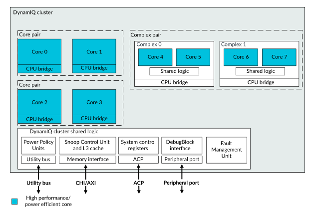

# DynamIQ cluster components

Source: <https://developer.arm.com/documentation/107721/0001/Technical-overview/-DynamIQ-cluster-components>

### DynamIQ cluster components

The DSU-120AE DynamIQ™ cluster contains all the cores and complexes together with the DynamIQ™ cluster shared logic. All the DynamIQ™ cluster shared logic is automatically connected to the cores and complexes by the configuration script during build-time configuration.

The following figure shows the main components that make up the DSU-120AE DynamIQ™ cluster within the DSU-120AE.

Figure 1. DSU-120AE DynamIQ™ cluster components

### Cores

The DSU-120AE DynamIQ™ cluster supports up to two different types of cores. The maximum number of supported cores depends on the build-time Dual-Core Lock-Step (DCLS) configuration as follows:

- For Lock-configuration, a maximum of seven cores
- For Split-configuration or Mixed-configuration, a maximum of 14 cores.

For information on the behavior and features of each core, see the Technical Reference Manual (TRM) of each core.

### Complexes

The DSU-120AE DynamIQ™ cluster supports complexes a maximum of 14 cores organized in complex-pairs. These complex-pairs can make up a pair of single-core complexes or a pair of dual-core complexes. Both of the complexes in the complex-pair have to be in identical arrangement.

A single cluster can have a mixture of both cores and complexes. The maximum number of cores in a cluster is 14, regardless if the cores are in the form of single cores or cores within a complex. Complexes are made up of specialized cores. See [What is a complex?](/documentation/107721/0001/The-DynamIQ-Shared-Unit-120AE/Cluster-configurations/What-is-a-complex-?lang=en "The DSU-120AE DynamIQ cluster supports blocks that are called complexes which contain up to two cores of the same type and some shared logic. Sharing some logic between the two cores of a dual core complex can make the dual core complex area efficient. However, this area efficiency is at the cost of reduced performance compared with using two single-core complexes."). See the DSU-120AE dependent features in your core TRM to determine if your core is supported in a complex.

### DynamIQ™ cluster shared logic

The DynamIQ™ cluster shared logic forms part of the DSU-120AE DynamIQ™ cluster. See [DynamIQ cluster shared logic components](/documentation/107721/0001/Technical-overview/DynamIQ-cluster-shared-logic-components?lang=en "The DynamIQ cluster shared logic includes the following components:").

### Related information

- [DynamIQ cluster shared logic components](/documentation/107721/0001/Technical-overview/DynamIQ-cluster-shared-logic-components?lang=en "The DynamIQ cluster shared logic includes the following components:")
- [DebugBlock components](/documentation/107721/0001/Technical-overview/DebugBlock-components?lang=en "The DebugBlock is a dedicated debug component for the DynamIQ Shared Unit-120AE (DSU-120AE) but is instanced as a separate unit to support Debug over Powerdown.")
- [Cluster configurations](/documentation/107721/0001/The-DynamIQ-Shared-Unit-120AE/Cluster-configurations?lang=en "A cluster can be configured with up to two different types of cores in the same cluster, irrespective of whether the cluster is configured either for Lock-configuration or Mixed-configuration. Each core can target different power efficiency and performance levels. The cluster also supports complexes.")
- [What is a complex?](/documentation/107721/0001/The-DynamIQ-Shared-Unit-120AE/Cluster-configurations/What-is-a-complex-?lang=en "The DSU-120AE DynamIQ cluster supports blocks that are called complexes which contain up to two cores of the same type and some shared logic. Sharing some logic between the two cores of a dual core complex can make the dual core complex area efficient. However, this area efficiency is at the cost of reduced performance compared with using two single-core complexes.")
