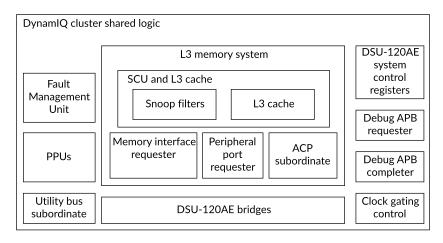

# DynamIQ cluster shared logic components

Source: <https://developer.arm.com/documentation/107721/0001/Technical-overview/DynamIQ-cluster-shared-logic-components>

### DynamIQ™ cluster shared logic components

The DynamIQ™ cluster shared logic includes the following components:

### Snoop Control Unit

The Snoop Control Unit (SCU) maintains coherency between all the data caches in the cluster.

The SCU contains buffers that can handle direct cache-to-cache transfers between cores without having to read or write data to the L3 cache. Cache line migration enables dirty lines to be moved between cores.

The SCU contains a set of snoop filters that track the addresses for locations cached in the core caches. Including the snoop filters means that the SCU does not need to request a look up in the core caches when it receives a coherent memory request. These snoop filters are accessed by the coherent requests from the other cores or from the system. If there is a simultaneous hit in the L3 tags and the SCU snoop filters, then the L3 cache normally provides the data in preference to a core. The size of the snoop filter is automatically determined from the configured number of cores and the cache sizes in those cores.

### Clock management

Clock gating is supported through Q-Channel requests from an external clock controller to the DSU-120AE. The Q-Channels allow individual control of the following clock input signals:

- ATCLK
- COREyCLK where y is the core instance number
- COMPLEXxCLK where x is the complex instance number
- GICCLK
- PCLK
- PERIPHCLK
- PPUCLK
- SCLK

### L3 memory interfaces

Main memory requester
:   The main memory
    requester provides an interface between the
    DynamIQ™ Shared Unit-120AE and the external interconnect. For a connection to an external coherent interconnect, the memory interface must be configured to use the AMBA 5 CHI (Issue E) protocol. For connection to a non-coherent external interconnect, the memory interface can either be configured to use the CHI protocol or AXI5 (Issue H) protocol. In either configuration, the interfaces are 256-bit wide, with support up to four bus
    requester ports.

Accelerator Coherency Port
:   The Accelerator Coherency Port (ACP) is an optional
    subordinate interface. The ACP provides direct memory access to cacheable memory. The SCU maintains cache coherency by checking ACP accesses for allocation in the
    core and L3 caches. The ACP implements a subset of the ACE-Lite protocol. Up to two ACP interfaces can be configured, with each interface configured to either 128-bit wide or 256-bit wide.

Peripheral port
:   The peripheral port is an optional requester interface. It provides accesses to tightly coupled accelerators and it separates the traffic to the system. The port implements the AXI5 or CHI Issue E requesterinterface protocol.

Utility bus
:   The utility bus is a 64-bit AXI5
    subordinate interface that provides access to the control registers for various system components in the cluster. The control registers are memory-mapped onto the utility bus. The utility bus provides programming access to the following system components:
:   - Power Policy Units (PPUs)
    - Activity monitors in the cores
    - L3 cache power-related monitors
    - Maximum Power Mitigation Mechanism (MPMM) registers in the cores
    - Reliability, Availability, and Serviceability (RAS) registers

If control registers require access from the cores, then the system must provide a loopback mechanism for accesses from the cluster to the relevant address range to map to the utility bus.

### L3 cache

The following table shows the optional L3 cache sizes together with their associativity.

<table id="osy1660577214636__table_dwt_ywt_phb">
 <caption>
  
   
    Table 1.
   
   L3 cache size
  
 </caption>
 <colgroup>
  <col span="1"/>
  <col span="1"/>
 </colgroup>
 <thead>
  <tr>
   <th class="documents-cellrowborder" colspan="1" id="d117377e309" rowspan="1">
    Size
   </th>
   <th class="documents-cellrowborder" colspan="1" id="d117377e312" rowspan="1">
    Associativity
   </th>
  </tr>
 </thead>
 <tbody>
  <tr>
   <td class="documents-cellrowborder" colspan="1" rowspan="1">
    256KB
   </td>
   <td class="documents-cellrowborder" colspan="1" rowspan="1">
    16-way
   </td>
  </tr>
  <tr>
   <td class="documents-cellrowborder" colspan="1" rowspan="1">
    512KB
   </td>
   <td class="documents-cellrowborder" colspan="1" rowspan="1">
    16-way
   </td>
  </tr>
  <tr>
   <td class="documents-cellrowborder" colspan="1" rowspan="1">
    1024KB
   </td>
   <td class="documents-cellrowborder" colspan="1" rowspan="1">
    16-way
   </td>
  </tr>
  <tr>
   <td class="documents-cellrowborder" colspan="1" rowspan="1">
    1536KB
   </td>
   <td class="documents-cellrowborder" colspan="1" rowspan="1">
    12-way
   </td>
  </tr>
  <tr>
   <td class="documents-cellrowborder" colspan="1" rowspan="1">
    2MB
   </td>
   <td class="documents-cellrowborder" colspan="1" rowspan="1">
    16-way
   </td>
  </tr>
  <tr>
   <td class="documents-cellrowborder" colspan="1" rowspan="1">
    3MB
   </td>
   <td class="documents-cellrowborder" colspan="1" rowspan="1">
    12-way
   </td>
  </tr>
  <tr>
   <td class="documents-cellrowborder" colspan="1" rowspan="1">
    4MB
   </td>
   <td class="documents-cellrowborder" colspan="1" rowspan="1">
    16-way
   </td>
  </tr>
  <tr>
   <td class="documents-cellrowborder" colspan="1" rowspan="1">
    6MB
   </td>
   <td class="documents-cellrowborder" colspan="1" rowspan="1">
    12-way
   </td>
  </tr>
  <tr>
   <td class="documents-cellrowborder" colspan="1" rowspan="1">
    8MB
   </td>
   <td class="documents-cellrowborder" colspan="1" rowspan="1">
    16-way
   </td>
  </tr>
  <tr>
   <td class="documents-cellrowborder" colspan="1" rowspan="1">
    12MB
   </td>
   <td class="documents-cellrowborder" colspan="1" rowspan="1">
    12-way
   </td>
  </tr>
  <tr>
   <td class="documents-cellrowborder" colspan="1" rowspan="1">
    16MB
   </td>
   <td class="documents-cellrowborder" colspan="1" rowspan="1">
    16-way
   </td>
  </tr>
  <tr>
   <td class="documents-cellrowborder" colspan="1" rowspan="1">
    24MB
   </td>
   <td class="documents-cellrowborder" colspan="1" rowspan="1">
    12-way
   </td>
  </tr>
  <tr>
   <td class="documents-cellrowborder" colspan="1" rowspan="1">
    32MB
   </td>
   <td class="documents-cellrowborder" colspan="1" rowspan="1">
    16-way
   </td>
  </tr>
 </tbody>
</table>

All caches have 64-byte line cache length. Data and tag RAMs have Error Correcting Code (ECC) protection.

### Power management and Power Policy Units

The DynamIQ™ cluster shared logic integrates several PPUs to control power modes and resets. The PPUs can be programmed to directly select a specific power mode or can be programmed to autonomously switch between power modes within a specified range, based on the requirements of the cluster. The PPUs can be programmed from your System Control Processor (SCP) using the utility bus to access them.

### DSU-120AE system control registers

The DynamIQ™ cluster shared logic implements a set of system control registers, which is common to all cores in the cluster. You can access these registers from any core in the cluster. These registers provide:

- Control for power management of the cluster
- L3 cache partitioning control
- CHI Quality of Service (QoS) bus control
- Information about the hardware configuration of the DSU-120AE
- L3 cache hit and miss count information
- Status of the pin-configured modes of the Mixed-configuration for the DSU-120AE logic and cores.

Some of the system control registers, for example those in the PPU, are memory-mapped to the utility bus and can only be accessed from this bus.

### Debug and trace components

Each core includes an Embedded Trace Extension (ETE) to allow program tracing while debugging.

Trigger events from the cores are combined and output to the DebugBlock. Trigger events to the cores, and Debug register accesses, are received in the DebugBlock.

### Fault Management Unit

The Fault Management Unit (FMU) is utilized as an organizational structure to manage faults that are generated in the underlying units. There are comparators in various places of the DSU logic. The FMUs are responsible for bringing together all the faults and combining them into the output signals.

The following figure shows the main components of the DynamIQ™ cluster shared logic.

Figure 1. DynamIQ™ cluster shared logic components

### Related information

- [Clocks and resets](/documentation/107721/0001/Clocks-and-resets?lang=en "The DynamIQ Shared Unit-120AE (DSU-120AE) has separate clock signals for each of the standalone cores (those cores not in a complex), and for each complex. There are also clocks for the internal logic, and some of the external interfaces of the DSU-120AE.")
- [Power management](/documentation/107721/0001/Power-management?lang=en "This chapter describes the power domains, power modes, and operating modes for the DynamIQ Shared Unit-120AE (DSU-120AE) and for the cores and complexes. It also provides a state transition diagram showing the supported power and operating mode transitions of the cluster, and describes the power-saving features employed by the DSU-120AE.")
- [L3 cache](/documentation/107721/0001/L3-cache?lang=en "All the cores and complexes in the DSU-120AE DynamIQ cluster share the L3 cache.")
- [CHI requester interface](/documentation/107721/0001/CHI-requester-interface?lang=en "You can use the Coherent Hub Interface (CHI) interface for either a coherent or non-coherent connection to your memory system. You can configure the DynamIQ Shared Unit-120AE (DSU-120AE) to have either one, two, three, or four bus requester interface ports that use the AMBA 5 CHI Issue E protocol.")
- [AXI manager interface](/documentation/107721/0001/AXI-manager-interface?lang=en "You can configure the DSU-120AE to have an AMBA AXI5 manager interface to your memory system, at a build-time configuration. This provides a non-coherent connection to your memory system. You can configure the DSU-120AE to have either one, two, three, or four AXI manager interface ports.")
- [AXI or CHI requester peripheral port](/documentation/107721/0001/AXI-or-CHI-requester-peripheral-port?lang=en "You can use the peripheral port to program registers for peripherals using Device accesses, for example, to configure tightly coupled accelerators. You can also use the peripheral port as an alternative requester port to support accesses to the rest of the system whilst the main requester ports connect to main memory.")
- [System control registers](/documentation/107721/0001/System-control-registers?lang=en "The system control registers control and provide status information for the functions that the DynamIQ Shared Unit-120AE (DSU-120AE) implements. They can be accessed from the cores directly or externally through the utility bus.")
- [Utility bus](/documentation/107721/0001/Utility-bus?lang=en "The utility bus provides access to control registers for various system components in the DynamIQ Shared Unit-120AE (DSU-120AE) and the cores within the DSU-120AE DynamIQ cluster. The utility bus is implemented as a 64-bit AMBA AXI5 subordinate port, and the control registers are memory-mapped onto the utility bus.")
- [Debug](/documentation/107721/0001/Debug?lang=en "The DSU-120AE DynamIQ cluster provides a debug system that supports both self-hosted and external debug. It has an external DebugBlock component, and integrates various CoreSight debug related components.")
