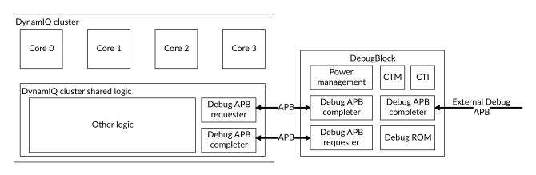

# DebugBlock components

Source: <https://developer.arm.com/documentation/107721/0001/Technical-overview/DebugBlock-components>

### DebugBlock components

The DebugBlock is a dedicated debug component for the DynamIQ Shared Unit-120AE (DSU-120AE) but is instanced as a separate unit to support Debug over Powerdown.

The following figure shows the main components of the DebugBlock.

Figure 1. DebugBlock components

### Cluster (requester) to DebugBlock APB (completer)

Trigger events from the cores are transferred to the DebugBlock as APB writes.

### DebugBlock (requester) to cluster APB (completer)

Trigger events to the cores are transferred as APB writes to the DSU-120AE. Register accesses from the system debug APB are transferred to the DSU-120AE.

### System debug APB

The system debug APB completer interface connects to external CoreSight components, such as the Debug Access Port (DAP).

### CTI and CTM

The DebugBlock implements an Embedded Cross Trigger (ECT). A Cross Trigger Interface (CTI) is allocated to each Processing Element (PE) in the cluster. An additional CTI is allocated to the cluster Performance Monitoring Unit (PMU) and the cluster Embedded Logic Analyzer (ELA) when present.

The CTIs are interconnected through the Cross Trigger Matrix (CTM). A single external channel interface is implemented to allow cross-triggering to be extended to the System on Chip (SoC).

### Debug ROM

The ROM table contains a list of components in the system. Debuggers can use the ROM table to determine which CoreSight components are implemented.

### Power management and clock gating

The DebugBlock implements two Q-Channel interfaces, one for requests to gate the PCLK clock and a second for requests to control the Debug power domain.

### Related reference

- [Debug](/documentation/107721/0001/Debug?lang=en "The DSU-120AE DynamIQ cluster provides a debug system that supports both self-hosted and external debug. It has an external DebugBlock component, and integrates various CoreSight debug related components.")
