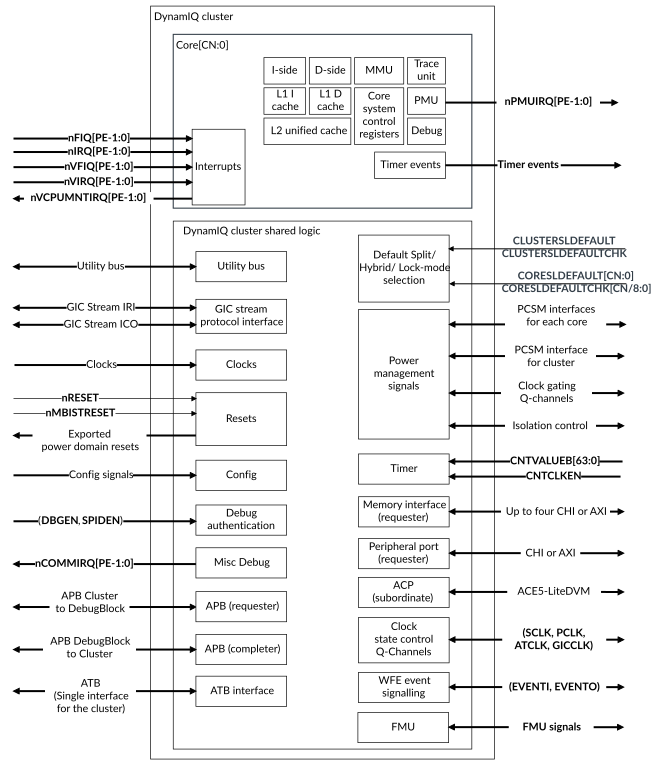
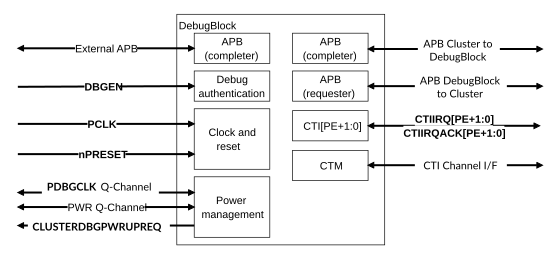

# Interfaces

Source: <https://developer.arm.com/documentation/107721/0001/Technical-overview/Interfaces>

### Interfaces

The DynamIQ Shared Unit-120AE (DSU-120AE) manages all the external interfaces to the System on Chip (SoC) including those from the cores and complexes in the cluster.

### DSU-120AE interfaces

The following figure shows the major external interfaces of the DSU-120AE DynamIQ™ cluster.

Figure 1. DSU-120AE DynamIQ™ cluster interfaces

The following table describes the external interfaces of the DSU-120AE DynamIQ™ cluster.

<table id="zuo1660577217613__table_c3x_sjp_dvb">
 <caption>
  
   
    Table 1.
   
   
    
     DSU-120AE DynamIQ&trade; cluster
    
   
   interfaces
  
 </caption>
 <colgroup>
  <col span="1"/>
  <col span="1"/>
  <col span="1"/>
 </colgroup>
 <thead>
  <tr>
   <th class="documents-cellrowborder" colspan="1" id="d30935e133" rowspan="1">
    Purpose
   </th>
   <th class="documents-cellrowborder" colspan="1" id="d30935e136" rowspan="1">
    Protocol
   </th>
   <th class="documents-cellrowborder" colspan="1" id="d30935e139" rowspan="1">
    Notes
   </th>
  </tr>
 </thead>
 <tbody>
  <tr>
   <td class="documents-cellrowborder" colspan="1" rowspan="1">
    Trace
   </td>
   <td class="documents-cellrowborder" colspan="1" rowspan="1">
    ATB
   </td>
   <td class="documents-cellrowborder" colspan="1" rowspan="1">
    
     Transmitter
    
    ATB interface. This is a single interface for the whole cluster.
   </td>
  </tr>
  <tr>
   <td class="documents-cellrowborder" colspan="1" rowspan="1">
    Memory
   </td>
   <td class="documents-cellrowborder" colspan="1" rowspan="1">
    AMBA AXI5 or CHI Issue E
   </td>
   <td class="documents-cellrowborder" colspan="1" rowspan="1">
    

     
      Requester
     
     interface to main memory. You can configure the
     
      DSU-120AE
     
     with either:
    

    <ul id="zuo1660577217613__ul_e3x_sjp_dvb">
     <li>
      1, 2, 3, or 4 CHI bus
      
       requester
      
      ports; or
     </li>
     <li>
      1, 2, 3, or 4 AXI bus
      
       manager
      
      ports
     </li>
    </ul>
    

     For more information, see
     <a class="document-topic" document-topic-path="/107721/0001/The-DynamIQ-Shared-Unit-120AE/DynamIQ-Shared-Unit-120AE-configuration-options?lang=en" href="/documentation/107721/0001/The-DynamIQ-Shared-Unit-120AE/DynamIQ-Shared-Unit-120AE-configuration-options?lang=en" title="You must configure the DynamIQ Shared Unit-120AE (DSU-120AE) RTL for your implementation requirements prior to hardware synthesis at build time configuration. Configuration for the DSU-120AE is carried out together with configuration for the cores in your cluster.">
      DynamIQ Shared Unit-120AE configuration options
     </a>
    

   </td>
  </tr>
  <tr>
   <td class="documents-cellrowborder" colspan="1" rowspan="1">
    Accelerator Coherency Port (optional)
   </td>
   <td class="documents-cellrowborder" colspan="1" rowspan="1">
    AMBA ACE5-Lite
   </td>
   <td class="documents-cellrowborder" colspan="1" rowspan="1">
    
     Subordinate
    
    interface allowing an external
    
     manager
    
    to make coherent requests to cacheable memory. You can configure the
    
     DSU-120AE
    
    to have one or two ACP interfaces.
   </td>
  </tr>
  <tr>
   <td class="documents-cellrowborder" colspan="1" rowspan="1">
    Peripheral port (optional)
   </td>
   <td class="documents-cellrowborder" colspan="1" rowspan="1">
    AMBA AXI5 Issue H or CHI Issue E
   </td>
   <td class="documents-cellrowborder" colspan="1" rowspan="1">
    The peripheral port provides the capability to separate the external system into a main memory subsystem accessed through the main
    
     requester
    
    interfaces and a subsystem for peripheral devices accessed through the peripheral port.
   </td>
  </tr>
  <tr>
   <td class="documents-cellrowborder" colspan="1" rowspan="1">
    Utility bus
   </td>
   <td class="documents-cellrowborder" colspan="1" rowspan="1">
    

     AMBA AXI5 Issue H
    

   </td>
   <td class="documents-cellrowborder" colspan="1" rowspan="1">
    Memory-mapped port for accessing the following:
    <ul id="zuo1660577217613__ul_g3x_sjp_dvb">
     <li>
      Power Policy Units (PPUs)
     </li>
     <li>
      Activity monitors
     </li>
     <li>
      Maximum Power Mitigation Mechanism (MPMM) registers
     </li>
     <li>
      RAS registers
     </li>
     <li>
      Memory System Resource Partitioning and Monitoring (MPAM) registers
     </li>
    </ul>
   </td>
  </tr>
  <tr>
   <td class="documents-cellrowborder" colspan="1" rowspan="1">
    Cluster to DebugBlock
   </td>
   <td class="documents-cellrowborder" colspan="1" rowspan="1">
    AMBA APB5 Issue D
   </td>
   <td class="documents-cellrowborder" colspan="1" rowspan="1">
    APB interface from the cluster (
    
     requester
    
    ) to the DebugBlock (
    
     completer
    
    )
   </td>
  </tr>
  <tr>
   <td class="documents-cellrowborder" colspan="1" rowspan="1">
    DebugBlock to cluster
   </td>
   <td class="documents-cellrowborder" colspan="1" rowspan="1">
    

     AMBA APB5 Issue D
    

   </td>
   <td class="documents-cellrowborder" colspan="1" rowspan="1">
    APB interface from the DebugBlock (
    
     requester
    
    ) to the cluster (
    
     completer
    
    )
   </td>
  </tr>
  <tr>
   <td class="documents-cellrowborder" colspan="1" rowspan="1">
    Power state control
   </td>
   <td class="documents-cellrowborder" colspan="1" rowspan="1">
    P-Channel
   </td>
   <td class="documents-cellrowborder" colspan="1" rowspan="1">
    P-Channels for
    
     DSU-120AE
    
    and
    
     
      core
     
    
    power management
   </td>
  </tr>
  <tr>
   <td class="documents-cellrowborder" colspan="1" rowspan="1">
    Clock state control
   </td>
   <td class="documents-cellrowborder" colspan="1" rowspan="1">
    Q-Channel
   </td>
   <td class="documents-cellrowborder" colspan="1" rowspan="1">
    Q-Channels for clock gating control
   </td>
  </tr>
  <tr>
   <td class="documents-cellrowborder" colspan="1" rowspan="1">
    Wait For Event (WFE) event signaling
   </td>
   <td class="documents-cellrowborder" colspan="1" rowspan="1">
    -
   </td>
   <td class="documents-cellrowborder" colspan="1" rowspan="1">
    Signals for Wait For Event (WFE) wake up events
   </td>
  </tr>
  <tr>
   <td class="documents-cellrowborder" colspan="1" rowspan="1">
    Generic timer
   </td>
   <td class="documents-cellrowborder" colspan="1" rowspan="1">
    -
   </td>
   <td class="documents-cellrowborder" colspan="1" rowspan="1">
    Input for the generic time count value. The count value is distributed to all
    
     
      cores
     
    
    . Each core outputs timer events.
   </td>
  </tr>
  <tr>
   <td class="documents-cellrowborder" colspan="1" rowspan="1">
    GIC interfaces
   </td>
   <td class="documents-cellrowborder" colspan="1" rowspan="1">
    GIC Stream Protocol
   </td>
   <td class="documents-cellrowborder" colspan="1" rowspan="1">
    Interrupts to individual
    
     
      cores
     
    
    . A single GIC Stream Protocol interface is shared by all
    
     
      cores
     
    
    .
   </td>
  </tr>
  <tr>
   <td class="documents-cellrowborder" colspan="1" rowspan="1">
    Design for Test (DFT)
   </td>
   <td class="documents-cellrowborder" colspan="1" rowspan="1">
    -
   </td>
   <td class="documents-cellrowborder" colspan="1" rowspan="1">
    Interface to allow access for Automatic Test Pattern Generation (ATPG) scan-path testing.
   </td>
  </tr>
  <tr>
   <td class="documents-cellrowborder" colspan="1" rowspan="1">
    Memory Built-In Self Test (MBIST)
   </td>
   <td class="documents-cellrowborder" colspan="1" rowspan="1">
    Arm MBIST
   </td>
   <td class="documents-cellrowborder" colspan="1" rowspan="1">
    Internal interface that supports the manufacturing test of the L3 cache and Snoop Control Unit (SCU) memories embedded in the
    
     DSU-120AE
    
    . Each
    
     
      core
     
    
    has its own internal MBIST interface.
   </td>
  </tr>
 </tbody>
</table>

### DebugBlock interfaces

The following figure shows the major external interfaces of the DebugBlock.

Figure 2. DebugBlock interfaces

The following table describes the major external interfaces of the DebugBlock.

<table id="zuo1660577217613__table_own_lkp_dvb">
 <caption>
  
   
    Table 2.
   
   DebugBlock interfaces
  
 </caption>
 <colgroup>
  <col span="1"/>
  <col span="1"/>
  <col span="1"/>
 </colgroup>
 <thead>
  <tr>
   <th class="documents-cellrowborder" colspan="1" id="d30935e502" rowspan="1">
    Purpose
   </th>
   <th class="documents-cellrowborder" colspan="1" id="d30935e505" rowspan="1">
    Protocol
   </th>
   <th class="documents-cellrowborder" colspan="1" id="d30935e508" rowspan="1">
    Notes
   </th>
  </tr>
 </thead>
 <tbody>
  <tr>
   <td class="documents-cellrowborder" colspan="1" rowspan="1">
    External debug
   </td>
   <td class="documents-cellrowborder" colspan="1" rowspan="1">
    AMBA APB5 Issue D
   </td>
   <td class="documents-cellrowborder" colspan="1" rowspan="1">
    

     
      Completer
     
     interface to external debug component, for example a Debug Access Port (DAP). It allows access to Debug registers and resources.
    

   </td>
  </tr>
  <tr>
   <td class="documents-cellrowborder" colspan="1" rowspan="1">
    Cluster to DebugBlock
   </td>
   <td class="documents-cellrowborder" colspan="1" rowspan="1">
    

     AMBA APB5 Issue D
    

   </td>
   <td class="documents-cellrowborder" colspan="1" rowspan="1">
    APB interface from the cluster (
    
     requester
    
    ) to the DebugBlock (
    
     completer
    
    ).
   </td>
  </tr>
  <tr>
   <td class="documents-cellrowborder" colspan="1" rowspan="1">
    DebugBlock to cluster
   </td>
   <td class="documents-cellrowborder" colspan="1" rowspan="1">
    

     AMBA APB5 Issue D
    

   </td>
   <td class="documents-cellrowborder" colspan="1" rowspan="1">
    APB interface from the DebugBlock (
    
     requester
    
    ) to the cluster (
    
     completer
    
    ).
   </td>
  </tr>
  <tr>
   <td class="documents-cellrowborder" colspan="1" rowspan="1">
    Cross-trigger channel interface
   </td>
   <td class="documents-cellrowborder" colspan="1" rowspan="1">
    CTI
   </td>
   <td class="documents-cellrowborder" colspan="1" rowspan="1">
    Allows cross-triggering to be extended to external SoC components.
   </td>
  </tr>
  <tr>
   <td class="documents-cellrowborder" colspan="1" rowspan="1">
    Power management
   </td>
   <td class="documents-cellrowborder" colspan="1" rowspan="1">
    Q-Channel
   </td>
   <td class="documents-cellrowborder" colspan="1" rowspan="1">
    

     Enables communication to an external power controller. To control clock gating and powerdown.
    

   </td>
  </tr>
 </tbody>
</table>

### Related information

- [Clocks and resets](/documentation/107721/0001/Clocks-and-resets?lang=en "The DynamIQ Shared Unit-120AE (DSU-120AE) has separate clock signals for each of the standalone cores (those cores not in a complex), and for each complex. There are also clocks for the internal logic, and some of the external interfaces of the DSU-120AE.")
- [CHI requester interface](/documentation/107721/0001/CHI-requester-interface?lang=en "You can use the Coherent Hub Interface (CHI) interface for either a coherent or non-coherent connection to your memory system. You can configure the DynamIQ Shared Unit-120AE (DSU-120AE) to have either one, two, three, or four bus requester interface ports that use the AMBA 5 CHI Issue E protocol.")
- [ACP subordinate interface](/documentation/107721/0001/ACP-subordinate-interface?lang=en "The Accelerator Coherency Port (ACP) is an optional subordinate interface that provides coherent transaction support between the DynamIQ Shared Unit-120AE (DSU-120AE) and external accelerators such as a Direct Memory Access (DMA) engine. Up to two ACP interfaces can be configured during build time configuration, with each ACP interface being implemented as either a 128-bit or 256-bit port.")
- [AXI manager interface](/documentation/107721/0001/AXI-manager-interface?lang=en "You can configure the DSU-120AE to have an AMBA AXI5 manager interface to your memory system, at a build-time configuration. This provides a non-coherent connection to your memory system. You can configure the DSU-120AE to have either one, two, three, or four AXI manager interface ports.")
- [AXI or CHI requester peripheral port](/documentation/107721/0001/AXI-or-CHI-requester-peripheral-port?lang=en "You can use the peripheral port to program registers for peripherals using Device accesses, for example, to configure tightly coupled accelerators. You can also use the peripheral port as an alternative requester port to support accesses to the rest of the system whilst the main requester ports connect to main memory.")
- [Debug](/documentation/107721/0001/Debug?lang=en "The DSU-120AE DynamIQ cluster provides a debug system that supports both self-hosted and external debug. It has an external DebugBlock component, and integrates various CoreSight debug related components.")
