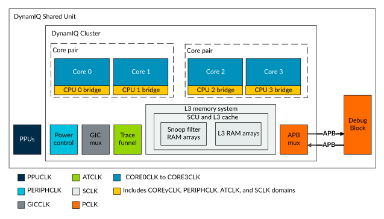

# Clock domains

Source: <https://developer.arm.com/documentation/107721/0001/Clocks-and-resets/Clock-domains>

### Clock domains

The DynamIQ Shared Unit-120AE (DSU-120AE) has multiple clock domains. Each core-pair or complex-pair can be implemented in a separate clock domain.

The following figure shows the clock domains for an example cluster with four standalone cores.

Figure 1. DSU-120AE clock domains

The cluster contains several clock domains for functionality that is likely to be connected to different clocks in the system. Within each core, the CPU bridge contains asynchronous bridges for all crossings between the core and cluster clock domains. Each CPU bridge is split, with one half of each bridge in the core clock domain and the other half in the cluster shared logic domain. At the cluster-level, there is the Snoop Control Unit (SCU) bridge which contains crossings between the cluster clock domains as required.

> ### Note
>
> The DebugBlock is shown in a common PCLK domain with the cluster debug logic. However, the DebugBlock can be placed in a different clock domain if asynchronous bridges are inserted on the APB interfaces between the DebugBlock and the cluster.

### Related information

- [DynamIQ Shared Unit-120AE configuration options](/documentation/107721/0001/The-DynamIQ-Shared-Unit-120AE/DynamIQ-Shared-Unit-120AE-configuration-options?lang=en "You must configure the DynamIQ Shared Unit-120AE (DSU-120AE) RTL for your implementation requirements prior to hardware synthesis at build time configuration. Configuration for the DSU-120AE is carried out together with configuration for the cores in your cluster.")
- [Clocks](/documentation/107721/0001/Clocks-and-resets/Clocks?lang=en "The DynamIQ Shared Unit-120AE (DSU-120AE) has a separate clock signal for each standalone core or complex. There are also separate clocks for the internal logic, and some of the external interfaces.")
