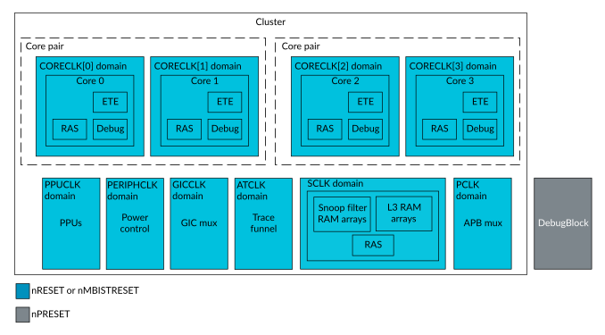

# Resets

Source: <https://developer.arm.com/documentation/107721/0001/Clocks-and-resets/Resets>

### Resets

The DynamIQ Shared Unit-120AE (DSU-120AE) has five external reset signals, a cluster-wide Cold reset, a cluster-wide MBIST reset, and a reset for the DebugBlock. Other resets, such as Warm resets to the cores are controlled, inside the cluster, by the Power Policy Units (PPUs).

The following table describes the DSU-120AE reset signals.

<table id="jwu1660577222848__table_nhy_hm1_shb">
 <caption>
  
   
    Table 1.
   
   DSU reset signals
  
 </caption>
 <colgroup>
  <col span="1"/>
  <col span="1"/>
 </colgroup>
 <thead>
  <tr>
   <th class="documents-cellrowborder" colspan="1" id="d112936e85" rowspan="1">
    Signal
   </th>
   <th class="documents-cellrowborder" colspan="1" id="d112936e88" rowspan="1">
    Description
   </th>
  </tr>
 </thead>
 <tbody>
  <tr>
   <td class="documents-cellrowborder" colspan="1" rowspan="1">
    
     
      nRESET
     
    
   </td>
   <td class="documents-cellrowborder" colspan="1" rowspan="1">
    A
    
     
      DSU-120AE DynamIQ&trade; cluster
     
    
    reset.
    
     
      nRESET
     
    
    is a single cluster-wide Cold reset.
    
     
      nRESET
     
    
    resets the PPU for the cluster and
    
     
      cores
     
    
    , which in turn resets the
    
     
      DynamIQ&trade; cluster shared logic
     
    
    and
    
     
      cores
     
    
    .
   </td>
  </tr>
  <tr>
   <td class="documents-cellrowborder" colspan="1" rowspan="1">
    
     
      nRESETCHK
     
    
   </td>
   <td class="documents-cellrowborder" colspan="1" rowspan="1">
    A redundant copy of the
    
     
      nRESET
     
    
    signal.
   </td>
  </tr>
  <tr>
   <td class="documents-cellrowborder" colspan="1" rowspan="1">
    
     
      nMBISTRESET
     
    
   </td>
   <td class="documents-cellrowborder" colspan="1" rowspan="1">
    A
    
     
      DSU-120AE DynamIQ&trade; cluster
     
    
    reset.
    
     
      nMBISTRESET
     
    
    is a single cluster-wide reset signal that resets all necessary logic in the
    
     
      cores
     
    
    and cluster for Memory Built-In Self Test (MBIST) testing.
   </td>
  </tr>
  <tr>
   <td class="documents-cellrowborder" colspan="1" rowspan="1">
    
     
      nMBISTRESETCHK
     
    
   </td>
   <td class="documents-cellrowborder" colspan="1" rowspan="1">
    A redundant copy of the
    
     
      nMBISTRESET
     
    
    signal.
   </td>
  </tr>
  <tr>
   <td class="documents-cellrowborder" colspan="1" rowspan="1">
    
     
      nPRESET
     
    
   </td>
   <td class="documents-cellrowborder" colspan="1" rowspan="1">
    The DebugBlock reset. A reset for all resettable registers in the DebugBlock.
   </td>
  </tr>
 </tbody>
</table>

The nMBISTRESET signal is active low and must be driven high for functional mode. A single top level nMBISTRESET is utilized to reset the IP in preparation for MBIST operations.

All reset inputs can be asserted (HIGH to LOW) and deasserted (LOW to HIGH) asynchronously. Reset synchronization logic inside the DSU-120AE ensures that reset deassertion is synchronous for all resettable registers inside those reset domains. The core clock does not need to be present for reset assertion. For reset deassertion, only PPUCLK (for the cluster) or PCLK (for the DebugBlock nPRESET) must be active. However, the reset deassertion in other clock domains is not effective until the relevant clock for that domain is active.

Resetting individual cores and other cluster logic can be performed by programming the appropriate integrated PPU, see [Power and reset control with Power Policy Units](/documentation/107721/0001/Power-and-reset-control-with-Power-Policy-Units?lang=en "This chapter describes how to control the power mode and reset behavior for the DSU-120AE DynamIQ cluster, cores, and complexes using the Power Policy Units (PPUs)."). When the cluster internal resets are asserted, the PPUs drive the reset output signals that correspond to the power domain logic that is being reset.

> ### Note
>
> You can use the
> DSU-120AE reset output signals, which are driven from the PPUs, to reset any external logic that is in the same power domain as the relevant parts of the cluster. For example, if the DebugBlock is in the same power domain as the cluster, the
> nPRESET input to the DebugBlock can be connected to the
> nPRESET output of the cluster. The
> nPRESET output of the cluster is driven by the cluster PPU. These reset outputs are all generated in the PPUCLK clock domain and therefore must be synchronized before use in the destination component.

The following figure shows the pin-controlled reset domains.

Figure 1. DSU-120AE pin-controlled reset domains

