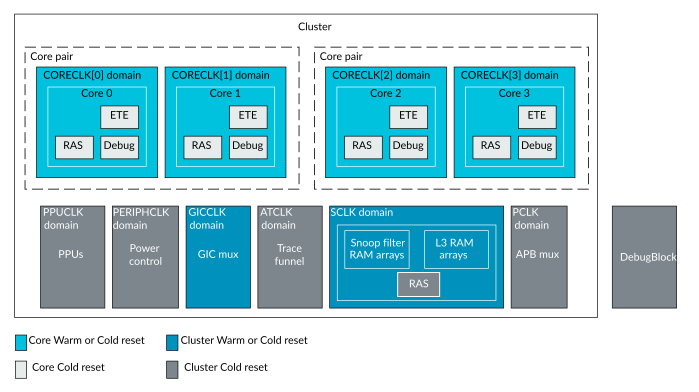

# Resetting with Power Policy Units

Source: <https://developer.arm.com/documentation/107721/0001/Clocks-and-resets/Resetting-with-Power-Policy-Units->

### Resetting with Power Policy Units

The Power Policy Units (PPUs) for the cluster and each of the cores are used to control the power management features of the cluster and cores using a software interface. This includes managing various power states and transitions between these states. Certain power mode changes, for example powering up the cluster from a powered down state, include implicit resets to internal logic.

This internal reset is managed by the PPU controlling the transition between the two modes. This internal reset does not require an external signal to be asserted or explicit programming of the PPU. For more information on what internal reset actions result from power mode changes, see [Power and reset control with Power Policy Units](/documentation/107721/0001/Power-and-reset-control-with-Power-Policy-Units?lang=en "This chapter describes how to control the power mode and reset behavior for the DSU-120AE DynamIQ cluster, cores, and complexes using the Power Policy Units (PPUs).").

The following figure shows the reset domains that can be controlled by programming the PPUs.

Figure 1. DSU-120AE PPU-controlled reset domains

When performing a Cold reset by asserting the nRESET signal, the PPUs are reset, and this in turn causes an internal reset to all the cluster and core logic. For more details on this process, see [nRESET sequence](/documentation/107721/0001/Power-and-reset-control-with-Power-Policy-Units/Power-policy-unit-operation/nRESET-sequence?lang=en "Asserting nRESET causes all the cluster and core logic to be Cold reset, using the Power Policy Units (PPUs). Each PPU has its own set of reset output and input signals, which are internal to the cluster, and connect to the core and cluster logic. Each PPU is responsible for resetting its associated core or cluster logic during nRESET.").
