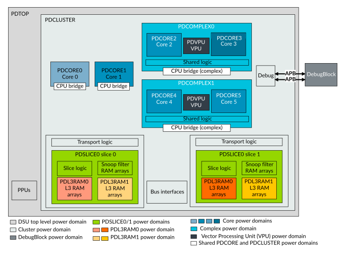

# DSU-120AE supported power domains

Source: <https://developer.arm.com/documentation/107721/0001/Power-management/DSU-120AE-supported-power-domains>

### DSU-120AE supported power domains

The DynamIQ Shared Unit-120AE (DSU-120AE) supports different power domains. You do not need to implement all power domains. The number and type of domains that are implemented depends on the choices made by the System on Chip (SoC) implementer. Each of the L3 cache slices, cores, and complexes can be placed in their own separate power domain. As the number of these components can vary depending on implementation, therefore the total number of power domains can also vary.

The following figure shows all the different types of power domains that are supported in a DSU-120AE-based cluster.

Figure 1. DSU-120AE power domains

> ### Note
>
> The logic for each CPU bridge is split across the core and cluster power domains.

The cluster comprises the following power domains:

### PDTOP

The top-level power domain (PDTOP) is typically placed in the same power domain as the other system components, for example, external bus infrastructure. The only cluster logic in this domain is the Power Policy Units (PPUs). This domain must be relatively always on compared to the other power domains. This is because the PPUs need to be able to power down the other domains including PDCLUSTER while remaining active. Therefore, the PDTOP power domain must be powered up before any of the other power domains are powered up, and it must only be powered down after the other power domains have been powered down.

The DebugBlock can be in the PDTOP or PDCLUSTER power domains. Alternatively, the DebugBlock can be placed with other debug components in a separate power domain as required.

### PDCLUSTER

Separating the cluster power domain (PDCLUSTER) from the power domain where the PPUs reside allows the PPUs and other system logic to stay on when the rest of the cluster is powered off.

### PDCORE<CN>

Optionally, you can place each core in its own separate power domain, for example PDCORE0 and PDCORE1 for two cores. Placing the cores in their own power domains allows them to be powered down individually. A core might have further internal power domains, see your core Technical Reference Manual (TRM) for details.

For any individually instantiated cores, their respective CPU bridges have logic both in the PDCORE power domain and in the PDCLUSTER power domain.

### PDCOMPLEX<CPXN>

If any complexes are included in the cluster, they each reside in their own separate power domain, for example PDCOMPLEX0 and PDCOMPLEX1 for two complexes. Within each PDCOMPLEX power domain, each core is in its own separate power domain, for example PDCORE2 and PDCORE3 as shown in [DSU-120AE power domains](/documentation/107721/0001/Power-management/DSU-120AE-supported-power-domains?lang=en#qkr1660577226777__cluster_powerdomains_ae). If the Vector Processing Unit (VPU) is included, this resides in its own separate PDVPU power domain within PDCOMPLEX. Both PDCORE and PDVPU are gated power domains that can support retention.

The CPU bridge for a complex has some logic in the PDCLUSTER power domain and remaining logic in the PDCOMPLEX power domain.

For more information on the power domains of a complex, see your core TRM.

### PDSLICE<SLICEN>

Each L3 cache slice is placed in its own separate power domain (PDSLICE), to allow the logic and RAMs of the cache slice to be powered down or to be placed in retention when not required. For example, in a cluster with more than one core, where only one core is powered on and lightly loaded most of the L3 cache might not be required.

> ### Note
>
> For configurations with more than two L3 cache slices, the Power Policy Unit (PPU) cannot control the powering up or powering down of each individual cache slice. Instead, the only configuration that is powered up is either, a single L3 cache slice, half the cache slices, or all L3 cache slices.
>
> For example, a DSU-120AE configured with four L3 cache slices, cache slices 1-3 are powered down together while cache slice 0 remains powered up.

### PDL3RAM0 and PDL3RAM1

Within each L3 cache slice, there are further power domains for the L3 cache RAMs (PDL3RAM0 and PDL3RAM1). These domains enable half or all of the cache ways for those RAMs to be powered off when the cache is empty, saving leakage power. The RAM power domains are expected to use power gates or retention support that is typically built into many RAMs.
