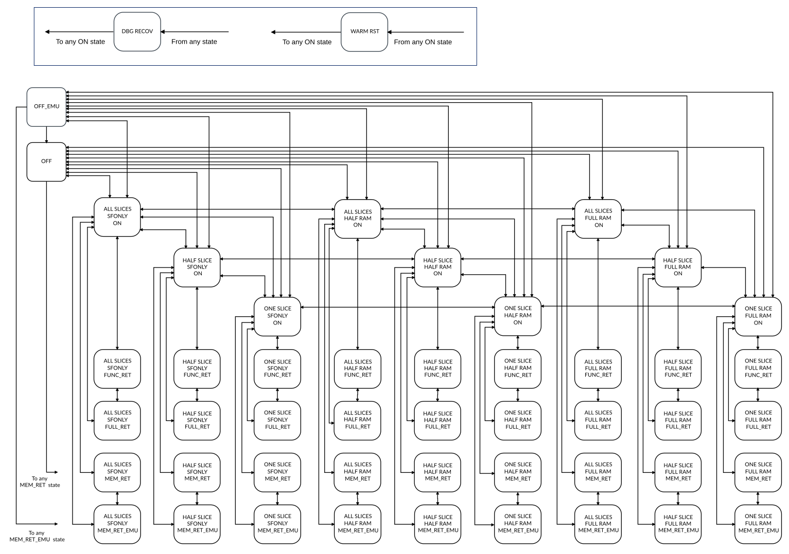
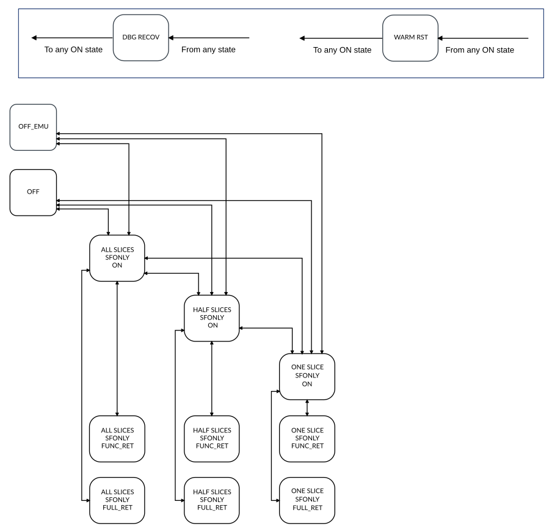

# Cluster PPU mode transitions

Source: <https://developer.arm.com/documentation/107721/0001/Power-management/Cluster-PPU-mode-transitions>

### Cluster PPU mode transitions

The DynamIQ Shared Unit-120AE (DSU-120AE) supports transitions between power and operating modes. Each combination of power mode with an L3 cache slice and L3 cache RAM operating mode forms a Power Policy Unit (PPU) mode, for example, ONE SLICE FULL RAM ON. Some power modes do not have associated operating modes, but these can also be referred to as PPU modes.

The cluster PPU controls transitions between the cluster PPU modes. Therefore, a System Control Processor (SCP) can program the PPU to go to any allowed PPU mode, and the PPU automatically makes the necessary transitions to reach the requested PPU mode.

The following figure shows the supported PPU mode transitions for the DSU-120AE DynamIQ™ cluster.

> ### Note
>
> The cluster PPU controls which PPU mode the cluster enters at reset deassertion.

Figure 1. DSU-120AE DynamIQ™ cluster PPU mode transitions

The following figure shows the supported PPU mode transitions for the DSU-120AE DynamIQ™ cluster where L3 cache is not implemented.

> ### Note
>
> The cluster PPU controls which PPU mode the cluster enters at reset deassertion.

Figure 2. DSU-120AE DynamIQ™ cluster PPU mode transitions, no L3 cache

### ALL SLICE FULL RAM ON

In this PPU mode, all the DynamIQ™ cluster shared logic, including the L3 cache RAMs and snoop filters, is powered up and fully operational. When a transition to the On mode completes, the L3 cache and the snoop filter are accessible and coherent without requiring any software configuration.

### ALL SLICES SFONLY ON and ALL SLICES HALF RAM ON

In these PPU modes, the DynamIQ™ cluster shared logic, including snoop filter RAMs, is powered up but half or all the L3 cache RAMs remain powered down. If the DSU-120AE is implemented with no L3 cache, then only the ALL SLICES SFONLY ON mode is supported.

### HALF SLICES SFONLY ON, HALF SLICES HALF RAM ON, and HALF SLICES FULL RAM ON

In these PPU modes, the DSU-120AE DynamIQ™ cluster is on and operational in the same way as the equivalent ALL SLICES operational mode, except that only half of the total number of cache slices configured are powered up and are active. The other slices are inactive and can be powered down.

> ### Note
>
> If the cluster is configured with two slices, then these PPU modes are identical to the ONE SLICE related PPU modes.

### ONE SLICE SFONLY ON, ONE SLICE HALF RAM ON, and ONE SLICE FULL RAM ON

In these PPU modes, the DynamIQ™ cluster shared logic is powered up and fully operational. This is equivalent to ALL\_SLICES operating mode, except that only one cache slice is powered up and active. The other slices are inactive and can be powered down.

> ### Note
>
> If the design is configured with only a single slice, then these modes are identical to the full slice modes.

### SFONLY FUNC\_RET, HALF RAM FUNC\_RET, and FULL RAM FUNC\_RET

In these PPU modes, the L3 cache RAMs and snoop filter RAMs are in retention. This means the RAMs are inoperable but their contents are retained. The rest of the DynamIQ™ cluster shared logic is operational. Therefore, if a request from a core or a snoop from the system is required to be serviced while in this mode it is stalled until the cluster enters one of the On modes.

### SFONLY FULL\_RET, HALF RAM FULL\_RET, and FULL RAM FULL\_RET

In these PPU modes, the L3 cache RAMs and snoop filter RAMs are in retention. This means the RAMs are inoperable but their contents are retained. The L3 cache slice logic is powered down. The rest of the DynamIQ™ cluster shared logic is operational. Therefore, if a request from a core or a snoop from the system is required to be serviced while in this mode it is stalled until the cluster enters one of the On modes.

### SFONLY MEM\_RET, HALF RAM MEM\_RET and FULL RAM MEM\_RET

In these PPU modes, the L3 cache RAMs are in retention, but the rest of the DynamIQ™ cluster shared logic is powered down, apart from the PPUs. This is also known as Dormant mode. Because the L3 cache still contains data, if another agent in the system needs to snoop the cluster to access that data then the cluster needs to transition to an On mode before the snoop can proceed. As this transition takes a significant amount of time, Arm® recommends that MEM\_RET is only used when other coherent agents are also idle.

> ### Note
>
> SFONLY MEM\_RET is equivalent to OFF mode within the cluster but might have an effect on the wider system.
