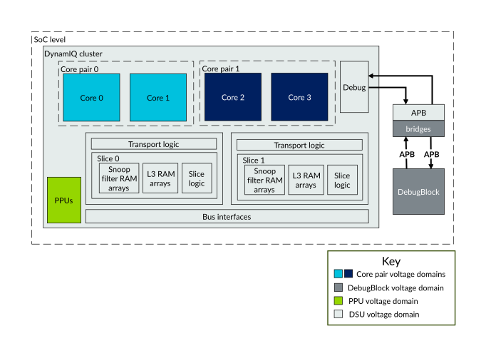

# DSU-120AE voltage domains

Source: <https://developer.arm.com/documentation/107721/0001/Power-management/DSU-120AE-voltage-domains>

### DSU-120AE voltage domains

The DSU-120AE supports each core-pair in the DSU-120AE DynamIQ™ cluster being implemented in a separate voltage domain. There is also a separate voltage domain for the DSU-120AE DynamIQ™ cluster itself.

The following figure shows the voltage domains in the cluster.

Figure 1. DSU-120AE voltage domains

Having each core-pair in a separate voltage domain allows Dynamic Voltage Frequency Scaling (DVFS) to be applied to each core-pair.

> ### Note
>
> Implementing each
> core
> -pair in a separate voltage domain is optional, but depends on an asynchronous bridge configuration. When the bridge configuration is synchronous, all cores must be in the
> DSU-120AE voltage domain. Some implementations might choose to reduce cost by combining groups of
> core
> -pairs into the same voltage domain.

The boundary of the core voltage domain is within the core-pair hierarchy itself. For the core asynchronous bridges, part of the bridge is in the core-pair voltage domain and part is in the cluster voltage domain.

The DSU-120AE DynamIQ™ cluster is typically placed in the same voltage domain as the System on Chip (SoC) interconnect and other system components but can be placed separately if necessary. Similarly, the DebugBlock can be placed in a separate domain if necessary, provided the implementer places appropriate bridges on the APB interfaces between the DebugBlock and the cluster.
