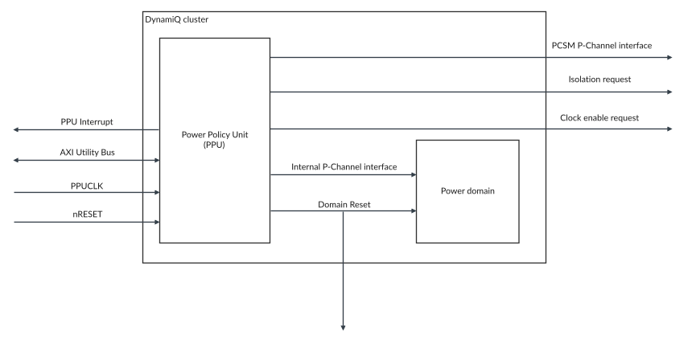
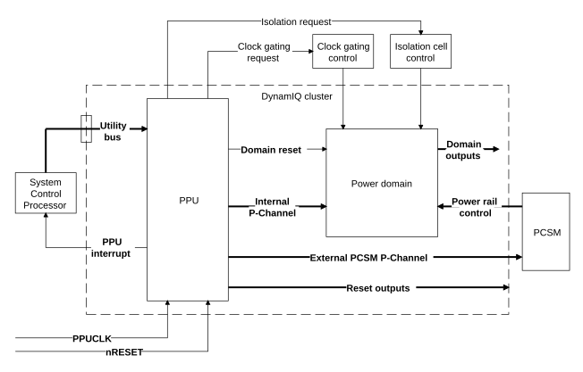

# The Power Policy Unit

Source: <https://developer.arm.com/documentation/107721/0001/Power-and-reset-control-with-Power-Policy-Units/The-Power-Policy-Unit>

### The Power Policy Unit

Power mode control for the DynamIQ Shared Unit-120AE (DSU-120AE) is provided by the Power Policy Units (PPUs) that are integrated into the cluster. These PPUs control all the PPU modes for all components in the cluster.

A PPU is a standard component for abstracting software-controlled power domain policy to low-level hardware control signaling. There is one PPU for controlling the DSU-120AE DynamIQ™ cluster power domain (PDCLUSTER). Also, each core has its own individual PPU for controlling its respective core power domain (for example, a PPU for PDCORE0 and a PPU for PDCORE1). This includes any cores included as part of a complex.

A component in the system such as a System Control Processor (SCP) can program the PPUs through the utility bus to set the required power policy. The PPUs control the low-level details of powering up, powering down, and resetting domains as necessary to implement the requested policy. The hardware performs any actions to reach the requested power mode, such as gating clocks, cleaning and invalidating caches, or disabling coherency.

> ### Note
>
> - Although the cluster and each core in the cluster has their own PPU, the shared logic of a complex does not have a dedicated PPU. Instead, power management of the complex is controlled as a combination of the PPUs for the cores it contains, see [PPU mode and power domain states for a dual-core complex](/documentation/107721/0001/Power-management/Complex-power-management/Complex-power-modes?lang=en#bzd1660577241616__table_complex_power_modes).
> - The cluster and all the core PPUs are provided as part of the DSU-120AE.
> - The implementation process automatically creates the PPU for the cluster and each core PPU, and connects these into the DSU-120AE DynamIQ™ cluster. Each PPU has a set of memory-mapped control registers which is accessed using the utility bus.

The PPUs:

- Abstract away the underlying mechanics of power state machine control of the DSU-120AE. This allows the external power manager to focus on the power modes it wants to achieve without being concerned about low-level control.
- Can provide autonomous control of power modes depending on the requirements of the cluster, for example the number of hits into the L3 cache.

PPUs can provide autonomous control of power modes with a range of modes.

The following figure shows the DSU-120AE PPU interfaces. All interfaces are external to the DSU-120AE apart from the Device Control interface, which has signals that both connect to the internal logic of cluster, and signals that are exported outside of the cluster.

Figure 1. DSU-120AE PPU interfaces

All PPUs have the following main interfaces:

Software interface
:   The programming interface for the PPU registers is accessed through the external utility bus. These registers are programmed with the high-level policy and configuration.

Device control interface
:   The Device control interface is the internal interface that connects to each of the cluster and core power domains.

    > ### Note
    >
    > Some of the device control interface signals are exported outside of the
    > DSU-120AE to allow control of other components that might be in the same power domain.

    The interface provides low-level device control and ensures device quiescence. The interface comprises:

    - The device interface, which consists of a P-Channel interface, see  [AMBA® Low Power Interface Specification](https://developer.arm.com/documentation/ihi0068/latest/).
    - The device control interface, which includes clock enables, resets, and isolation control.

PCSM interface
:   The
    Power Control State Machine (PCSM) interface is an external interface for controlling low-level technology-specific power switch and retention controls. You must connect a PCSM to each interface as part of the
    DSU-120AE implementation. There are separate PSCM interfaces for each
    core instantiated in the cluster, and a separate PCSM for the
    DSU-120AE DynamIQ™ cluster itself.

The following figure shows a high-level illustration of how the PPU and PCSM controls connect to each other, and to a power-gated domain. The dotted lines indicate the implementation-dependent components and signal connections.

Figure 2. DSU-120AE PPU connections to a power-gated domain

All the PPUs contained within the DSU-120AE are pre-built and are based on configurations of the CoreLink PCK-600 Power Policy Units and comply with the PPU architecture specification version 1.1, see [Arm® Power Policy Unit Architecture Specification](https://developer.arm.com/documentation/den0051/latest).
