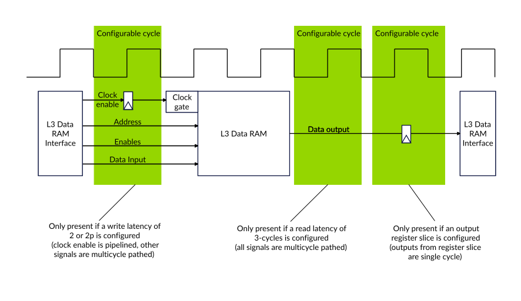

# L3 cache data RAM latency

Source: <https://developer.arm.com/documentation/107721/0001/L3-cache/L3-cache-data-RAM-latency>

### L3 cache data RAM latency

The DSU-120AE L3 data RAM interface can be implemented with a configurable latency on the input and output paths.

The following options are available:

- Either a 1-cycle (the default) or 2-cycles write latency on the input path to the L3 data RAMs
- Either a 2-cycles (the default) or 3-cycles read latency on the output path from the L3 data RAMs
- A 2p write latency option on the input path, when the 3-cycles read latency is configured on the output path
  > ### Note
  >
  > This 2p write latency also keeps the RAM input signals stable for an extra cycle, allowing an extra cycle of hold timing on the RAM inputs.
- An optional register slice on the output of the L3 data RAMs.

On the input paths, if a 2 or 2p write latency is requested then the RAM clock enable is pipelined and a multicycle path is applied to all other RAM input signals.

On the output paths, the 2-cycles read latency and 3-cycles read latency applies a multicycle path to all RAM output signals. The output of the optional register slice is single cycle and must never have a multicycle path applied.

The following figure shows the L3 data RAM timing.

Figure 1. L3 cache data RAM latency

An increase in RAM latency increases the L3 hit latency, which reduces performance. For this reason, only use the 3-cycles read latency option if the RAM cannot meet the timing requirement of the 2-cycles latency. But, if only the wire routing delay from the RAM to the SCU logic cannot meet this timing requirement, then use the register slice instead.

> ### Note
>
> Latency options are only specified for the L3 data RAMs, because the L3 tag RAMs and SCU snoop filter RAMs meet the 1-cycle input and 1-cycle output timing requirement.

The following table describes the impact on L3 data RAM performance with the different latency configuration parameters:

<table id="smy1660577260336__table_inc_pgf_vt">
 <caption>
  
   
    Table 1.
   
   L3 data RAM performance with different latency configurations
  
 </caption>
 <colgroup>
  <col span="1"/>
  <col span="1"/>
  <col span="1"/>
  <col span="1"/>
  <col span="1"/>
 </colgroup>
 <thead>
  <tr>
   <th class="documents-nocellnorowborder" colspan="1" id="d250958e125" rowspan="1">
    L3_DATA_WR_LATENCY
   </th>
   <th class="documents-nocellnorowborder" colspan="1" id="d250958e128" rowspan="1">
    L3_DATA_RD_LATENCY
   </th>
   <th class="documents-nocellnorowborder" colspan="1" id="d250958e131" rowspan="1">
    L3_DATA_RD_SLICE
   </th>
   <th class="documents-nocellnorowborder" colspan="1" id="d250958e134" rowspan="1">
    L3 data RAM access cycles
   </th>
   <th class="documents-cell-norowborder" colspan="1" id="d250958e137" rowspan="1">
    L3 lookup bandwidth
   </th>
  </tr>
 </thead>
 <tbody>
  <tr>
   <td class="documents-nocellnorowborder" colspan="1" rowspan="1">
    1-cycle
   </td>
   <td class="documents-nocellnorowborder" colspan="1" rowspan="1">
    2-cycles
   </td>
   <td class="documents-nocellnorowborder" colspan="1" rowspan="1">
    No
   </td>
   <td class="documents-nocellnorowborder" colspan="1" rowspan="1">
    2
   </td>
   <td class="documents-cell-norowborder" colspan="1" rowspan="1">
    Access every 2-clock cycles
   </td>
  </tr>
  <tr>
   <td class="documents-nocellnorowborder" colspan="1" rowspan="1">
    1-cycle
   </td>
   <td class="documents-nocellnorowborder" colspan="1" rowspan="1">
    3-cycles
   </td>
   <td class="documents-nocellnorowborder" colspan="1" rowspan="1">
    No
   </td>
   <td class="documents-nocellnorowborder" colspan="1" rowspan="1">
    3
   </td>
   <td class="documents-cell-norowborder" colspan="1" rowspan="1">
    Access every 3-clock cycles
   </td>
  </tr>
  <tr>
   <td class="documents-nocellnorowborder" colspan="1" rowspan="1">
    1-cycle
   </td>
   <td class="documents-nocellnorowborder" colspan="1" rowspan="1">
    2-cycles
   </td>
   <td class="documents-nocellnorowborder" colspan="1" rowspan="1">
    Yes
   </td>
   <td class="documents-nocellnorowborder" colspan="1" rowspan="1">
    3
   </td>
   <td class="documents-cell-norowborder" colspan="1" rowspan="1">
    Access every 2-clock cycles
   </td>
  </tr>
  <tr>
   <td class="documents-nocellnorowborder" colspan="1" rowspan="1">
    1-cycle
   </td>
   <td class="documents-nocellnorowborder" colspan="1" rowspan="1">
    3-cycles
   </td>
   <td class="documents-nocellnorowborder" colspan="1" rowspan="1">
    Yes
   </td>
   <td class="documents-nocellnorowborder" colspan="1" rowspan="1">
    4
   </td>
   <td class="documents-cell-norowborder" colspan="1" rowspan="1">
    Access every 3-clock cycles
   </td>
  </tr>
  <tr>
   <td class="documents-nocellnorowborder" colspan="1" rowspan="1">
    2-cycles
   </td>
   <td class="documents-nocellnorowborder" colspan="1" rowspan="1">
    2-cycles
   </td>
   <td class="documents-nocellnorowborder" colspan="1" rowspan="1">
    No
   </td>
   <td class="documents-nocellnorowborder" colspan="1" rowspan="1">
    3
   </td>
   <td class="documents-cell-norowborder" colspan="1" rowspan="1">
    Access every 2-clock cycles
   </td>
  </tr>
  <tr>
   <td class="documents-nocellnorowborder" colspan="1" rowspan="1">
    2-cycles (including 2p)
   </td>
   <td class="documents-nocellnorowborder" colspan="1" rowspan="1">
    3-cycles
   </td>
   <td class="documents-nocellnorowborder" colspan="1" rowspan="1">
    No
   </td>
   <td class="documents-nocellnorowborder" colspan="1" rowspan="1">
    4
   </td>
   <td class="documents-cell-norowborder" colspan="1" rowspan="1">
    Access every 3-clock cycles
   </td>
  </tr>
  <tr>
   <td class="documents-nocellnorowborder" colspan="1" rowspan="1">
    2-cycles
   </td>
   <td class="documents-nocellnorowborder" colspan="1" rowspan="1">
    2-cycles
   </td>
   <td class="documents-nocellnorowborder" colspan="1" rowspan="1">
    Yes
   </td>
   <td class="documents-nocellnorowborder" colspan="1" rowspan="1">
    4
   </td>
   <td class="documents-cell-norowborder" colspan="1" rowspan="1">
    Access every 2-clock cycles
   </td>
  </tr>
  <tr>
   <td class="documents-row-nocellborder" colspan="1" rowspan="1">
    2-cycles (including 2p)
   </td>
   <td class="documents-row-nocellborder" colspan="1" rowspan="1">
    3-cycles
   </td>
   <td class="documents-row-nocellborder" colspan="1" rowspan="1">
    Yes
   </td>
   <td class="documents-row-nocellborder" colspan="1" rowspan="1">
    5
   </td>
   <td class="documents-cellrowborder" colspan="1" rowspan="1">
    Access every 3-clock cycles
   </td>
  </tr>
 </tbody>
</table>

### Related concepts

- [L3 cache](/documentation/107721/0001/L3-cache?lang=en "All the cores and complexes in the DSU-120AE DynamIQ cluster share the L3 cache.")

### Related reference

- [DynamIQ Shared Unit-120AE configuration options](/documentation/107721/0001/The-DynamIQ-Shared-Unit-120AE/DynamIQ-Shared-Unit-120AE-configuration-options?lang=en "You must configure the DynamIQ Shared Unit-120AE (DSU-120AE) RTL for your implementation requirements prior to hardware synthesis at build time configuration. Configuration for the DSU-120AE is carried out together with configuration for the cores in your cluster.")
