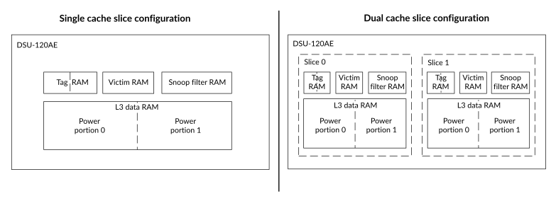

# Cache slices and power portions

Source: <https://developer.arm.com/documentation/107721/0001/L3-cache/Cache-slices-and-power-portions>

### Cache slices and power portions

The L3 cache of the DynamIQ Shared Unit-120AE (DSU-120AE) can be divided up into identical slices, up to a limit of eight slices, each containing between 256KB and 4MB of the cache. A cache slice consists of the data, tag, victim, and snoop filter RAMs and associated logic. A power portion is a further subdivision of RAM in a cache slice.

For each cache slice, both the data RAM and tag RAM is subdivided into two power portion.

The following figure shows the differences between a single and a dual cache slice configuration.

Figure 1. Comparison between a single and dual L3 cache slice configuration

Splitting the L3 cache into slices provides the following advantages:

- Improving the physical floorplan when implementing the macrocell, by ensuring that the RAMs are located close to the logic that is controlling them.
- Increasing the bandwidth because the slices can be accessed in parallel.

### Related information

- [Available number of cache ways](/documentation/107721/0001/L3-cache/Available-number-of-cache-ways?lang=en "The available number of cache ways in each cache slice depend on the L3 cache size that you choose to implement.")
- [Cache slice and requester port selection](/documentation/107721/0001/L3-cache/Cache-slices-and-power-portions/Cache-slice-and-requester-port-selection?lang=en "For an implementation with more than one cache slice, requests are sent to a particular slice depending on the address and the memory attributes.")
- [L3 cache slice powerdown](/documentation/107721/0001/Power-management/L3-RAM-power-control/L3-cache-slice-powerdown?lang=en "In addition to powering down the L3 cache RAMs, you can gain further leakage savings by powering down some of the L3 cache slice control logic as well. Control of powering up or powering down L3 cache slices is performed by the cluster Power Policy Unit (PPU).")
