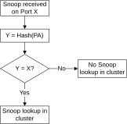

# CHI transaction routing with multiple requester ports

Source: <https://developer.arm.com/documentation/107721/0001/CHI-requester-interface/CHI-transaction-routing-with-multiple-requester-ports>

### CHI transaction routing with multiple requester ports

Transactions from the cores are routed, using the address target groups, to one of the CHI bus requester ports based on the transaction type, memory type, and transaction address.

> ### Note
>
> Address target group[0] has special functionality. For example, Distributed Virtual Memory (DVM) transactions always use
> address target group 0 unless the
> DEFAULTP configuration signal is set. Depending on your configuration signals, Device transactions are assigned to address target group 0. Typically, address target group 0 is mapped to bus interface port 0, but there might be special circumstances where bus interface port 0 is disabled. See
> [Mapping between address target groups and bus requester ports](/documentation/107721/0001/CHI-requester-interface/Configure-CHI-bus-requester-ports-to-use-address-target-groups/Mapping-for-address-target-groups-to-CHI-bus-requester-ports?lang=en#kft1660577264504__table_mp_mapping) for details.

The following table summarizes how CHI transactions are routed based on the transaction type.

<table id="dwx1660577265803__table_chi_routing">
 <caption>
  
   
    Table 1.
   
   CHI transaction routing
  
 </caption>
 <colgroup>
  <col span="1"/>
  <col span="1"/>
 </colgroup>
 <thead>
  <tr>
   <th class="documents-nocellnorowborder" colspan="1" id="d43388e91" rowspan="1">
    Transaction type
   </th>
   <th class="documents-cell-norowborder" colspan="1" id="d43388e94" rowspan="1">
    Routed to
   </th>
  </tr>
 </thead>
 <tbody>
  <tr>
   <td class="documents-nocellnorowborder" colspan="1" rowspan="1">
    Cacheable transactions
   </td>
   <td class="documents-cell-norowborder" colspan="1" rowspan="1">
    Bus
    
     requester
    
    port number that is based on the address target group.
   </td>
  </tr>
  <tr>
   <td class="documents-nocellnorowborder" colspan="1" rowspan="1">
    Normal Non-cacheable transactions
   </td>
   <td class="documents-cell-norowborder" colspan="1" rowspan="1">
    Bus
    
     requester
    
    port number that is based on the target address group.
   </td>
  </tr>
  <tr>
   <td class="documents-nocellnorowborder" colspan="1" rowspan="1">
    Device non-reorderable transactions
   </td>
   <td class="documents-cell-norowborder" colspan="1" rowspan="1">
    

     These are sent to either:
    

    <ul id="dwx1660577265803__ul_f2m_cb2_lrb">
     <li>
      The bus
      
       requester
      
      port, which is assigned to address target group 0.
     </li>
     <li>
      All bus
      
       requester
      
      interfaces.
     </li>
    </ul>
   </td>
  </tr>
  <tr>
   <td class="documents-nocellnorowborder" colspan="1" rowspan="1">
    Device reorderable transactions
   </td>
   <td class="documents-cell-norowborder" colspan="1" rowspan="1">
    Bus
    
     requester
    
    port number that is based on the target address group.
   </td>
  </tr>
  <tr>
   <td class="documents-nocellnorowborder" colspan="1" rowspan="1">
    External snoop transactions
   </td>
   <td class="documents-cell-norowborder" colspan="1" rowspan="1">
    Snoop responses are routed to back to the same bus
    
     requester
    
    port that received the snoop.
   </td>
  </tr>
  <tr>
   <td class="documents-row-nocellborder" colspan="1" rowspan="1">
    DVM transactions
   </td>
   <td class="documents-cellrowborder" colspan="1" rowspan="1">
    

     DVM transaction routing is controlled by the signal
     
      
       DEFAULTP
      
     
     :
    

    <ul id="dwx1660577265803__ul_ldl_thq_lrb">
     <li>
      Either sent to the bus
      
       requester
      
      port assigned to address target group 0; or
     </li>
     <li>
      Not used on this interface and these transactions are managed by the peripheral port.
     </li>
    </ul>
   </td>
  </tr>
 </tbody>
</table>

> ### Note
>
> - In the preceding table, you can find the bus requester port that corresponds to the target group given from the look-up table, see [Mapping between address target groups and bus requester ports](/documentation/107721/0001/CHI-requester-interface/Configure-CHI-bus-requester-ports-to-use-address-target-groups/Mapping-for-address-target-groups-to-CHI-bus-requester-ports?lang=en#kft1660577264504__table_mp_mapping).
> - By default, transactions described in the preceding table are directed to one of the requester interface ports unless they match one of the peripheral port address ranges. However, if the DEFAULTP signal is asserted at reset, then the mapping is inverted. Therefore all transactions, including DVM operations, go to the peripheral port except those that match the configured address ranges. These transactions that match the configured address ranges are sent to the main requester interface ports instead.

Cacheable and Non-cacheable transactions
:   For Cacheable transactions and Normal Non-cacheable transactions, routing from the
    cores are based on the
    address target group of the transaction. A configurable hash of the transaction address selects which
    requester interface port is used. See
    [Hashing for CHI transaction distribution](/documentation/107721/0001/CHI-requester-interface/Configure-CHI-bus-requester-ports-to-use-address-target-groups/Hashing-for-CHI-transaction-distribution?lang=en "When more than one bus requester port is implemented, the hashing to decide which transaction goes to which address target group is based on the Physical Address (PA) of the transaction, and the number of requester ports configured. There is a 1-bit, 2-bit, or 3-bit value that is used to identify the address target group number for each transaction depending on the number of bus requester ports configured. This gives a maximum of eight groups.").

Device non-reorderable transactions
:   Device non-reorderable transactions are either always routed to address target group 0 or are routed based on the calculated address target group and on the value of the DEVNRINTERLEAVE[1:0] input signal as follows:
:   0b00
    :   All Device non-reorderable transactions are sent to address target group 0.

    0b01
    :   Device non-reorderable transactions are sent to any requester interface port that is based on the same address interleaving as for non-Device transactions.

    0b10
    :   Reserved

    0b11
    :   There is no downstream convergence of traffic from different ports. This includes transactions sent on the same physical port using a different TgtID due to having a different address target group. This means that the system interconnect design must guarantee that the transactions from different ports or from the same port but with different TgtID values are not routed to the same endpoint and therefore the ReadReceipt or Data Buffer ID (DBID) is enough to guarantee global ordering.

External snoop transactions
:   The following figure shows how a snoop from the external memory system on one of the interface ports is handled. In this figure, PA is the physical address of the snoop.

    Figure 1. External snoop handling on CHI requester port

    

    If there is no match, the response to the snoop is a cache miss and there is no lookup in the cluster. Therefore, when the external memory system sends snoops, it must either:

    - Send the snoop to all the requester ports. All but one of the snoops are guaranteed to miss, the remaining snoop might hit or miss depending on the state of the cache line in the cluster.
    - Send the snoop only to the requester interface port that is relevant for the address of the snoop. This behavior is normal operation for an external memory system that contains a snoop filter. The snoop filter indicates that the line is present in one of the requesters.

    The second method is more efficient, and therefore if multiple requester interfaces are implemented, Arm® recommends that the external memory system includes a snoop filter. The snoop filter must be able to either:

    - Track the exact requester interface port.
    - Calculate the correct requester interface port based on the snoop transaction address.

DVM message transactions
:   The DSU-120AE only issues DVM messages on one port. When the DEFAULTP signal is asserted, all outgoing DVM messages are sent on the peripheral port. When the DEFAULTP signal is de-asserted, all outgoing DVM messages are sent on the port that is allocated to address target group 0.

    The DSU-120AE only processes incoming DVM messages that are sent to the port used for outgoing DVM messages. In systems with multiple bus requester interface ports, DVM messages sent to the other bus requester ports receive a response but have no effect inside the cluster.

    For information about mappings for outgoing messages, see [Mapping between address target groups and bus requester ports](/documentation/107721/0001/CHI-requester-interface/Configure-CHI-bus-requester-ports-to-use-address-target-groups/Mapping-for-address-target-groups-to-CHI-bus-requester-ports?lang=en#kft1660577264504__table_mp_mapping).
