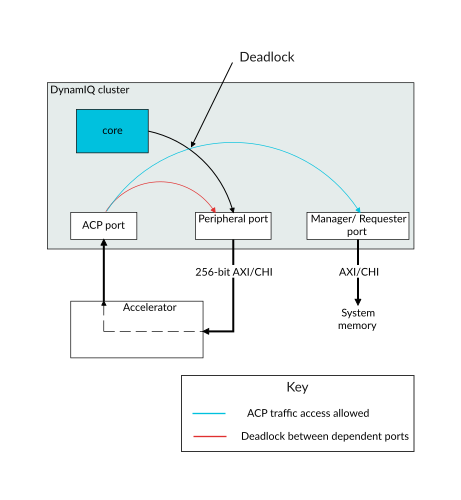
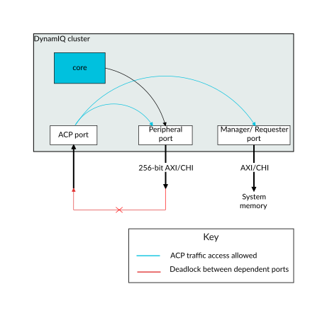

# Peripheral port and ACP interface usage

Source: <https://developer.arm.com/documentation/107721/0001/AXI-or-CHI-requester-peripheral-port/Peripheral-port-and-ACP-interface-usage>

### Peripheral port and ACP interface usage

When using a 256-bit CHI or 256-bit AXI configured peripheral port, ensure the peripheral port and main manager ports complete their accesses independently of the Accelerator Coherency Port (ACP) interface to avoid a system deadlock. Alternatively use the 64-bit AXI configured peripheral port which does not have this restriction.

There are two main use-cases for the peripheral port:

- For connecting to a tightly-coupled accelerator.
- For use as a more general system port.

If the system is not correctly designed, both of these use cases can result in deadlock scenarios.

### Deadlock condition when peripheral port is connected to an accelerator

The following figure shows an example of how the deadlock condition can arise when the peripheral port of the DynamIQ Shared Unit-120AE (DSU-120AE) is connected to a tightly-coupled accelerator.

Figure 1. Deadlock scenario when peripheral port is connected to an accelerator

When the peripheral port is connected to a tightly-coupled accelerator, the accelerator might have an internal dependency, this is shown by the dashed line in the preceding figure. This means, a read or write to the registers of the accelerator through the peripheral port cannot complete until an outstanding transaction that it has started on the Accelerator Coherency Port (ACP) completes. Because of this dependency, if an ACP access is routed to the peripheral port (shown by the red arrow in the preceding figure) then it creates a circular dependency which can result in a system deadlock. Therefore, when the peripheral port is configured as 64-bit mode, any ACP access to the peripheral port address range receives a SLVERR response. Therefore, the ACP cannot access the peripheral port. This illegal condition is shown by the red cross between the ACP port and peripheral port.

If an ACP access is routed to the main manager ports, then it travels down the same pipeline as accesses from the core. This is shown where the black and blue arrows cross over each other in the preceding figure. This could create a circular dependency between the accesses. However, when the peripheral port is configured in 64-bit mode there is additional logic in the cluster that ensures that ACP and core traffic do not depend on each other. Therefore, the deadlock is avoided.

### Deadlock condition when peripheral port is used as a system port

The following figure shows an example of how a deadlock condition can arise when the peripheral port is used as a general system port.

Figure 2. Deadlock scenario when peripheral port is used as general system port

When the peripheral port is used as a general system port, ACP traffic is allowed to access the peripheral port and the access completes normally. This is shown by the blue line between the ACP port in the preceding figure. Therefore, when the peripheral port is configured in 256-bit mode, the system must ensure that peripheral port accesses can complete independently without requiring any process on ACP. However, if there is a dependency between the peripheral port and ACP port, shown by the red arrow with a cross in the preceding figure, then the system could deadlock.
