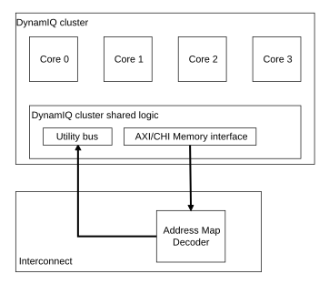

# Core access to system component registers

Source: <https://developer.arm.com/documentation/107721/0001/Utility-bus/Utility-bus-accesses/Core-access-to-system-component-registers>

### Core access to system component registers

Some of the system-accessible component registers are only available through memory-mapped accesses on the utility bus. For these registers, there is no direct access to the registers from the cores. If you require memory-mapped access from the cores, Arm® recommends allowing your interconnect to provide a loopback address mapping for the cores to access the utility bus through your interconnect.

The following table shows which system components are directly accessible from the cores using System register access instructions. Note that all the registers are accessible through the utility bus.

<table id="mse1660577297664__table_byn_5t3_qjb">
 <caption>
  
   
    Table 1.
   
   System component registers accessible from cores
  
 </caption>
 <colgroup>
  <col span="1"/>
  <col span="1"/>
 </colgroup>
 <thead>
  <tr>
   <th class="documents-nocellnorowborder" colspan="1" id="d24883e84" rowspan="1">
    Registers
   </th>
   <th class="documents-cell-norowborder" colspan="1" id="d24883e87" rowspan="1">
    Directly accessible from cores
   </th>
  </tr>
 </thead>
 <tbody>
  <tr>
   <td class="documents-nocellnorowborder" colspan="1" rowspan="1">
    Cluster power control
   </td>
   <td class="documents-cell-norowborder" colspan="1" rowspan="1">
    Yes
   </td>
  </tr>
  <tr>
   <td class="documents-nocellnorowborder" colspan="1" rowspan="1">
    Cluster Memory System Resource Partitioning and Monitoring (MPAM)
   </td>
   <td class="documents-cell-norowborder" colspan="1" rowspan="1">
    No
   </td>
  </tr>
  <tr>
   <td class="documents-nocellnorowborder" colspan="1" rowspan="1">
    Cluster Reliability, Availability, and Serviceability (RAS)
   </td>
   <td class="documents-cell-norowborder" colspan="1" rowspan="1">
    Yes
   </td>
  </tr>
  <tr>
   <td class="documents-nocellnorowborder" colspan="1" rowspan="1">
    Cluster Power Policy Unit (PPU)
   </td>
   <td class="documents-cell-norowborder" colspan="1" rowspan="1">
    No
   </td>
  </tr>
  <tr>
   <td class="documents-nocellnorowborder" colspan="1" rowspan="1">
    Cluster Activity Monitor Unit (AMU)
   </td>
   <td class="documents-cell-norowborder" colspan="1" rowspan="1">
    No
   </td>
  </tr>
  <tr>
   <td class="documents-nocellnorowborder" colspan="1" rowspan="1">
    
     Core
    
    PPU
   </td>
   <td class="documents-cell-norowborder" colspan="1" rowspan="1">
    No
   </td>
  </tr>
  <tr>
   <td class="documents-row-nocellborder" colspan="1" rowspan="1">
    Cluster-AE
   </td>
   <td class="documents-cellrowborder" colspan="1" rowspan="1">
    No
   </td>
  </tr>
 </tbody>
</table>

> ### Note
>
> For accessibility information on the
> core registers, other than PPU registers, see your
> core Technical Reference Manual (TRM).

The following figure shows an example of memory-mapped addressing for the cores to access the utility bus through the interconnect.

Figure 1. Memory-mapped access from the cores to the utility bus

