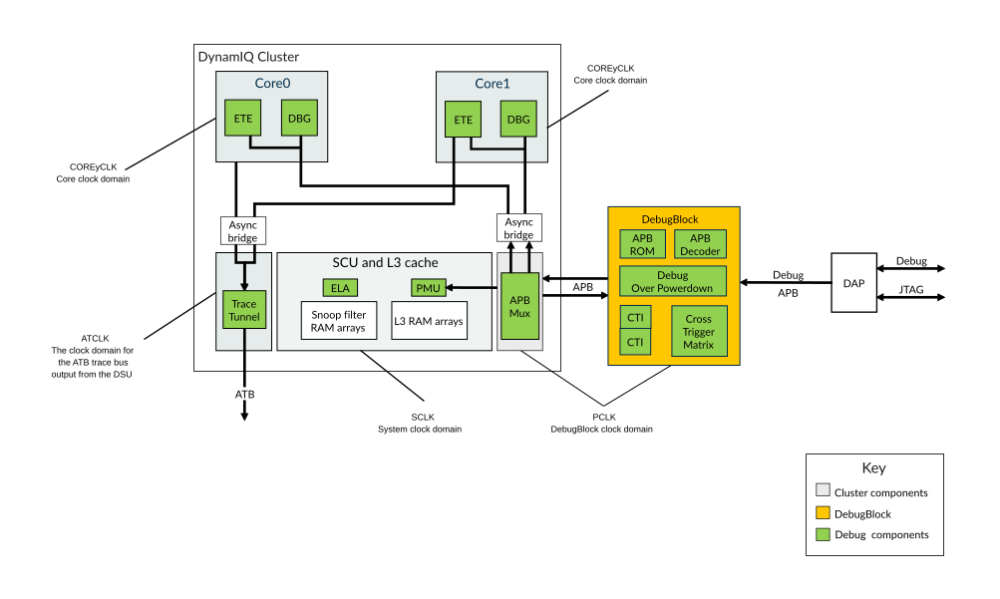

# Debug

Source: <https://developer.arm.com/documentation/107721/0001/Debug>

### Debug

The DSU-120AE DynamIQ™ cluster provides a debug system that supports both self-hosted and external debug. It has an external DebugBlock component, and integrates various CoreSight™ debug related components.

The CoreSight debug related components are split into two groups in the DSU-120AE. Some components are in the DynamIQ™ cluster itself, while some of the others are in the separate DebugBlock. The DebugBlock is deliberately separate from the cluster, to facilitate the following system design options:

- The DebugBlock is placed in a separate power domain, to ensure that it is possible to maintain the connection to a debugger while the cores and cluster are powered down.
- The DebugBlock is physically placed with the other CoreSight logic in the SoC, rather than close to the cluster.

The connection between the cluster and the DebugBlock consists of a pair of Advanced Peripheral Bus APB interfaces, one in each direction. All debug traffic, except the authentication interface, takes place over this interface as read or write APB transactions. This debug traffic includes register reads, register writes, and CTI triggers. There are no other wires between these two components to ensure that this traffic can be routed over any standard APB interconnect or APB bridge.

The following figure shows how the DSU-120AE implements the following CoreSight debug components:

- Per-core Embedded Trace Extension (ETE). Although the ETE is supplied with the core, the DSU-120AE integrates this into the CoreSight subsystem.
- Per-core Cross Trigger Interface (CTI). These are contained in the DebugBlock.
- Cross Trigger Matrix (CTM)
- Debug over Powerdown support
- APB Decoder
- APB ROM
- APB Mux

Figure 1. Cluster debug components

The primary debug APB interface on the DebugBlock, controls all the debug components and forms a standard CoreSight interface that is compatible with the previous generation of cores. The APB decoder decodes the requests on this bus before they are sent to the appropriate component in the DebugBlock or in the cluster. The per-core CTIs are connected to a CTM.

Each core contains a debug component that is accessed by the debug APB bus. The cores support Debug over Powerdown through modules in the DebugBlock that mirror key core information. These modules allow access to Debug over Powerdown CoreSight registers while the core is powered down.

The ETE unit in each core outputs trace, which is funneled in the cluster down to a single AMBA 5 ATB-C interface, which is 32 bits wide in small clusters and 64 bits wide in larger clusters.

### Cache debug

Cache debug of the DSU-120AE cache RAMs is supported, which allows software to read the contents of the L3 cache and snoop filter. This cache debug is under the control of the core, in the same way that L1 or L2 cache debug is controlled. The core sends a read operation to the DSU-120AE with the physical location to read, and the DSU-120AE returns the RAM contents at that location. The core then exposes this information in a system register.

### Related information

- [DebugBlock subcomponents](/documentation/107721/0001/Debug/DebugBlock-subcomponents?lang=en "The DebugBlock component consists of various subcomponents that facilitate the debugging of the DSU-120AE DynamIQ cluster while the cores, complexes, and cluster are powered down.")
- [Embedded Cross Trigger overview](/documentation/107721/0001/Debug/Embedded-Cross-Trigger-overview?lang=en "The Embedded Cross Trigger (ECT) allows debug events to be sent between Processing Elements (PEs).")
