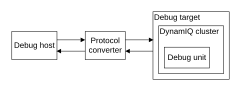

# Supported debug methods

Source: <https://developer.arm.com/documentation/107721/0001/Debug/Supported-debug-methods>

### Supported debug methods

The DSU-120AE DynamIQ™ cluster along with its associated complexes and cores is part of a debug system that supports both self-hosted and external debug.

The following figure shows a typical external debug system.

Figure 1. External debug system

Debug host
:   A computer, for example a personal computer, that is running a software debugger such as the
    Arm Debugger. With the debug host, you can issue high-level commands, such as setting a breakpoint at a certain location or examining the contents of a memory address.

Protocol converter
:   The debug host sends messages to the debug target using an interface such as Ethernet. However, the debug target typically implements a different interface protocol. A device such as DSTREAM is required to convert between the two protocols.

Debug target
:   The lowest level of the system implements system support for the protocol converter to access the debug unit. For DynamIQ Shared Unit-120AE (DSU-120AE) based devices, the mechanism used to access the debug unit is based on the CoreSight architecture. The DSU-120AE itself is accessed using an APB completer interface. An example of a debug target is a development system with a test chip or a silicon part with a DSU-120AE.

Debug unit
:   Helps debugging software that is running on the core:

    - DSU-120AE and external hardware based around the core.
    - Operating systems.
    - Application software.

    With the debug unit, you can:

    - Stop program execution.
    - Examine and alter process and coprocessor state.
    - Examine and alter memory and the state of the input or output peripherals.
    - Restart the PE.

For self-hosted debug, the debug target runs debug monitor software that runs on the core in the cluster. This way, it does not require expensive interface hardware to connect a second host computer.
