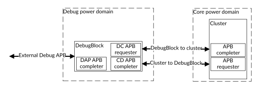

# DebugBlock overview

Source: <https://developer.arm.com/documentation/107721/0001/Debug/DebugBlock-overview>

### DebugBlock overview

The DebugBlock combines the functions, registers, and interfaces that are required for Debug over Powerdown.

The DebugBlock is provided as a separate component to allow implementation in a separate power domain from the cluster. Having a separate debug power domain allows the connection to a debugger be maintained while the cores, complexes, and cluster are powered down. The DynamIQ™ Shared Unit-120AE (DSU-120AE) also allows powering down the DebugBlock when debug is not in process.

The following figure shows how the DebugBlock is connected to the cluster.

Figure 1. Debug APB connections

The DebugBlock has the following APB interfaces:

External Debug APB (DAP APB)
:   An APB
    completer interface, allowing communication with an external debugger, for example through a CoreSight Debug Access Port (DAP).
:   All debug register read and write requests from an external debugger are received on this bus.

DebugBlock to cluster (DC APB)
:   An APB requester interface that is connected to the cluster. It sends all debug register read and write requests to the cluster.

    CTI output trigger events are sent to the cluster as trigger requests on this bus.

Cluster to DebugBlock (CD APB)
:   An APB completer interface that is connected to the cluster. It receives CTI input trigger event requests from the cluster.

### Debug register reads and writes

The DebugBlock holds all the debug registers that are implemented in the Debug power domain. Registers implemented in the Debug power domain are specified in the [Arm® Architecture Reference Manual for A-profile architecture](https://developer.arm.com/documentation/ddi0487/latest/).

Accesses through the DAP APB interface to Debug domain registers are handled internally by the DebugBlock.

Accesses through the DAP APB interface to core power domain registers are passed on to the cluster through the DC APB interface.

### CTI trigger events

Trigger events are transferred between the DebugBlock and cluster through the CD APB and DC APB interfaces.

Input trigger events
:   Input trigger events are sent from the cluster to the CTIs through the CD APB as write transactions.

Output trigger events
:   Output trigger events are sent from the CTIs to the cluster through the DC APB as write transactions.

### DebugBlock power states

The DebugBlock supports two power modes: ON and OFF. These power modes are controlled using the power Q-Channel interface. When the DebugBlock is in the OFF power mode, any uncompleted transactions on the external Debug APB interface to complete with an SLVERR.

### Related concepts

- [Embedded Cross Trigger overview](/documentation/107721/0001/Debug/Embedded-Cross-Trigger-overview?lang=en "The Embedded Cross Trigger (ECT) allows debug events to be sent between Processing Elements (PEs).")

### Related reference

- [Debug](/documentation/107721/0001/Debug?lang=en "The DSU-120AE DynamIQ cluster provides a debug system that supports both self-hosted and external debug. It has an external DebugBlock component, and integrates various CoreSight debug related components.")
- [DebugBlock subcomponents](/documentation/107721/0001/Debug/DebugBlock-subcomponents?lang=en "The DebugBlock component consists of various subcomponents that facilitate the debugging of the DSU-120AE DynamIQ cluster while the cores, complexes, and cluster are powered down.")
