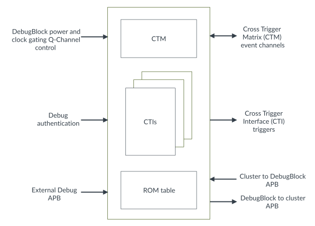

# DebugBlock subcomponents

Source: <https://developer.arm.com/documentation/107721/0001/Debug/DebugBlock-subcomponents>

### DebugBlock subcomponents

The DebugBlock component consists of various subcomponents that facilitate the debugging of the DSU-120AE DynamIQ™ cluster while the cores, complexes, and cluster are powered down.

The following figure shows the DebugBlock.

Figure 1. DebugBlock block diagram

> ### Note
>
> The CTIs shown in the diagram include the CTI attached to each
> core and the cluster CTI.

Cross Trigger Matrix (CTM)
:   The CTM distributes trigger events between the CTI instances inside the DebugBlock. The CTM event channels connect the DebugBlock CTM to the system-level CTM.

Cross Trigger Interface (CTI)
:   The CTIs generate and receive debug trigger events. The trigger events are transmitted to and from the cluster using the cluster and DebugBlock APB interfaces.

APB ROM table
:   The APB ROM table holds the address decoding for each debug component in the DebugBlock and the cluster. The APB ROM table complies with the
    [Arm® CoreSight™ Architecture Specification v3.0](https://developer.arm.com/documentation/ihi0029/latest). The ROM table is hierarchical, with further ROM tables in the cluster and
    cores. See
    [ROM tables](/documentation/107721/0001/ROM-tables?lang=en "The ROM tables hold the locations of debug components, which debuggers can use to determine which components are implemented. The DynamIQ Shared Unit-120AE (DSU-120AE) has three different types of ROM tables. There is a ROM table for DebugBlock components, a ROM table for the cluster components, and a ROM table for each standalone core or complex.") for more information on ROM tables.

### Related concepts

- [Embedded Cross Trigger overview](/documentation/107721/0001/Debug/Embedded-Cross-Trigger-overview?lang=en "The Embedded Cross Trigger (ECT) allows debug events to be sent between Processing Elements (PEs).")
