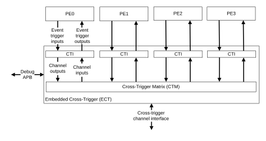

# Embedded Cross Trigger overview

Source: <https://developer.arm.com/documentation/107721/0001/Debug/Embedded-Cross-Trigger-overview>

### Embedded Cross Trigger overview

The Embedded Cross Trigger (ECT) allows debug events to be sent between Processing Elements (PEs).

The ECT provides a Cross Trigger Interface (CTI) for each PE in the cluster. There is also a cluster CTI, which is present in all configurations. The CTIs are interconnected through a Cross Trigger Matrix (CTM) to send debug and trace events between PEs.

The following figure shows a conceptual view of the trigger event inputs and outputs between the PEs and the ECT.

Figure 1. Embedded Cross Trigger concept

The CTIs selectively send trigger events to the CTM on their respective channel outputs. The CTIs receive trigger events from the CTM on their channel inputs.

Trigger events are transferred between CTIs over the channel interface. The CTM connects the channel interface to the channel inputs and channel outputs of the CTIs.

### External interfaces

The external cross-trigger channel interface, from the CTM, allows cross-triggering between SoC external devices.

The Debug APB provides access to the CTI registers to allow an external debugger to configure the trigger event routing, and send events to PEs. For example, an external debugger might use this mechanism to put a PE into Debug state.

### CTI registers

Registers in the CTI perform the following functions:

- Control the mapping of the input trigger events to channel outputs.
- Control the mapping of the channel inputs to output trigger events.
- Capture the state of input and output trigger events.
- Set, clear, or pulse output trigger events.

### Related reference

- [CTI triggers](/documentation/107721/0001/Debug/Embedded-Cross-Trigger-overview/CTI-triggers?lang=en "The Cross Trigger Interfaces (CTIs) each have input and output trigger events that are mapped onto the debug and trace events in the Processing Elements (PEs) and Embedded Logic Analyzers (ELAs). All PEs in the cluster have the same mapping.")
- [DebugBlock subcomponents](/documentation/107721/0001/Debug/DebugBlock-subcomponents?lang=en "The DebugBlock component consists of various subcomponents that facilitate the debugging of the DSU-120AE DynamIQ cluster while the cores, complexes, and cluster are powered down.")
